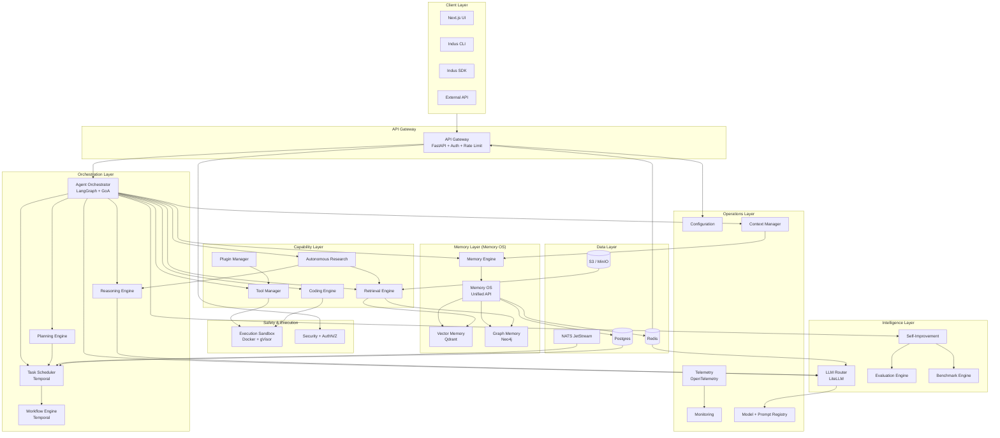
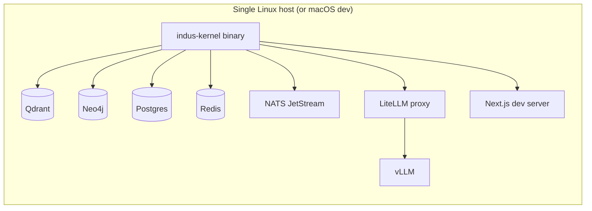
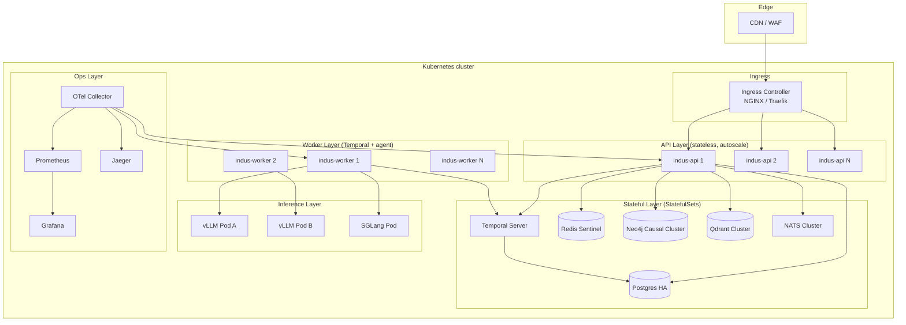
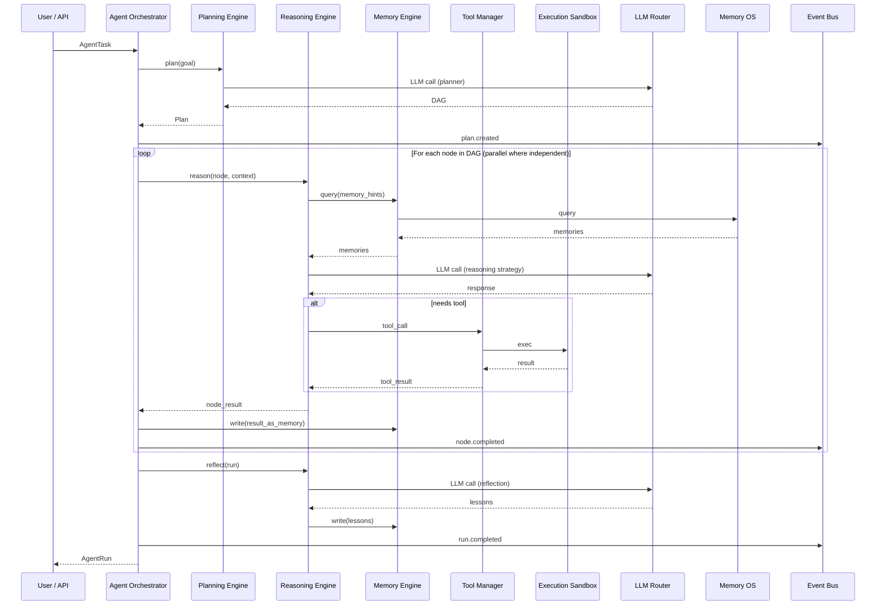
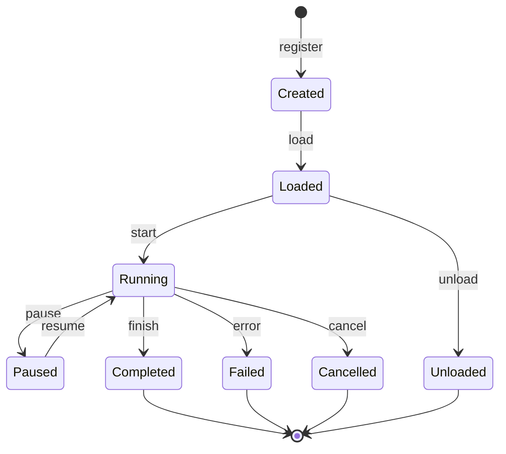

# Indus Kernel — Architecture Specification

**Version:** 1.0.0
**Date:** 2026-08-06
**Status:** Approved for implementation
**Author:** Mavis (Chief Systems Architect)
**Audience:** Senior engineering team — Phase 3 implementation starts immediately after sign-off
**Baseline source:** [`PHASE_1_RESEARCH_AUDIT.md`](./PHASE_1_RESEARCH_AUDIT.md) (read in full before this document was written)
**Supersedes:** none
**Companion documents:** `PHASE_1_RESEARCH_AUDIT.md`, `/workspace/papers-deep-dive/REPORT.md`

---

## Table of Contents

0. Document Control
1. System Overview
2. Architectural Principles
3. Deployment Topology
4. Monorepo Structure
5. Subsystem Specifications (35)
6. Unified Cognitive Loop
7. Data Models
8. API Specifications
9. Agent Protocols
10. Memory Architecture Detail
11. Reasoning Detail
12. Observability Detail
13. Security Detail
14. Deployment Detail
15. Testing Strategy
16. Implementation Roadmap
17. Architecture Decision Records (ADRs)

---

## 0. Document Control

| Field | Value |
|---|---|
| Spec version | 1.0.0 |
| Phase | 2 (Architecture Design) |
| Approved by | (user, pending) |
| Last updated | 2026-08-06 |
| Next review | After Phase 3 MVP skeleton |
| Conventions | RFC 2119 (MUST/SHOULD/MAY), SemVer 2.0, Conventional Commits |
| Source-of-truth precedence | 1. This document 2. PHASE_1_RESEARCH_AUDIT.md 3. Papers 4. Repos |
| Stability | Public API = 1.0.0 after MVP. Subsystem internals < 1.0.0 until each subsystem's E2E benchmark passes. |

---

## 1. System Overview

Indus Kernel is a **cognitive operating system** that orchestrates LLMs, agents, memory, tools, retrieval, workflows, and observability into one unified runtime. It is **AI-model-agnostic** (works with 100+ providers via LiteLLM), **agent-framework-agnostic** (LangGraph primary, AutoGen/CrewAI/smolagents as plug-ins), **storage-pluggable** (Qdrant/Milvus/Weaviate, Neo4j, Postgres, Redis, NATS, S3), and **deployment-agnostic** (single-binary, Docker, Kubernetes, self-hosted, cloud).

### 1.1 One-line description

> "The cognitive operating system that makes every AI system work together as one unified intelligence."

### 1.2 High-level component diagram



### 1.3 Core invariants

1. **Every external state mutation goes through the kernel.** No subsystem owns its own private DB write path. All writes are events on the bus or transactions through the State Manager.
2. **Every LLM call is mediated by the LLM Router.** No subsystem calls an LLM directly.
3. **Every memory access is mediated by the Memory OS.** No subsystem reads/writes Mem0/Qdrant/Neo4j directly.
4. **Every tool execution is mediated by the Tool Manager + Execution Sandbox.** No subsystem executes untrusted code directly.
5. **Every public action produces a trace.** OpenTelemetry span wrapping, no exceptions.
6. **The Agent Orchestrator is the only place that holds multi-agent state.** All other subsystems are stateless w.r.t. agent execution.

### 1.4 Design forces (priority order)

From the charter, in priority order: **Performance > Reliability > Scalability > Modularity > Maintainability > Observability > Security > Extensibility > Fault tolerance > Developer experience.**

When two forces conflict, the higher-priority force wins. Every ADR records which forces were traded off.

---

## 2. Architectural Principles

| # | Principle | Statement |
|---|-----------|-----------|
| P1 | Wrap, don't rebuild | Every external capability is wrapped behind a kernel interface. If a battle-tested repo exists, wrap it. |
| P2 | Pluggable everywhere | Every dependency (DB, broker, model provider, agent framework) MUST be replaceable via configuration. |
| P3 | Async-first | All I/O is async. The kernel's internal API is async-typed. No blocking calls in the hot path. |
| P4 | Event-sourced for state, request-response for queries | State changes emit events on the bus. Queries hit the State Manager. No "service mesh of mutable singletons". |
| P5 | Type-safe contracts | Every interface boundary has a typed schema (Pydantic + JSON Schema). No `dict` crosses a module boundary without a schema. |
| P6 | Failure-as-data | Errors are first-class values. Every async operation returns a `Result[T, Error]`-shaped object (Rust-style) using Python's `Result` type or a tagged union. |
| P7 | Testability = correctness | A subsystem is "done" when it has unit + integration + e2e + chaos tests, and they pass. |
| P8 | Observability is not optional | Every component ships with traces, metrics, logs wired by default. A component without telemetry is a bug. |
| P9 | Resource-bounded | Every LLM call has a token budget. Every tool call has a timeout. Every workflow has a deadline. |
| P10 | Single source of truth | Configuration, model registry, prompt registry, schema registry, capability registry — all live in Postgres with a Redis cache. No copy-paste config files. |

---

## 3. Deployment Topology

### 3.1 Single-node (dev / MVP)



### 3.2 Distributed (production)



### 3.3 Topology matrix

| Topology | Use case | Min resources |
|---|---|---|
| Single-binary | Dev, demos, small teams | 4 vCPU / 8 GB |
| Docker Compose | Staging, small prod | 8 vCPU / 16 GB |
| Kubernetes | Production | 16+ vCPU / 32+ GB + autoscaling |
| Hybrid cloud | LLM calls to remote providers, state on-prem | per K8s |
| Air-gapped | Regulated industries | self-hosted models only |

---

## 4. Monorepo Structure

```
indus-kernel/
├── Cargo.toml                          # workspace root (Rust hot paths)
├── pyproject.toml                      # Python workspace (Poetry / uv)
├── package.json                        # JS workspace
├── turbo.json                          # Turborepo pipeline
├── docker-compose.yml                  # local dev
├── charts/                             # Helm charts
│   └── indus-kernel/
├── crates/                             # Rust crates (hot path)
│   ├── ik-vector/                      # Qdrant client + custom ANN
│   ├── ik-router/                      # LLM routing (proto-LiteLLM)
│   ├── ik-graph/                       # Neo4j client + traversal
│   ├── ik-eventbus/                    # NATS client
│   ├── ik-sandbox/                     # Wasmtime + Docker exec
│   ├── ik-crypto/                      # JWT, secrets, signing
│   └── ik-protocol/                    # wire protocol (protobuf)
├── packages/                           # Python packages
│   ├── ik_kernel/                      # core kernel package
│   │   ├── __init__.py
│   │   ├── app.py                      # FastAPI app factory
│   │   ├── config.py                   # Pydantic Settings
│   │   ├── lifespan.py                 # startup/shutdown
│   │   └── deps.py                     # FastAPI dependencies
│   ├── ik_memory/                      # Memory Engine
│   │   ├── engine.py
│   │   ├── hierarchy.py                # working/short/long
│   │   ├── consolidation.py
│   │   ├── reflection.py
│   │   ├── forgetting.py
│   │   ├── conflict.py
│   │   └── adapters/
│   │       ├── mem0.py
│   │       ├── qdrant.py
│   │       ├── neo4j.py
│   │       └── postgres.py
│   ├── ik_reasoning/                   # Reasoning Engine
│   │   ├── strategies/
│   │   │   ├── cot.py
│   │   │   ├── self_consistency.py
│   │   │   ├── tot.py
│   │   │   ├── got.py
│   │   │   ├── least_to_most.py
│   │   │   ├── pot.py
│   │   │   ├── plan_and_solve.py
│   │   │   ├── react.py
│   │   │   ├── reflexion.py
│   │   │   ├── llm_compiler.py
│   │   │   ├── toolformer.py
│   │   │   ├── gorilla.py
│   │   │   └── dspy_opt.py
│   │   ├── selector.py                 # auto strategy selection
│   │   └── composer.py                 # strategy composition
│   ├── ik_planning/                    # Planning Engine
│   │   ├── planner.py
│   │   ├── dag.py
│   │   ├── replanner.py
│   │   └── verifier.py
│   ├── ik_router/                      # LLM Router (LiteLLM wrapper)
│   │   ├── router.py
│   │   ├── policy.py
│   │   ├── cache.py
│   │   ├── budget.py
│   │   └── fallback.py
│   ├── ik_tools/                       # Tool Manager
│   │   ├── registry.py
│   │   ├── schema.py
│   │   ├── executor.py
│   │   ├── mcp.py                      # MCP server adapter
│   │   └── verifier.py
│   ├── ik_plugins/                     # Plugin Manager
│   │   ├── loader.py
│   │   ├── lifecycle.py
│   │   └── wasm.py
│   ├── ik_retrieval/                   # Retrieval Engine
│   │   ├── indexer.py
│   │   ├── chunker.py
│   │   ├── embedder.py
│   │   ├── retriever.py
│   │   ├── reranker.py
│   │   ├── strategies/
│   │   │   ├── vector.py
│   │   │   ├── bm25.py
│   │   │   ├── hybrid.py
│   │   │   ├── self_rag.py
│   │   │   ├── crag.py
│   │   │   ├── graph_rag.py
│   │   │   ├── raptor.py
│   │   │   ├── hyde.py
│   │   │   └── colbert.py
│   │   └── ingestors/
│   │       ├── firecrawl.py
│   │       └── crawl4ai.py
│   ├── ik_agents/                      # Agent Orchestrator (LangGraph)
│   │   ├── orchestrator.py
│   │   ├── graph.py                    # LangGraph state
│   │   ├── goa.py                      # Graph-of-Agents
│   │   ├── roles.py
│   │   ├── messaging.py
│   │   └── adapters/
│   │       ├── langgraph.py
│   │       ├── autogen.py
│   │       ├── crewai.py
│   │       └── smolagents.py
│   ├── ik_coding/                      # Coding Engine
│   │   ├── engine.py
│   │   └── adapters/
│   │       ├── aider.py
│   │       ├── swe_agent.py
│   │       ├── opencode.py
│   │       └── codex.py
│   ├── ik_research/                    # Autonomous Research
│   │   ├── loop.py
│   │   ├── hypothesis.py
│   │   └── experiment.py
│   ├── ik_workflow/                    # Workflow + Scheduler
│   │   ├── temporal.py
│   │   ├── scheduler.py
│   │   └── workflows/
│   ├── ik_automation/                  # Automation Engine
│   │   ├── triggers.py
│   │   ├── scheduler_cron.py
│   │   └── webhooks.py
│   ├── ik_api/                         # API Gateway
│   │   ├── routes/
│   │   ├── middleware/
│   │   ├── auth.py
│   │   ├── ratelimit.py
│   │   └── versioning.py
│   ├── ik_security/                    # Security + AuthN/Z
│   │   ├── oidc.py
│   │   ├── jwt.py
│   │   ├── rbac.py
│   │   ├── abac.py
│   │   └── audit.py
│   ├── ik_telemetry/                   # Telemetry + Monitoring
│   │   ├── traces.py
│   │   ├── metrics.py
│   │   ├── logs.py
│   │   └── health.py
│   ├── ik_config/                      # Configuration
│   │   ├── settings.py
│   │   ├── secrets.py
│   │   └── hotreload.py
│   ├── ik_registry/                    # Model + Prompt Registry
│   │   ├── models.py
│   │   ├── prompts.py
│   │   └── skills.py
│   ├── ik_context/                     # Context Manager
│   │   ├── window.py
│   │   ├── compactor.py
│   │   ├── long_context.py
│   │   └── strategies/
│   │       ├── streaming_llm.py
│   │       ├── yarn.py
│   │       ├── longrope.py
│   │       ├── infini_attention.py
│   │       └── ring_attention.py
│   ├── ik_eval/                        # Evaluation + Benchmark
│   │   ├── evaluator.py
│   │   ├── llm_judge.py
│   │   ├── regression.py
│   │   └── harness.py
│   ├── ik_improvement/                 # Self-Improvement
│   │   ├── dspy_opt.py
│   │   ├── reflexion.py
│   │   └── ab_test.py
│   ├── ik_distributed/                 # Distributed Execution
│   │   ├── executor.py
│   │   └── balancer.py
│   ├── ik_memory_os/                   # Memory Operating System (unified)
│   │   ├── bus.py
│   │   ├── consistency.py
│   │   └── api.py
│   ├── ik_eventbus/                    # Event Bus
│   │   ├── nats_client.py
│   │   ├── publisher.py
│   │   └── subscriber.py
│   ├── ik_state/                       # State Manager
│   │   ├── temporal_client.py
│   │   └── postgres_state.py
│   ├── ik_sandbox/                     # Execution Sandbox
│   │   ├── docker.py
│   │   ├── gvisor.py
│   │   ├── wasm.py
│   │   └── e2b.py
│   ├── ik_protocols/                   # Agent protocols
│   │   ├── messages.py
│   │   ├── tasks.py
│   │   ├── tools.py
│   │   ├── memory.py
│   │   └── research.py
│   └── ik_sdk/                         # Client SDK
│       ├── client.py
│       └── types.py
├── apps/
│   ├── web/                            # Next.js UI
│   │   ├── app/
│   │   ├── components/
│   │   └── lib/
│   └── cli/                            # Indus CLI
│       └── src/
├── proto/                              # Protocol buffers
│   ├── agent.proto
│   ├── task.proto
│   ├── memory.proto
│   ├── tool.proto
│   └── event.proto
├── schemas/                            # JSON schemas
│   ├── agent_message.json
│   ├── task.json
│   ├── memory_object.json
│   ├── tool_definition.json
│   ├── workflow_state.json
│   ├── model_card.json
│   └── prompt_template.json
├── db/
│   ├── migrations/                     # Alembic
│   │   └── versions/
│   ├── seed/
│   └── cypher/                         # Neo4j initialisation
├── tests/
│   ├── unit/
│   ├── integration/
│   ├── e2e/
│   ├── chaos/
│   ├── benchmark/
│   └── regression/
├── docs/
│   ├── adr/                            # ADRs
│   ├── api/
│   ├── guides/
│   └── diagrams/
├── scripts/
│   ├── dev.sh
│   ├── bench.sh
│   └── release.sh
├── .github/
│   └── workflows/
├── Cargo.lock
├── uv.lock
└── README.md
```

### 4.1 Module dependency rules

- `ik_*` packages MUST NOT import from `apps/`.
- `crates/ik_*` MUST NOT import from `packages/`.
- `ik_kernel` is the only package allowed to import from all other `ik_*` packages.
- Cross-cutting concerns (`ik_telemetry`, `ik_config`, `ik_security`) are imported by everyone but import nothing domain-specific.

---

## 5. Subsystem Specifications

The 35 subsystems follow this uniform template. Subsystem ID matches the kernel-responsibility index from the charter.

---

### 5.1 LLM Router (Subsystem #8)

**Purpose.** The single ingress for every LLM call in the kernel. Selects model, enforces budgets, caches semantically, retries with backoff, falls back on failure, and emits per-call telemetry.

**Responsibilities.** Model selection; capability matching; cost/latency/quality-aware routing; per-tenant token budgets; semantic caching; retry with exponential backoff + jitter; cascading fallback to cheaper/faster model on failure; per-call trace + metric emission; per-model rate limiting; streaming passthrough.

**Inputs.** `LLMRequest { prompt | messages, model_hint?, capability_requirements, max_tokens, max_cost_cents, max_latency_ms, temperature, top_p, stop, response_format, tools?, stream }`.

**Outputs.** `LLMResponse { id, model_used, content | delta, usage: {prompt_tokens, completion_tokens, cost_cents, latency_ms}, cache_hit, fallback_used, trace_id }`.

**Dependencies.** LiteLLM (router) · vLLM (local backend) · SGLang (structured gen) · Postgres (model registry) · Redis (semantic cache) · OTel (telemetry) · `ik_security` (auth, quotas).

**Internal components.** `Router` · `PolicyEngine` · `SemanticCache` · `BudgetEnforcer` · `FallbackChain` · `RateLimiter` · `Streamer`.

**Public APIs.**
```python
class LLMRouter(Protocol):
    async def complete(self, req: LLMRequest) -> LLMResponse: ...
    async def stream(self, req: LLMRequest) -> AsyncIterator[LLMDelta]: ...
    async def embed(self, req: EmbedRequest) -> EmbedResponse: ...
    async def count_tokens(self, text: str, model: str) -> int: ...
```

**Internal APIs.** `PolicyEngine.select(req) -> ModelCandidate` · `SemanticCache.lookup(req) -> Optional[LLMResponse]` · `BudgetEnforcer.check(tenant_id, estimated_cost) -> bool` · `FallbackChain.execute(req, primary) -> LLMResponse`.

**Module boundaries.** Owns: model selection, caching, retry, fallback, rate limit. Does NOT own: prompt construction (callers' job), tool schema (Tool Manager's job), memory context (Context Manager's job).

**Data flow.** Request → PolicyEngine (select candidates) → BudgetEnforcer (check) → SemanticCache (lookup) → on miss: RateLimiter → FallbackChain → LiteLLM → response → cache write → telemetry.

**Event flow.** Emits `llm.requested`, `llm.completed`, `llm.failed`, `llm.cached`, `llm.budget_exceeded` to the bus.

**Control flow.** Synchronous for `complete`; async-iterator for `stream`; `asyncio.Task` for fire-and-forget telemetry.

**Lifecycle.** Initialised at app startup with model registry loaded from Postgres. Re-loads registry on `registry.updated` event (SIGHUP also supported).

**Failure modes.** Primary model 5xx → fallback to next candidate. All candidates exhausted → `LLMUnavailableError`. Budget exceeded → `BudgetExceededError` (no fallback). Rate limited → `RateLimitedError` with `Retry-After`.

**Recovery strategy.** Circuit breaker per model: 5 failures in 60 s → open for 60 s. Health check every 30 s when open.

**Performance goals.** P50 < 200 ms overhead (cache hit); P99 < 50 ms overhead (cache miss). Cache hit rate target > 40% after warmup.

**Scalability strategy.** Stateless router; horizontally scalable. Redis cache is the bottleneck — cluster-mode Redis. Semantic cache uses Qdrant.

**Security considerations.** Per-tenant API keys (hashed in Postgres). No API keys in logs. Secrets via Vault.

**Extension points.** Custom model providers (register a `ModelProvider` adapter). Custom policies (register a `Policy`). Custom caches (register a `Cache`).

**Future roadmap.** Speculative routing (issue to 2 models in parallel, take first response). RL-based policy (learn from latency/cost feedback). v2: integrate EAGLE-2 speculative decoding for served models.

---

### 5.2 Memory Engine (Subsystem #1)

**Purpose.** Unified memory for agents: working (turn), short-term (session), long-term (episodic + semantic + procedural), and consolidation/reflection/forgetting machinery.

**Responsibilities.** CRUD over memory objects; importance scoring; consolidation (working → short → long); reflection (long → higher-level summaries); forgetting (TTL + importance-weighted decay); conflict resolution (newer wins, contradicting fact triggers re-resolution); retrieval by recency, importance, relevance; skill library (procedural memory); per-tenant isolation.

**Inputs.** `MemoryWrite { content, type, importance?, ttl?, tags?, source, scope: "working" | "short" | "long", tenant_id, agent_id, user_id }`. `MemoryQuery { scope?, type?, tags?, query?, k, recency_weight, importance_weight, relevance_weight }`.

**Outputs.** `MemoryObject { id, content, type, importance, created_at, last_accessed, access_count, embeddings_ref, graph_ref, scope, source, tags, version }`. `MemoryQueryResult { objects: List[MemoryObject], scores: Dict[id, float] }`.

**Dependencies.** Mem0 (semantic memory API) · Qdrant (vector store) · Neo4j (graph store) · Postgres (metadata + audit) · Redis (working memory) · LLM Router (for reflection + importance scoring) · `ik_memory_os` (unified access layer).

**Internal components.** `MemoryEngine` (façade) · `HierarchyManager` (working/short/long tiers) · `Consolidator` · `Reflector` · `ForgettingPolicy` · `ConflictResolver` · `SkillLibrary` (procedural memory) · `ImportanceScorer`.

**Public APIs.**
```python
class MemoryEngine(Protocol):
    async def write(self, m: MemoryWrite) -> MemoryObject: ...
    async def read(self, id: str) -> MemoryObject: ...
    async def query(self, q: MemoryQuery) -> MemoryQueryResult: ...
    async def update(self, id: str, patch: MemoryPatch) -> MemoryObject: ...
    async def delete(self, id: str) -> bool: ...
    async def reflect(self, agent_id: str) -> List[MemoryObject]: ...        # consolidate + summarise
    async def forget(self, policy: ForgettingPolicy) -> int: ...             # return count
    async def add_skill(self, skill: Skill) -> Skill: ...                   # procedural memory
    async def find_skill(self, query: str) -> List[Skill]: ...
```

**Internal APIs.** `HierarchyManager.promote(id)` · `Consolidator.run(tenant_id, scope)` · `Reflector.summarise(memory_ids)` · `ConflictResolver.detect(memory) -> List[Conflict]` · `ImportanceScorer.score(content) -> float`.

**Module boundaries.** Owns memory lifecycle. Does NOT own: which memories to write (agent's decision via Tool Manager), retrieval query construction (Retrieval Engine's job when the user wants search), storage internals (delegated to `ik_memory_os`).

**Data flow.** Write → ImportanceScorer (LLM call) → store in working (Redis) → on threshold: promote to short (Postgres + Qdrant) → on reflection: promote to long (Qdrant + Neo4j).

**Event flow.** Emits `memory.written`, `memory.promoted`, `memory.consolidated`, `memory.reflected`, `memory.forgotten`, `memory.conflict_resolved`.

**Control flow.** All async. Consolidation runs as a Temporal cron (every 5 min per tenant). Reflection runs on session end + per-N writes.

**Lifecycle.** Initialised at app startup with model registry + LLM Router. Periodic background workers for consolidation + reflection.

**Failure modes.** LLM failure during importance scoring → default importance = 0.5, retry async. Qdrant unavailable → fall back to Postgres full-text search. Conflict detected → emit `memory.conflict_resolved` event for audit.

**Recovery strategy.** All writes idempotent (idempotency key on write). Backfill on Qdrant recovery from Postgres source-of-truth.

**Performance goals.** Write P99 < 100 ms (without LLM scoring). Read P99 < 50 ms (cache hit) / 200 ms (Qdrant). Consolidation throughput > 1000 memories/sec/tenant.

**Scalability strategy.** Stateless façade; Qdrant + Neo4j + Postgres are the scaling points. Sharding by tenant_id.

**Security considerations.** Per-tenant encryption at rest (envelope encryption via Vault). Row-level security in Postgres. Memory objects scoped to tenant_id; cross-tenant access denied at the engine.

**Extension points.** Custom memory types (register a `MemoryType`). Custom importance scorers. Custom conflict resolution strategies.

**Future roadmap.** v2: dream-style offline consolidation (background job that re-plays memories and produces higher-level abstractions). v3: federated memory across multiple kernel deployments (consent-based).

---

### 5.3 Reasoning Engine (Subsystem #3)

**Purpose.** Execute reasoning strategies over an LLM call. Provides a typed registry of reasoning patterns: CoT, Self-Consistency, ToT, GoT, Least-to-Most, PoT, Plan-and-Solve, ReAct, Reflexion, LLM Compiler, Toolformer, Gorilla, DSPy-optimised. Auto-selection and composition of strategies.

**Responsibilities.** Strategy registry; per-strategy executor; auto-selection from query characteristics; composition (chain strategies); cost/quality budgeting per call; trace emission.

**Inputs.** `ReasoningRequest { query, context?, strategy?: StrategyName | "auto", budget: {max_tokens, max_cost_cents, max_latency_ms, min_quality_score?}, tools?, memory_hints? }`.

**Outputs.** `ReasoningResult { final_answer, strategy_used, intermediate_steps: List[Step], total_tokens, total_cost_cents, total_latency_ms, confidence, trace_id }`.

**Dependencies.** LLM Router (every reasoning strategy calls it) · Tool Manager (for ReAct/Toolformer) · Memory Engine (for context) · `ik_eval` (for strategy quality scoring) · OTel.

**Internal components.** `ReasoningEngine` (façade) · `StrategyRegistry` · `StrategySelector` (auto mode) · `StrategyComposer` (chain) · `StrategyTraceRecorder`.

**Public APIs.**
```python
class ReasoningEngine(Protocol):
    async def reason(self, req: ReasoningRequest) -> ReasoningResult: ...
    async def stream_reason(self, req: ReasoningRequest) -> AsyncIterator[ReasoningDelta]: ...
    def register_strategy(self, name: str, strategy: ReasoningStrategy) -> None: ...
```

**Internal APIs.** Each strategy implements `ReasoningStrategy.execute(req, llm, tools, memory) -> ReasoningResult`. The selector uses a meta-LLM to pick the best strategy given the query.

**Module boundaries.** Owns reasoning. Does NOT own tool execution (Tool Manager's job), memory (Memory Engine's job), planning (Planning Engine's job).

**Data flow.** Request → StrategySelector (if auto) → strategy.execute → llm calls (via Router) + tool calls (via Tool Manager) + memory reads (via Memory Engine) → step trace + final answer.

**Event flow.** Emits `reasoning.started`, `reasoning.step`, `reasoning.completed`, `reasoning.failed`.

**Control flow.** All async. Strategies may run multiple LLM calls in parallel (Self-Consistency) or sequence (ToT) or with feedback (Reflexion).

**Lifecycle.** Strategies are stateless functions. Registered at app startup. Auto-selector uses a meta-LLM and learns from past quality scores.

**Failure modes.** Strategy exception → return partial result with `confidence=0`. LLM failure → propagates from Router. Tool failure → strategy decides retry/skip.

**Recovery strategy.** Reflexion: on failure, generate verbal reflection, retry with reflection in context (capped at N=3 retries).

**Performance goals.** CoT: P50 < 2 s for 1k-token reasoning. Self-Consistency (n=10): P50 < 15 s. ToT (depth=5, branch=4): P50 < 60 s. LLM Compiler: P50 < 5 s for 20 parallel calls.

**Scalability strategy.** Stateless. Parallel strategies (Self-Consistency, ToT branching) scale horizontally with worker count.

**Security considerations.** Reasoning traces are auditable. Strategies that generate code (PoT) MUST route through Tool Manager + Sandbox.

**Extension points.** Custom strategies (register a `ReasoningStrategy`). Custom selectors. Custom composers.

**Future roadmap.** v2: learned strategy selection via offline RL on execution traces. v3: speculative reasoning (issue 2 strategies in parallel, take the higher-confidence one).

---

### 5.4 Planning Engine (Subsystem #4)

**Purpose.** Decompose a goal into a task DAG. Plan, schedule (with the Scheduler), monitor execution, replan on failure, verify the plan against a verifier (LLM-based or rule-based).

**Responsibilities.** Goal decomposition; DAG construction with dependencies; constraint propagation (cost, time, capability); replanning on failure; plan verification; plan caching (per-goal-similarity); plan-replay for debugging; plan-explanation.

**Inputs.** `PlanRequest { goal, context, constraints: {max_cost_cents, max_duration_s, required_capabilities, deadline?}, memory_hints?, plan_strategy?: "llm_compiler" | "metagpt" | "manual" }`.

**Outputs.** `Plan { id, goal, dag: DAG { nodes: List[TaskNode], edges: List[Dependency] }, estimated_cost_cents, estimated_duration_s, verification: VerificationResult, plan_hash, created_at }`. `PlanResult { plan, executed: List[TaskResult], status: "succeeded" | "partial" | "failed", actual_cost_cents, actual_duration_s }`.

**Dependencies.** LLM Router (planner + verifier) · Task Scheduler (executes the DAG) · Tool Manager (capability check) · Memory Engine (plan cache) · Workflow Engine (durable execution).

**Internal components.** `Planner` (LLM-driven) · `DAGBuilder` · `Replanner` · `Verifier` · `PlanCache` · `PlanExplainer`.

**Public APIs.**
```python
class PlanningEngine(Protocol):
    async def plan(self, req: PlanRequest) -> Plan: ...
    async def execute(self, plan: Plan) -> PlanResult: ...  # delegates to Scheduler
    async def replan(self, plan: Plan, failure: TaskFailure) -> Plan: ...
    async def verify(self, plan: Plan) -> VerificationResult: ...
    async def explain(self, plan: Plan) -> str: ...           # human-readable
    async def replay(self, plan_id: str) -> PlanResult: ...   # deterministic replay
```

**Internal APIs.** `Planner.decompose(goal, context) -> DAG` · `Verifier.check(plan) -> VerificationResult` · `Replanner.fix(failed_node, cause) -> DAG` (LLM Compiler-style).

**Module boundaries.** Owns planning. Does NOT own task execution (Scheduler/Workflow), tool calls (Tool Manager), agent selection (Agent Orchestrator).

**Data flow.** PlanRequest → Planner (LLM) → DAG → Verifier (LLM + rules) → Scheduler (Temporal) → on failure: Replanner → updated DAG.

**Event flow.** Emits `plan.created`, `plan.verified`, `plan.started`, `plan.node_started`, `plan.node_completed`, `plan.node_failed`, `plan.replanned`, `plan.completed`.

**Control flow.** Async. DAG traversal via Temporal workflow (durable).

**Lifecycle.** Planner + Replanner are stateless LLM-callers. Verifier is stateless. PlanCache uses Mem0 + Qdrant.

**Failure modes.** Planner hallucination → Verifier catches invalid DAG → Replanner fixes. DAG cycle → ValidationError at build time.

**Recovery strategy.** Per-node retry policy. Node failure → Replanner generates patch → resumes from failed node. Whole-plan failure → Replanner rebuilds from scratch (with past failures in context).

**Performance goals.** Plan (10 nodes) P50 < 5 s. Verify P50 < 2 s. Replan on single-node failure P50 < 3 s.

**Scalability strategy.** Stateless. Plan cache scales with vector store.

**Security considerations.** Plan execution is resource-bounded (token budget, wall-clock budget). Plans that require dangerous capabilities (network, fs write) require explicit capability grant.

**Extension points.** Custom planners (register a `Planner`). Custom verifiers. Custom DAG node types.

**Future roadmap.** v2: hierarchical planning (plan-of-plans). v3: simulation-based verification (run the plan in a sandboxed dry-run before execution).

---

### 5.5 Task Scheduler (Subsystem #5)

**Purpose.** Queue, priority, deadline-aware scheduling of agent tasks. Capacity-aware, token-budget-aware, fair-share across tenants.

**Responsibilities.** Task queue; priority assignment; deadline propagation; capacity reservation; token-budget enforcement; fair-share; backpressure; metrics.

**Inputs.** `Task { id, plan_id, node_id, payload, priority: "low"|"normal"|"high"|"urgent", deadline?: datetime, tenant_id, estimated_tokens, required_capabilities }`.

**Outputs.** `TaskReceipt { task_id, scheduled_at, worker_id, eta_ms }`. `TaskResult { task_id, status, result, error?, completed_at }`.

**Dependencies.** Temporal (durable queue) · Redis (priority queue for fast path) · NATS (event broadcast) · Postgres (task audit) · LLM Router (token budget) · `ik_security` (tenant quotas).

**Internal components.** `Scheduler` · `PriorityAssigner` · `DeadlinePropagator` · `CapacityPlanner` · `TokenBudgetGuard` · `FairShareEnforcer` · `BackpressureController`.

**Public APIs.**
```python
class TaskScheduler(Protocol):
    async def submit(self, task: Task) -> TaskReceipt: ...
    async def cancel(self, task_id: str) -> bool: ...
    async def status(self, task_id: str) -> TaskStatus: ...
    async def list(self, filter: TaskFilter) -> AsyncIterator[Task]: ...
```

**Internal APIs.** `PriorityAssigner.score(task) -> int` (urgency, deadline proximity, tenant priority) · `TokenBudgetGuard.check(tenant_id, estimated) -> bool` · `FairShareEnforcer.weight(tenant_id) -> float`.

**Module boundaries.** Owns task queueing. Does NOT own execution (workers do), planning (Planning Engine does), tool calls (Tool Manager does).

**Data flow.** Task submitted → PriorityAssigner → TokenBudgetGuard → FairShareEnforcer → Temporal queue → worker pulls → execute → result.

**Event flow.** Emits `task.submitted`, `task.scheduled`, `task.started`, `task.completed`, `task.failed`, `task.deadline_missed`, `task.budget_exceeded`.

**Control flow.** Async. Workers pull from Temporal; `asyncio` workers handle many concurrent tasks.

**Lifecycle.** Initialised at app startup. Background worker pool scales with Temporal.

**Failure modes.** Task timeout → `task.deadline_missed`. Budget exceeded → `task.budget_exceeded` + no execution. Worker crash → Temporal reassigns.

**Recovery strategy.** Temporal handles retries with exponential backoff. Dead-letter queue for permanently-failed tasks. Per-tenant circuit breaker.

**Performance goals.** Submit P99 < 50 ms. Picked up by worker P99 < 1 s. Fair-share variance < 10%.

**Scalability strategy.** Temporal workers scale horizontally. Sharding by `tenant_id`.

**Security considerations.** Per-tenant isolation. No cross-tenant task injection. Task payloads encrypted at rest.

**Extension points.** Custom priority policies. Custom fair-share policies. Custom backpressure signals.

**Future roadmap.** v2: predictive scheduling (forecast load from historical telemetry). v3: cross-region scheduling for latency.

---

### 5.6 Workflow Engine (Subsystem #6)

**Purpose.** Durable, retryable, resumable, observable workflows. Wraps Temporal with kernel-specific primitives: human-in-the-loop, token budget gates, plan DAG execution, agent task chains.

**Responsibilities.** Workflow definition (DSL); workflow execution; durable timers; signals; queries; retries; versioning; per-workflow telemetry.

**Inputs.** `WorkflowDef { name, version, input_schema, activities: List[ActivityDef], signals: List[SignalDef], queries: List[QueryDef], retry_policy }`. `WorkflowStart { workflow: name, input, idempotency_key? }`.

**Outputs.** `WorkflowHandle { id, run_id, status }`. `WorkflowResult { handle, output, history }`.

**Dependencies.** Temporal (engine) · Postgres (workflow metadata) · OTel · `ik_planning` (DAG execution) · `ik_agents` (agent activities) · `ik_telemetry` (per-workflow traces).

**Internal components.** `WorkflowEngine` (Temporal wrapper) · `WorkflowRegistry` · `ActivityRunner` · `HumanInTheLoopGateway` · `BudgetGate` (waits until budget approved) · `VersionManager`.

**Public APIs.**
```python
class WorkflowEngine(Protocol):
    async def register(self, def: WorkflowDef) -> None: ...
    async def start(self, start: WorkflowStart) -> WorkflowHandle: ...
    async def signal(self, handle: WorkflowHandle, signal: str, payload: Any) -> None: ...
    async def query(self, handle: WorkflowHandle, query: str) -> Any: ...
    async def cancel(self, handle: WorkflowHandle, reason: str) -> None: ...
    async def describe(self, name: str, version: int) -> WorkflowDef: ...
    def stream_history(self, handle: WorkflowHandle) -> AsyncIterator[HistoryEvent]: ...
```

**Internal APIs.** Each activity implements `async def execute(input, ctx) -> output`. Activities are non-deterministic-free; all side effects via registered clients.

**Module boundaries.** Owns workflow lifecycle. Does NOT own the activities themselves (subsystems implement activities).

**Data flow.** Start → Temporal → ActivityRunner → activity.execute → result. On exception: retry with policy. On signal: resume with state.

**Event flow.** Emits `workflow.started`, `workflow.activity_started`, `workflow.activity_completed`, `workflow.activity_failed`, `workflow.signaled`, `workflow.completed`, `workflow.failed`.

**Control flow.** Async. Workflow code is deterministic; activities are side-effecting. Temporal handles durable timers.

**Lifecycle.** Workflows registered at app startup. Long-running workflows (days) supported.

**Failure modes.** Activity failure → retry per policy. Non-retryable → fail workflow + notify. Determinism violation → Temporal error.

**Recovery strategy.** Full state recovery from Temporal event history. Workflow can be replayed deterministically.

**Performance goals.** Activity start P99 < 100 ms. Workflow state read P99 < 50 ms.

**Scalability strategy.** Temporal workers scale horizontally. Sharded by workflow namespace.

**Security considerations.** Workflow inputs/outputs encrypted. Per-tenant namespaces. Activity-level RBAC.

**Extension points.** Custom DSL (Python decorators, YAML, or JSON). Custom activity runners. Custom retry policies.

**Future roadmap.** v2: visual workflow designer in the UI. v3: workflow synthesis from natural language (LLM Compiler + plan DSL).

---

### 5.7 Agent Orchestrator (Subsystem #7)

**Purpose.** The only place in the kernel that holds multi-agent execution state. Coordinates multiple agents, assigns roles, manages communication, applies Graph-of-Agents-style relevance-aware message passing.

**Responsibilities.** Agent lifecycle; role assignment; topology construction (graph); message routing; relevance scoring; result aggregation; cost accounting; observability per agent.

**Inputs.** `AgentTask { goal, agents: List[AgentSpec], topology: "graph" | "chain" | "broadcast" | "consensus" | "graph_of_agents", constraints }`. `AgentSpec { role, model, tools, system_prompt_ref, capabilities }`.

**Outputs.** `AgentRun { id, task_id, agents: List[AgentRunState], messages: List[AgentMessage], result, total_tokens, total_cost_cents, total_latency_ms, trace_id }`.

**Dependencies.** LangGraph (primary runtime) · AutoGen (adapter) · CrewAI (adapter) · smolagents (adapter) · LLM Router · Memory Engine · Tool Manager · Reasoning Engine · Planning Engine · `ik_telemetry`.

**Internal components.** `Orchestrator` · `TopologyBuilder` · `RoleAssigner` · `MessageRouter` · `RelevanceScorer` (GoA-style) · `ResultAggregator` (max/mean pool) · `CostAccounter`.

**Public APIs.**
```python
class AgentOrchestrator(Protocol):
    async def run(self, task: AgentTask) -> AgentRun: ...
    async def stream(self, task: AgentTask) -> AsyncIterator[AgentEvent]: ...
    async def add_agent(self, spec: AgentSpec) -> AgentId: ...
    async def remove_agent(self, agent_id: AgentId) -> bool: ...
    async def status(self, run_id: RunId) -> AgentRun: ...
    async def cancel(self, run_id: RunId) -> bool: ...
```

**Internal APIs.** `TopologyBuilder.build(agents, topology) -> Graph` · `RelevanceScorer.score(message, agent) -> float` (GoA's score matrix) · `ResultAggregator.aggregate(responses) -> Response`.

**Module boundaries.** Owns multi-agent execution. Does NOT own: single-agent loop (delegated to LangGraph), tool calls (Tool Manager), memory (Memory Engine), LLM calls (Router).

**Data flow.** AgentTask → TopologyBuilder → per-agent loop: Reason → Act → Observe → Message → other agents (via MessageRouter + RelevanceScorer) → aggregate → final.

**Event flow.** Emits `agent.run.started`, `agent.message`, `agent.message_routed`, `agent.thought`, `agent.tool_call`, `agent.run.completed`, `agent.run.failed`.

**Control flow.** Async. LangGraph drives the loop. GoA-style relevance scoring may prune low-relevance agents.

**Lifecycle.** Orchestrator stateless; agent state lives in LangGraph checkpoints (Postgres). Long-running agents supported.

**Failure modes.** Agent exception → retry per policy. Topology failure → replan. All agents fail → `OrchestrationError`.

**Recovery strategy.** LangGraph checkpoints enable resume. GoA's relevance scoring reduces noise (skip low-relevance agents).

**Performance goals.** 3-agent GoA P50 < 10 s. 6-agent MoA P50 < 20 s. 10-agent broadcast P50 < 30 s.

**Scalability strategy.** Stateless orchestrator; agent state in Postgres. Worker pool scales with concurrent runs.

**Security considerations.** Per-tenant agent pools. No agent can call tools outside its capability grant. Inter-agent messages auditable.

**Extension points.** Custom topologies (register a `TopologyBuilder`). Custom aggregators. Custom message routers.

**Future roadmap.** v2: learned topology selection (auto-pick chain vs graph based on task). v3: multi-modal agents (vision + tool use).

---

### 5.8 Tool Manager (Subsystem #9)

**Purpose.** Tool registration, discovery, schema, invocation, sandboxing, verification, and recovery. The single ingress for every tool call in the kernel.

**Responsibilities.** Tool registry; JSON Schema / Pydantic schema validation; MCP server discovery; capability-based authorisation; sandboxed execution; result verification; retry; circuit breaker; observability per tool.

**Inputs.** `ToolCall { tool_id, args, caller_id, timeout_s, idempotency_key? }`. `ToolDefinition { id, name, description, input_schema, output_schema, capabilities, sandbox: "wasm" | "docker" | "gvisor" | "host", cost_hint, rate_limit }`.

**Outputs.** `ToolResult { call_id, output, latency_ms, cost_cents, sandbox_used, verified }`.

**Dependencies.** Execution Sandbox (`ik_sandbox`) · LLM Router (for schema-based synthesis, Gorilla-style) · `ik_security` (capability check) · OTel · `ik_registry` (tool registry persistence).

**Internal components.** `ToolManager` · `SchemaRegistry` · `MCPClient` · `CapabilityChecker` · `Executor` (delegates to Sandbox) · `Verifier` (LLM-based for critical tools) · `CircuitBreaker`.

**Public APIs.**
```python
class ToolManager(Protocol):
    async def register(self, def: ToolDefinition) -> ToolId: ...
    async def list(self, filter: ToolFilter) -> List[ToolDefinition]: ...
    async def call(self, call: ToolCall) -> ToolResult: ...
    async def stream(self, call: ToolCall) -> AsyncIterator[ToolDelta]: ...
    async def verify(self, call: ToolCall, result: ToolResult) -> VerificationResult: ...
```

**Internal APIs.** `SchemaRegistry.validate(args, schema) -> ValidationResult` · `MCPClient.discover(uri) -> List[ToolDefinition]` · `CapabilityChecker.check(tool, caller) -> bool`.

**Module boundaries.** Owns tool lifecycle + invocation. Does NOT own: tool code (developers provide), tool storage (delegated to `ik_registry`).

**Data flow.** ToolCall → SchemaRegistry (validate) → CapabilityChecker → Executor (sandbox) → result → Verifier (if critical) → ToolResult.

**Event flow.** Emits `tool.registered`, `tool.called`, `tool.succeeded`, `tool.failed`, `tool.verified`, `tool.circuit_open`.

**Control flow.** Async. Sandboxed execution is async (subprocess pool).

**Lifecycle.** Tools registered at startup or runtime via `register`. MCP servers discovered on demand.

**Failure modes.** Schema invalid → `SchemaValidationError`. Capability denied → `PermissionError`. Sandbox error → `SandboxError`. Timeout → `TimeoutError`. All trigger circuit breaker.

**Recovery strategy.** Per-tool retry policy. Circuit breaker per tool. Fallback tool optional.

**Performance goals.** Tool call P50 < 200 ms. Schema validation < 1 ms.

**Scalability strategy.** Stateless. Subprocess pool scales with worker count.

**Security considerations.** Every tool runs in a sandbox. Network egress filtered per tool capability. Filesystem access scoped. Audit log of every call.

**Extension points.** Custom sandboxes (register a `Sandbox`). Custom verifiers. Custom transport protocols.

**Future roadmap.** v2: automatic tool discovery (crawl public APIs, generate schemas). v3: tool synthesis (Gorilla-style, generate tool from natural language description).

---

### 5.9 Plugin Manager (Subsystem #10)

**Purpose.** Third-party plugin lifecycle: load, version, isolate, hot-swap. Sandboxed plugins via WASM (Wasmtime) or Python entry-points.

**Responsibilities.** Plugin discovery; version resolution; load + initialise; lifecycle (init, start, stop, reload); isolation; capability grant; observability per plugin.

**Inputs.** `PluginManifest { id, version, entry_point, type: "wasm" | "python", capabilities, dependencies, config_schema }`. `PluginLoadRequest { manifest, config }`.

**Outputs.** `PluginInstance { id, version, state: "loaded" | "running" | "stopped" | "errored", capabilities_granted, metrics }`.

**Dependencies.** Wasmtime (WASM runtime) · `ik_sandbox` · `ik_security` (capability grant) · `ik_registry` (plugin metadata) · OTel.

**Internal components.** `PluginManager` · `Loader` (Wasmtime, Python entry-points) · `LifecycleController` · `CapabilityBroker` · `HotReloader` (file watch).

**Public APIs.**
```python
class PluginManager(Protocol):
    async def install(self, manifest: PluginManifest) -> PluginId: ...
    async def load(self, id: PluginId, config: dict) -> PluginInstance: ...
    async def unload(self, id: PluginId) -> bool: ...
    async def reload(self, id: PluginId) -> PluginInstance: ...
    async def call(self, id: PluginId, fn: str, args: dict) -> Any: ...
    async def list(self) -> List[PluginInstance]: ...
```

**Internal APIs.** `Loader.load_wasm(module) -> WasmtimeInstance` · `Loader.load_python(entry) -> ModuleType` · `CapabilityBroker.grant(plugin, caps) -> CapabilityToken`.

**Module boundaries.** Owns plugin lifecycle. Does NOT own: plugin code (third-party provides), kernel extension (plugins extend subsystems, don't replace them).

**Data flow.** install → resolve deps → load → capability grant → run → on shutdown: unload.

**Event flow.** Emits `plugin.installed`, `plugin.loaded`, `plugin.started`, `plugin.stopped`, `plugin.errored`, `plugin.reloaded`.

**Control flow.** Async. Plugins called via `call` with capability-checked args.

**Lifecycle.** Long-lived. Hot-reload on file change.

**Failure modes.** Plugin exception → isolated (does not crash kernel). Capability violation → `PermissionError`. WASM trap → `WASMTrapError`.

**Recovery strategy.** Per-plugin circuit breaker. Auto-restart on crash with exponential backoff.

**Performance goals.** Load < 1 s for WASM, < 500 ms for Python. Call < 10 ms overhead.

**Scalability strategy.** Stateless manager; per-plugin instances scale horizontally.

**Security considerations.** WASM by default (sandboxed). Python plugins require explicit grant. Capability tokens scoped. Network egress filtered.

**Extension points.** Custom loaders (register a `Loader`). Custom capability types.

**Future roadmap.** v2: signed plugins (Sigstore). v3: plugin marketplace.

---

### 5.10 Retrieval Engine (Subsystem #11)

**Purpose.** Ingest, chunk, embed, index, retrieve, re-rank, augment. LlamaIndex as the orchestrator, with all 8 retrieval algorithms from the 78 papers implemented in-house.

**Responsibilities.** Multi-source ingestion (web, file, API); chunking (semantic, recursive, sentence-window); embedding; multi-strategy indexing; hybrid retrieval; re-ranking; query transformation (HyDE, step-back, decomposition); evaluation of retrieval quality.

**Inputs.** `IngestRequest { source: "url"|"file"|"api"|"text", content_or_uri, chunk_strategy, embed_model, index_strategy }`. `RetrieveRequest { query, k, strategy: "vector"|"bm25"|"hybrid"|"self_rag"|"crag"|"graph_rag"|"raptor"|"hyde"|"colbert", filters?, rerank? }`.

**Outputs.** `IngestResult { document_id, chunks_created, embeddings_stored }`. `RetrieveResult { chunks: List[ChunkWithScore], total_latency_ms, strategy_used, confidence }`.

**Dependencies.** LlamaIndex (orchestration) · Qdrant (vector store) · Neo4j (graph store) · Postgres (BM25 + metadata) · Firecrawl + Crawl4AI (web ingestion) · LLM Router (HyDE, Self-RAG reflection, RAPTOR summarisation) · `ik_memory` (chunk metadata) · OTel.

**Internal components.** `RetrievalEngine` · `Ingestor` (multi-source) · `Chunker` (multi-strategy) · `Embedder` (multi-model) · `Retriever` (8 strategies) · `Reranker` · `QueryTransformer` · `RetrieverEvaluator`.

**Public APIs.**
```python
class RetrievalEngine(Protocol):
    async def ingest(self, req: IngestRequest) -> IngestResult: ...
    async def retrieve(self, req: RetrieveRequest) -> RetrieveResult: ...
    async def augment(self, req: RetrieveRequest, prompt: str) -> AugmentedPrompt: ...
    async def evaluate(self, dataset: EvalDataset) -> RetrievalMetrics: ...
    def list_strategies(self) -> List[StrategyInfo]: ...
```

**Internal APIs.** Each strategy implements `Retriever.retrieve(query, k, filters) -> List[ChunkWithScore]`. `Reranker.rerank(query, chunks, top_k) -> List[ChunkWithScore]`.

**Module boundaries.** Owns retrieval. Does NOT own: generation (LLM Router), memory storage (`ik_memory_os`).

**Data flow.** Ingest: source → Chunker → Embedder → index (Qdrant + Postgres + Neo4j if graph). Retrieve: query → QueryTransformer (HyDE etc.) → Retriever → Reranker → top-k chunks.

**Event flow.** Emits `retrieval.ingested`, `retrieval.indexed`, `retrieval.queried`, `retrieval.completed`, `retrieval.low_confidence`.

**Control flow.** Async. Ingest is batched; retrieve is on-demand.

**Lifecycle.** Indexer workers (Celery-like, on Temporal) run continuously. Retriever is stateless.

**Failure modes.** Embedder failure → retry. Qdrant down → fall back to Postgres FTS. Low confidence → emit `retrieval.low_confidence` for self-RAG to decide to re-retrieve.

**Recovery strategy.** Idempotent ingest (document_id-based). Backfill from S3 source on index recovery.

**Performance goals.** Ingest P50 < 5 s per document. Retrieve P50 < 200 ms (hybrid). Rerank P50 < 100 ms (cross-encoder).

**Scalability strategy.** Stateless retriever; Qdrant + Postgres scale. Embedding is the bottleneck → batched + cached.

**Security considerations.** Per-tenant indices. Row-level security on chunks. Sensitive-doc tagging (PII detection → opt-out of embedding).

**Extension points.** Custom chunkers, embedders, retrievers, rerankers. Custom query transformers.

**Future roadmap.** v2: streaming indexer (incremental updates without re-index). v3: multi-modal retrieval (image + text + audio).

---

### 5.11 Vector Memory (Subsystem #12)

**Purpose.** ANN index over embeddings with hybrid search (BM25 + dense), re-ranking, multi-vector (ColBERT), payload filtering, on-disk persistence.

**Responsibilities.** Collection management; index building; multi-vector storage; hybrid search; payload filtering; backup/restore; multi-tenancy.

**Inputs.** `UpsertRequest { collection, vectors: List[VectorWithPayload], ids? }`. `SearchRequest { collection, vector, sparse_vector?, top_k, filter?, rerank?, ef?, search_params? }`.

**Outputs.** `UpsertResult { ids, vectors_stored }`. `SearchResult { hits: List[Hit], total_latency_ms }`.

**Dependencies.** Qdrant (primary) · Milvus (alternative for scale-out) · Weaviate (alternative) · `ik_retrieval` (orchestrator) · OTel.

**Internal components.** `VectorStore` (façade) · `QdrantAdapter` · `MilvusAdapter` · `WeaviateAdapter` · `HybridSearcher` (BM25 + dense fusion) · `RerankerAdapter`.

**Public APIs.**
```python
class VectorStore(Protocol):
    async def upsert(self, req: UpsertRequest) -> UpsertResult: ...
    async def search(self, req: SearchRequest) -> SearchResult: ...
    async def delete(self, collection: str, ids: List[str]) -> int: ...
    async def create_collection(self, schema: CollectionSchema) -> bool: ...
    async def backup(self, collection: str) -> BackupHandle: ...
    async def restore(self, handle: BackupHandle) -> bool: ...
```

**Internal APIs.** `HybridSearcher.fuse(dense_hits, sparse_hits, alpha) -> List[Hit]` (reciprocal rank fusion) · `RerankerAdapter.rerank(query, hits) -> List[Hit]`.

**Module boundaries.** Owns vector storage. Does NOT own: embedding (Retrieval Engine's job), query interpretation (Retrieval Engine's job).

**Data flow.** Upsert: vectors → Qdrant (with HNSW index, payload indexes). Search: query vector → HNSW top-k + BM25 (Postgres) → RRF → rerank → hits.

**Event flow.** Emits `vector.upserted`, `vector.searched`, `vector.collection_created`, `vector.backup_completed`.

**Control flow.** Async. gRPC to Qdrant.

**Lifecycle.** Persistent. Snapshots daily.

**Failure modes.** Qdrant down → fall back to Milvus or Postgres FTS. Index corruption → restore from snapshot.

**Recovery strategy.** WAL + snapshot. Per-tenant logical backup.

**Performance goals.** Search P99 < 50 ms for 1M vectors. Upsert P99 < 10 ms per vector (batched).

**Scalability strategy.** Qdrant cluster mode (shards + replicas). Sharding by tenant_id.

**Security considerations.** Per-tenant collections. Payload-level encryption for sensitive fields. Network TLS.

**Extension points.** Custom adapters. Custom fusion algorithms.

**Future roadmap.** v2: GPU-accelerated ANN (CAGRA). v3: learned sparse-dense fusion.

---

### 5.12 Graph Memory (Subsystem #13)

**Purpose.** Knowledge graph: entities, relations, attributes; traversal queries; community detection; graph-RAG.

**Responsibilities.** Entity extraction (LLM-driven); relation extraction; graph mutation; traversal; community detection; summarisation per community; versioning; per-tenant isolation.

**Inputs.** `GraphWrite { entities: List[Entity], relations: List[Relation], merge_strategy }`. `GraphQuery { cypher, parameters? }`. `GraphRAGRequest { query, community_level, top_k_communities }`.

**Outputs.** `GraphQueryResult { rows, stats }`. `GraphRAGResult { communities: List[Community], answers: List[str] }`.

**Dependencies.** Neo4j (Causal Cluster) · LLM Router (extraction, summarisation) · `ik_memory` (entity lifecycle) · OTel.

**Internal components.** `GraphMemory` (façade) · `EntityExtractor` (LLM) · `RelationExtractor` (LLM) · `CommunityDetector` (Leiden) · `CommunitySummariser` · `VersionManager` · `TenantIsolator`.

**Public APIs.**
```python
class GraphMemory(Protocol):
    async def write(self, req: GraphWrite) -> GraphWriteResult: ...
    async def query(self, req: GraphQuery) -> GraphQueryResult: ...
    async def graph_rag(self, req: GraphRAGRequest) -> GraphRAGResult: ...
    async def extract_from_text(self, text: str) -> GraphWrite: ...
    async def version(self, snapshot_name: str) -> SnapshotId: ...
    async def restore(self, id: SnapshotId) -> bool: ...
```

**Internal APIs.** `EntityExtractor.extract(text) -> List[Entity]` (LLM) · `CommunityDetector.leiden(graph) -> List[Community]` · `CommunitySummariser.summarise(community) -> str` (LLM).

**Module boundaries.** Owns graph storage. Does NOT own: vector storage (`ik_vector`), memory semantics (`ik_memory`).

**Data flow.** Write: entities + relations → Neo4j. Query: Cypher → rows. GraphRAG: query → community detection → summarise → top-k communities → answer.

**Event flow.** Emits `graph.entity_added`, `graph.relation_added`, `graph.community_detected`, `graph.queried`.

**Control flow.** Async. Bolt protocol to Neo4j.

**Lifecycle.** Incremental updates. Periodic community re-detection.

**Failure modes.** Cypher syntax error → `QueryError`. Entity conflict → merge per strategy. Graph corruption → restore from snapshot.

**Recovery strategy.** Neo4j backup. Per-tenant logical snapshot.

**Performance goals.** Query P99 < 100 ms. Community detection < 60 s for 1M nodes. GraphRAG P99 < 5 s.

**Scalability strategy.** Neo4j Causal Cluster (read replicas). Sharding by tenant_id (multi-database).

**Security considerations.** Per-tenant database. Row-level security. Cypher injection prevention (parameterised queries).

**Extension points.** Custom extractors. Custom community detection. Custom query languages.

**Future roadmap.** v2: temporal graph (valid time + transaction time). v3: graph ML (node embeddings via GraphSAGE).

---

### 5.13 Coding Engine (Subsystem #14)

**Purpose.** Code generation, review, refactor, test generation. Wraps Aider + SWE-agent + openai-codex + Qwen-Code + OpenCode + SkillOpt + Graphify. Does NOT reimplement.

**Responsibilities.** Adapter dispatch; repo context loading; diff generation; PR creation; review; test generation; language detection; code-aware chunking for memory.

**Inputs.** `CodeTask { kind: "generate"|"review"|"refactor"|"test"|"fix", repo, file_paths?, prompt, adapter: "aider"|"swe"|"openai"|"qwen"|"opencode", constraints }`. `ReviewRequest { repo, pr_number, focus }`.

**Outputs.** `CodeResult { diff, files_changed, tests_run?, tests_passed?, pr_url?, review_comments? }`.

**Dependencies.** Aider, SWE-agent, openai-codex, Qwen-Code, OpenCode, SkillOpt, Graphify (all wrapped as adapters) · LLM Router · Memory Engine (repo context) · Tool Manager (shell, git) · Execution Sandbox (run tests) · `ik_workflow` (durable).

**Internal components.** `CodingEngine` · `AdapterRegistry` · `RepoContextLoader` · `DiffGenerator` · `PRCreator` (GitHub/GitLab API) · `TestRunner` (delegated to Sandbox) · `CodeReviewGraph` (uses `tirth8205/code-review-graph` pattern).

**Public APIs.**
```python
class CodingEngine(Protocol):
    async def generate(self, task: CodeTask) -> CodeResult: ...
    async def review(self, req: ReviewRequest) -> ReviewResult: ...
    async def test(self, repo: str, file_paths: List[str]) -> TestResult: ...
    async def refactor(self, task: CodeTask) -> CodeResult: ...
    async def fix(self, task: CodeTask) -> CodeResult: ...
    async def add_skill(self, skill: Skill) -> Skill: ...
```

**Internal APIs.** Each adapter implements `Adapter.execute(task, ctx) -> CodeResult`. `RepoContextLoader.load(repo, paths) -> RepoContext` (uses Graphify for code→graph).

**Module boundaries.** Owns coding workflow. Does NOT own: tool execution (Tool Manager), memory of code (Memory Engine with code-aware chunking).

**Data flow.** CodeTask → AdapterRegistry.pick → adapter.execute → diff → TestRunner (sandbox) → PRCreator (if requested) → CodeResult.

**Event flow.** Emits `code.task_started`, `code.diff_generated`, `code.test_run`, `code.pr_created`, `code.review_completed`, `code.skill_added`.

**Control flow.** Async. Long-running tasks (PR creation) go through Workflow Engine.

**Lifecycle.** Adapters loaded at startup. Skills added incrementally.

**Failure modes.** Adapter exception → fall back to next adapter (configurable). Test failure → re-prompt with failure context (capped retries).

**Recovery strategy.** Per-adapter retry. Skill library stores successful patterns.

**Performance goals.** Generate (small file) P50 < 30 s. Review (PR) P50 < 60 s. Fix (SWE-bench-lite) P50 < 5 min.

**Scalability strategy.** Stateless façade. Adapter execution scales with worker count.

**Security considerations.** Repo access via least-privilege tokens. PR creation requires explicit user authorisation. Code never leaves the tenant boundary.

**Extension points.** Custom adapters. Custom skills. Custom diff strategies.

**Future roadmap.** v2: multi-repo refactor (cross-repo dependency update). v3: autonomous code architect (design → implement → test → review loop).

---

### 5.14 Autonomous Research Engine (Subsystem #15)

**Purpose.** Self-directed investigation loops: hypothesis → search → experiment → reflect → iterate. Inspired by Karpathy's autoresearch and AgentVerse.

**Responsibilities.** Hypothesis generation; experiment design; search (Retrieval Engine); execution (Tool Manager); reflection (Reflexion); iteration cap; report generation.

**Inputs.** `ResearchTask { question, scope, max_iterations, sources?, output_format }`.

**Outputs.** `ResearchResult { question, hypotheses: List[Hypothesis], experiments: List[Experiment], findings, citations, report, iterations_used, total_cost_cents, total_duration_s }`.

**Dependencies.** LLM Router · Retrieval Engine · Tool Manager (web search, code execution) · Memory Engine (research memory) · Reasoning Engine (Reflexion, ToT) · Planning Engine (sub-task DAG) · Agent Orchestrator (research team) · `ik_workflow` (durable).

**Internal components.** `ResearchLoop` · `HypothesisGenerator` · `ExperimentDesigner` · `Searcher` · `Reflector` · `ReportGenerator` · `CitationTracker`.

**Public APIs.**
```python
class ResearchEngine(Protocol):
    async def research(self, task: ResearchTask) -> ResearchResult: ...
    async def stream(self, task: ResearchTask) -> AsyncIterator[ResearchEvent]: ...
    async def cite(self, finding: Finding) -> Citation: ...
    async def verify(self, finding: Finding) -> VerificationResult: ...
```

**Internal APIs.** `ResearchLoop.iterate(state) -> State` (hypothesise → search → experiment → reflect) · `HypothesisGenerator.generate(question) -> List[Hypothesis]` · `CitationTracker.track(source) -> Citation`.

**Module boundaries.** Owns research loop. Does NOT own: search (Retrieval), memory (Memory), code (Coding).

**Data flow.** ResearchTask → HypothesisGenerator → for each iteration: Searcher (Retrieval) + ExperimentDesigner (Tool Manager) → Reflector (Reasoning) → next iter or Report.

**Event flow.** Emits `research.started`, `research.hypothesis`, `research.search`, `research.experiment`, `research.reflection`, `research.iteration`, `research.completed`.

**Control flow.** Async. Long-running research goes through Workflow Engine (durable).

**Lifecycle.** Long-lived (hours to days). Per-tenant rate limits.

**Failure modes.** Search failure → fall back to cached memory. Experiment failure → reflect + replan. Iteration cap reached → return partial result.

**Recovery strategy.** Workflow resume. Citations are durable (Postgres).

**Performance goals.** Simple research (1-2 iter) P50 < 30 s. Deep research (10 iter) P50 < 10 min.

**Scalability strategy.** Workflow workers scale. Multiple research tasks in parallel per tenant.

**Security considerations.** Web access scoped. Tool execution in sandbox. Citations auditable.

**Extension points.** Custom hypothesis generators. Custom search strategies. Custom report formats.

**Future roadmap.** v2: multi-agent research team (specialised: searcher, critic, writer). v3: paper writing (full draft + bibtex + figures).

---

### 5.15 Automation Engine (Subsystem #16)

**Purpose.** Scheduled + event-driven actions. Wraps Temporal cron + NATS subscriptions + webhook receivers.

**Responsibilities.** Cron schedule management; event trigger management; webhook receiver; workflow kick-off; rate limiting; observability.

**Inputs.** `AutomationDef { name, trigger: { type: "cron" | "event" | "webhook", spec }, workflow: name, input, constraints }`.

**Outputs.** `AutomationRun { id, automation_id, trigger, started_at, completed_at, status, result }`.

**Dependencies.** Temporal (cron + workflows) · NATS (event bus) · Webhook receiver (FastAPI) · `ik_workflow` (execution) · `ik_security` (auth on webhooks) · OTel.

**Internal components.** `AutomationEngine` · `CronScheduler` · `EventListener` · `WebhookReceiver` · `RateLimiter`.

**Public APIs.**
```python
class AutomationEngine(Protocol):
    async def create(self, def: AutomationDef) -> AutomationId: ...
    async def list(self) -> List[AutomationDef]: ...
    async def update(self, id: AutomationId, def: AutomationDef) -> bool: ...
    async def delete(self, id: AutomationId) -> bool: ...
    async def trigger(self, id: AutomationId, payload: dict) -> AutomationRun: ...
    async def history(self, id: AutomationId) -> List[AutomationRun]: ...
```

**Internal APIs.** `CronScheduler.next_fire(cron_expr, after) -> datetime` · `EventListener.subscribe(event_type, automation_id)`.

**Module boundaries.** Owns triggers. Does NOT own: workflow execution (Workflow Engine), tool calls (Tool Manager).

**Data flow.** Trigger fires → rate limit check → start workflow → wait for completion → emit event.

**Event flow.** Emits `automation.triggered`, `automation.started`, `automation.completed`, `automation.failed`.

**Control flow.** Async. Cron via Temporal schedules. Events via NATS subscriptions. Webhooks via FastAPI.

**Lifecycle.** Long-lived. Hot-reload on config change.

**Failure modes.** Workflow failure → retry per workflow policy. Rate limit hit → delay. Webhook signature invalid → reject.

**Recovery strategy.** Temporal handles retries. Webhook receiver is idempotent (idempotency key).

**Performance goals.** Cron precision < 5 s. Webhook P50 < 200 ms. Event propagation P99 < 1 s.

**Scalability strategy.** Stateless. Temporal + NATS scale.

**Security considerations.** Webhook signature verification (HMAC). Per-tenant webhooks. Rate limit per source.

**Extension points.** Custom trigger types. Custom rate limit policies.

**Future roadmap.** v2: visual automation designer. v3: natural-language automation ("every Monday at 9am, summarise my emails and post to Slack").

---

### 5.16 API Gateway (Subsystem #17)

**Purpose.** Public HTTP ingress. AuthN, authZ, rate limit, versioning, routing, request validation, response shaping.

**Responsibilities.** AuthN (JWT + API key + OIDC); authZ (RBAC + ABAC); rate limit (token bucket); versioning (`/v1/`, `/v2/`); routing; request validation (Pydantic); response shaping; CORS; CSRF; OpenAPI generation.

**Inputs.** HTTP requests on `/api/v1/*`, `/api/v2/*`, `/internal/*`, `/webhooks/*`.

**Outputs.** HTTP responses. OpenAPI 3.1 spec at `/openapi.json`.

**Dependencies.** FastAPI (framework) · Pydantic (validation) · `ik_security` (auth) · Redis (rate limit + token bucket) · OTel · `ik_telemetry` (per-request trace).

**Internal components.** `Gateway` (FastAPI app) · `AuthMiddleware` · `RateLimitMiddleware` · `VersioningMiddleware` · `CORSMiddleware` · `RequestValidator` · `ResponseShaper` · `OpenAPIGenerator`.

**Public APIs.** Standard REST. See Section 8.

**Internal APIs.** Middleware composition via FastAPI Depends. Sub-apps per subsystem.

**Module boundaries.** Owns public HTTP surface. Does NOT own: internal RPC (uses NATS/Temporal directly), WebSocket (separate API).

**Data flow.** Request → CORS → Auth (JWT/API key/OIDC) → Rate Limit → Version routing → Request validation → Route to handler → Response shaping → Telemetry.

**Event flow.** Emits `api.request`, `api.response`, `api.rate_limited`, `api.auth_failed`, `api.validation_failed`.

**Control flow.** Async. Middleware pipeline.

**Lifecycle.** Initialised at app startup. Hot-reload routes on file change (dev only).

**Failure modes.** Auth failure → 401. Rate limit → 429. Validation → 422. Server error → 500 with trace_id.

**Recovery strategy.** Circuit breaker on downstream. Retry on idempotent requests.

**Performance goals.** P50 < 50 ms overhead. P99 < 200 ms. 10k RPS per pod.

**Scalability strategy.** Stateless; horizontal scale behind load balancer.

**Security considerations.** All traffic TLS. No secrets in URLs. PII redaction in logs. OWASP top-10 mitigations.

**Extension points.** Custom auth providers. Custom rate limit policies. Custom middleware.

**Future roadmap.** v2: GraphQL gateway alongside REST. v3: MCP-native gateway (HTTP+SSE+JSON-RPC).

---

### 5.17 Event Bus (Subsystem #18)

**Purpose.** Pub/sub, async coordination. NATS JetStream primary.

**Responsibilities.** Subject-based pub/sub; durable streams; queue groups (competing consumers); key-value store (lightweight state); request-reply; observability.

**Inputs.** `PublishRequest { subject, payload, headers? }`. `SubscribeRequest { subject, queue_group?, durable_name?, ack_policy }`.

**Outputs.** `PublishReceipt { sequence }`. `Message { subject, payload, headers, sequence, timestamp }`.

**Dependencies.** NATS JetStream · `ik_telemetry` (per-message trace context propagation) · `ik_workflow` (cross-workflow signals via bus).

**Internal components.** `EventBus` (NATS client) · `Publisher` · `Subscriber` · `StreamManager` (create/drop streams) · `KVStore` (lightweight state) · `SubjectRegistry` (typed subjects).

**Public APIs.**
```python
class EventBus(Protocol):
    async def publish(self, req: PublishRequest) -> PublishReceipt: ...
    async def subscribe(self, req: SubscribeRequest) -> AsyncIterator[Message]: ...
    async def request(self, subject: str, payload: dict, timeout_s: float) -> Message: ...
    async def kv_get(self, bucket: str, key: str) -> Optional[bytes]: ...
    async def kv_put(self, bucket: str, key: str, value: bytes) -> None: ...
    async def create_stream(self, config: StreamConfig) -> bool: ...
```

**Internal APIs.** `SubjectRegistry.subject(domain, entity, action) -> str` (e.g., `memory.object.written`).

**Module boundaries.** Owns pub/sub. Does NOT own: durable workflows (Temporal), state (Postgres).

**Data flow.** Publisher → NATS → subject → Subscribers (fan-out) or queue group (competing).

**Event flow.** Meta: every event is itself traced via W3C trace context in headers.

**Control flow.** Async. Backpressure via NATS limits.

**Lifecycle.** Persistent streams. Durable consumers.

**Failure modes.** NATS down → retries with backoff. Consumer crash → message redelivered (ack policy).

**Recovery strategy.** NATS cluster (3+ nodes). Stream replication.

**Performance goals.** Publish P99 < 5 ms. Subscribe end-to-end P99 < 50 ms.

**Scalability strategy.** NATS cluster scales horizontally. Sharded subjects.

**Security considerations.** TLS. Per-subject auth tokens. Payload encryption for sensitive subjects.

**Extension points.** Custom subjects. Custom stream configs. Custom KV buckets.

**Future roadmap.** v2: schema registry integration (Confluent-compatible). v3: cross-cluster federation.

---

### 5.18 State Manager (Subsystem #19)

**Purpose.** Durable execution state: workflow state (Temporal handles), transactional state (Postgres), distributed state (NATS KV), secret state (Vault).

**Responsibilities.** State CRUD; transactional guarantees; versioning; locking; migration; backup.

**Inputs.** `StateWrite { key, value, ttl?, version? }`. `StateRead { key, version? }`. `StateTransaction { operations: List[StateOp] }`.

**Outputs.** `StateReadResult { value, version, modified_at }`. `StateTransactionResult { committed: bool, version }`.

**Dependencies.** Temporal (workflow state) · Postgres (transactional) · NATS KV (distributed) · Vault (secrets) · OTel.

**Internal components.** `StateManager` (façade) · `TemporalStateAdapter` · `PostgresStateAdapter` · `NATSStateAdapter` · `VaultStateAdapter` · `LockManager` (advisory locks in Postgres) · `Migrator`.

**Public APIs.**
```python
class StateManager(Protocol):
    async def read(self, key: str, version: int | str = "latest") -> StateReadResult: ...
    async def write(self, req: StateWrite) -> StateReadResult: ...
    async def delete(self, key: str) -> bool: ...
    async def transaction(self, req: StateTransaction) -> StateTransactionResult: ...
    async def lock(self, key: str, ttl_s: int) -> LockHandle: ...
    async def unlock(self, handle: LockHandle) -> bool: ...
    async def list(self, prefix: str) -> AsyncIterator[StateReadResult]: ...
```

**Internal APIs.** `Migrator.migrate(version_from, version_to) -> bool` (schema migrations) · `LockManager.acquire(key, ttl) -> handle`.

**Module boundaries.** Owns state. Does NOT own: business logic (subsystems' job), queries (Retrieval Engine for search).

**Data flow.** Read: route to adapter (Temporal/Postgres/NATS/Vault) by key prefix. Write: same, with transaction semantics.

**Event flow.** Emits `state.written`, `state.deleted`, `state.locked`, `state.unlocked`, `state.migrated`.

**Control flow.** Async. Transactions via Postgres or NATS.

**Lifecycle.** Migrations run on app startup (Alembic for Postgres).

**Failure modes.** Postgres down → fall back to NATS KV. Lock TTL expired → auto-release.

**Recovery strategy.** Postgres HA. NATS replicated. Vault HA.

**Performance goals.** Read P99 < 10 ms. Write P99 < 50 ms. Lock P99 < 20 ms.

**Scalability strategy.** Stateless façade. Each adapter scales independently.

**Security considerations.** Per-tenant key prefixes. Encryption at rest. Audit log of every write.

**Extension points.** Custom adapters. Custom migration strategies.

**Future roadmap.** v2: CRDT for collaborative state. v3: time-travel debugging (read historical state by version).

---

### 5.19 Execution Sandbox (Subsystem #20)

**Purpose.** Safe code/tool execution. Multiple backends: Docker, gVisor, WASM (Wasmtime), e2b (managed).

**Responsibilities.** Sandbox creation; command execution; file I/O; network policy enforcement; resource limits (CPU, memory, time); cleanup; audit.

**Inputs.** `ExecRequest { command, args, env?, cwd?, stdin?, timeout_s, network: "none" | "egress_allowlist", fs: "none" | "ro" | "rw", cpu_limit, mem_limit_mb, sandbox: "docker" | "gvisor" | "wasm" | "e2b" }`.

**Outputs.** `ExecResult { exit_code, stdout, stderr, duration_ms, resources_used }`.

**Dependencies.** Docker SDK · gVisor (runsc) · Wasmtime · e2b SDK · `ik_security` (network policy) · OTel.

**Internal components.** `Sandbox` (façade) · `DockerAdapter` · `GVisorAdapter` · `WasmAdapter` · `E2BAdapter` · `NetworkPolicyEnforcer` · `ResourceLimiter` · `Auditor`.

**Public APIs.**
```python
class Sandbox(Protocol):
    async def exec(self, req: ExecRequest) -> ExecResult: ...
    async def upload(self, sandbox_id: str, path: str, content: bytes) -> bool: ...
    async def download(self, sandbox_id: str, path: str) -> bytes: ...
    async def destroy(self, sandbox_id: str) -> bool: ...
    async def list(self) -> List[SandboxInfo]: ...
```

**Internal APIs.** `NetworkPolicyEnforcer.apply(container, policy) -> bool` · `ResourceLimiter.set(cgroup, cpu, mem) -> bool`.

**Module boundaries.** Owns execution. Does NOT own: tool registration (Tool Manager), tool schema (Tool Manager), capability grant (Security).

**Data flow.** ExecRequest → adapter.create → exec → capture → destroy (or pool).

**Event flow.** Emits `sandbox.created`, `sandbox.exec_started`, `sandbox.exec_completed`, `sandbox.exec_failed`, `sandbox.destroyed`.

**Control flow.** Async. Subprocess pool for Docker, async runtime for WASM.

**Lifecycle.** Short-lived per call. Pooled for hot-path.

**Failure modes.** Timeout → kill. OOM → kill + log. Network policy violation → reject. Resource limit hit → kill.

**Recovery strategy.** Always destroy on failure. Audit log of every failed exec.

**Performance goals.** Docker cold start P50 < 2 s. WASM cold start P50 < 50 ms. Hot path P50 < 100 ms.

**Scalability strategy.** Pooled. Per-tenant pools.

**Security considerations.** Default-deny network. Default-readonly fs. Seccomp profile. No privileged mode. Audit every exec with full command + args.

**Extension points.** Custom adapters. Custom network policies. Custom resource limits.

**Future roadmap.** v2: gVisor default for untrusted. v3: micro-VM (Firecracker) for highest isolation.

---

### 5.20 Monitoring (Subsystem #21)

**Purpose.** Health, SLI/SLO, alerting, dashboards. Wraps Prometheus + Grafana + Alertmanager.

**Responsibilities.** Health checks (liveness + readiness + startup); SLI/SLO definition; metric collection (delegated to Telemetry); alerting rules; dashboard provisioning.

**Inputs.** `HealthCheck { name, check_fn, interval_s, timeout_s }`. `SLO { name, sli, target, window }`. `AlertRule { name, expr, for_, severity }`.

**Outputs.** `/healthz`, `/readyz`, `/metrics` (delegated). Prometheus-format metrics. Alertmanager alerts.

**Dependencies.** Telemetry (metrics source) · Prometheus (scrape + alert) · Grafana (dashboards) · Alertmanager (notifications) · `ik_telemetry`.

**Internal components.** `Monitor` · `HealthChecker` · `SLOTracker` · `AlertManager` · `DashboardProvisioner`.

**Public APIs.**
```python
class Monitor(Protocol):
    async def register_health_check(self, check: HealthCheck) -> None: ...
    async def health(self) -> HealthReport: ...         # liveness
    async def ready(self) -> HealthReport: ...          # readiness
    def register_slo(self, slo: SLO) -> None: ...
    def register_alert(self, rule: AlertRule) -> None: ...
    def provision_dashboard(self, dashboard: Dashboard) -> None: ...
```

**Internal APIs.** `HealthChecker.run_all() -> HealthReport` · `SLOTracker.evaluate(slo) -> SLOState`.

**Module boundaries.** Owns health + SLOs. Does NOT own: tracing (Telemetry), logs (Telemetry), metric collection (Telemetry).

**Data flow.** Periodic health check → report → /healthz. Metric scrape → Prometheus → Grafana. SLO violation → Alertmanager → PagerDuty/Slack.

**Event flow.** Emits `monitor.health_changed`, `monitor.slo_violated`, `monitor.alert_fired`.

**Control flow.** Async. Periodic timers.

**Lifecycle.** Long-lived. Dashboards provisioned on startup.

**Failure modes.** Health check fails → /healthz returns 503. SLO violation → alert. Alertmanager down → alerts queued.

**Recovery strategy.** Per-component health checks (don't cascade). Per-tenant alert routing.

**Performance goals.** /healthz P99 < 50 ms. Alert evaluation < 30 s.

**Scalability strategy.** Stateless. Prometheus + Grafana scale independently.

**Security considerations.** /healthz and /readyz unauthenticated. /metrics authenticated via mTLS or basic auth.

**Extension points.** Custom health checks. Custom alert channels. Custom dashboard providers.

**Future roadmap.** v2: anomaly detection on metrics. v3: cost anomaly alerts (token budget).

---

### 5.21 Telemetry (Subsystem #22)

**Purpose.** Traces, metrics, logs. Wraps OpenTelemetry. The single source of telemetry in the kernel.

**Responsibilities.** Trace context propagation; span emission; metric collection; structured logging; W3C Trace Context compliance; OTLP export; sampling.

**Inputs.** `SpanStart { name, attributes, parent? }`. `MetricRecord { name, value, labels, type }`. `LogRecord { level, message, attributes, trace_id?, span_id? }`.

**Outputs.** OTLP exports to collector. Traces, metrics, logs.

**Dependencies.** OpenTelemetry SDK · OTLP exporter · `ik_config` (endpoint, sampling rate) · `ik_security` (PII redaction).

**Internal components.** `Telemetry` (OTel setup) · `Tracer` · `Meter` · `Logger` · `PIIRedactor` · `Sampler` (tail-based).

**Public APIs.**
```python
class Telemetry(Protocol):
    def tracer(self, name: str) -> Tracer: ...
    def meter(self, name: str) -> Meter: ...
    def logger(self, name: str) -> Logger: ...
    @contextmanager
    def span(self, name: str, **attrs) -> Iterator[Span]: ...
    def record_metric(self, metric: MetricRecord) -> None: ...
    def log(self, record: LogRecord) -> None: ...
```

**Internal APIs.** `PIIRedactor.redact(record) -> record` (regex + LLM-based for free-text).

**Module boundaries.** Owns telemetry. Does NOT own: alerting (Monitoring), dashboards (Monitoring).

**Data flow.** Span start → attributes attached → span end → OTLP export. Metric → counter/histogram → OTLP. Log → structured → OTLP.

**Event flow.** Every event on the bus carries W3C trace context. Every span emits events.

**Control flow.** Async. Batched OTLP export.

**Lifecycle.** Initialised at app startup. Hot-reload sampling rate.

**Failure modes.** OTLP collector down → buffer + retry. Buffer full → drop oldest. PII detection → redact before export.

**Recovery strategy.** Local disk buffer for OTLP. PII redaction in-process.

**Performance goals.** Span start overhead < 1 µs. OTLP export P99 < 100 ms. Sampling default 10% (configurable).

**Scalability strategy.** Stateless SDK. Collector scales.

**Security considerations.** PII redaction. Sampling decision respects tenant policy. No secrets in spans.

**Extension points.** Custom exporters. Custom samplers. Custom PII patterns.

**Future roadmap.** v2: eBPF-based telemetry (kernel-level). v3: LLM-aware cost telemetry (cost per task per agent).

---

### 5.22 Security (Subsystem #23)

**Purpose.** Defence-in-depth: input validation, output sanitisation, secret management, audit logging, threat detection.

**Responsibilities.** Secret management (Vault); input validation; output sanitisation; prompt injection detection; jailbreak detection; audit log; threat intel feed; security policy enforcement.

**Inputs.** `SecretRequest { name, tenant_id }`. `SanitiseRequest { content, kind }`. `ThreatCheck { content, context }`.

**Outputs.** `Secret { name, value }` (in-memory only, never logged). `SanitiseResult { safe, redacted }`. `ThreatResult { risk: "low"|"medium"|"high", reasons }`.

**Dependencies.** HashiCorp Vault · LLM Router (for injection detection) · `ik_telemetry` (audit) · `ik_audit` (compliance log) · `pomerium/awesome-zero-trust` patterns.

**Internal components.** `Security` (façade) · `SecretManager` (Vault) · `InputValidator` · `OutputSanitiser` · `PromptInjectionDetector` (LLM + pattern) · `JailbreakDetector` · `AuditLogger` · `ThreatIntel`.

**Public APIs.**
```python
class Security(Protocol):
    async def get_secret(self, req: SecretRequest) -> Secret: ...
    async def rotate_secret(self, name: str) -> bool: ...
    async def validate_input(self, content: str) -> ValidationResult: ...
    async def sanitise_output(self, req: SanitiseRequest) -> SanitiseResult: ...
    async def check_threat(self, req: ThreatCheck) -> ThreatResult: ...
    async def audit(self, event: AuditEvent) -> None: ...
```

**Internal APIs.** `PromptInjectionDetector.detect(text) -> ThreatResult` (heuristic + LLM) · `OutputSanitiser.redact_pii(text) -> text`.

**Module boundaries.** Owns security primitives. Does NOT own: auth (subsystem 24/25), networking (gateway).

**Data flow.** Input → InputValidator → injection check → use. Output → OutputSanitiser → PII redact → return. Secret access → Vault → in-memory only.

**Event flow.** Emits `security.threat_detected`, `security.secret_accessed`, `security.audit_logged`.

**Control flow.** Async. LLM calls for injection detection (rate-limited).

**Lifecycle.** Long-lived. Threat intel updated on schedule.

**Failure modes.** Vault down → fail closed (deny). Injection detection fails → fail open with warning + audit.

**Recovery strategy.** Vault HA. Threat detection fallback to heuristic-only.

**Performance goals.** Secret access P99 < 50 ms. Injection detection P99 < 500 ms (LLM).

**Scalability strategy.** Stateless. Vault scales. Injection detector scales with rate limit.

**Security considerations.** Belt-and-braces: pattern + LLM + audit. Per-tenant threat policies. No secrets in logs (enforced by logger).

**Extension points.** Custom detectors. Custom sanitisation rules. Custom audit sinks.

**Future roadmap.** v2: on-device prompt injection model. v3: formal verifier for high-stakes outputs.

---

### 5.23 Authentication (Subsystem #24)

**Purpose.** Who is calling. JWT + API key + OIDC. Wraps industry-standard libs.

**Responsibilities.** JWT issuance + validation (RS256/ES256); API key issuance + hashing; OIDC flow (Auth0/Okta/Keycloak/Cognito); session management; MFA optional; tenant binding.

**Inputs.** `AuthRequest { kind: "jwt"|"api_key"|"oidc", credentials }`. `TokenRequest { subject, scopes, tenant_id, ttl_s }`.

**Outputs.** `AuthResult { principal: { id, tenant_id, scopes, roles }, token, expires_at }`.

**Dependencies.** `python-jose` (JWT) · `authlib` (OIDC) · Postgres (user store) · Vault (signing keys) · Redis (session cache) · `ik_security` (audit).

**Internal components.** `Authenticator` · `JWTManager` · `APIKeyManager` · `OIDCClient` · `SessionManager` · `MFAHandler`.

**Public APIs.**
```python
class Authenticator(Protocol):
    async def authenticate(self, req: AuthRequest) -> AuthResult: ...
    async def issue_token(self, req: TokenRequest) -> Token: ...
    async def verify_token(self, token: str) -> Principal: ...
    async def revoke(self, token: str) -> bool: ...
    async def refresh(self, refresh_token: str) -> Token: ...
```

**Internal APIs.** `JWTManager.sign(claims) -> str` (RS256 with Vault-managed key) · `OIDCClient.exchange_code(code) -> Token`.

**Module boundaries.** Owns auth. Does NOT own: authZ (subsystem 25), user CRUD (kernel has minimal user model).

**Data flow.** Login → Authenticator → token issued → session cached → token returned. Subsequent request → verify → principal extracted.

**Event flow.** Emits `auth.login`, `auth.logout`, `auth.token_issued`, `auth.token_revoked`, `auth.failed`.

**Control flow.** Async. OIDC flow is callback-based.

**Lifecycle.** Keys rotated per policy. Sessions expire per TTL.

**Failure modes.** Invalid token → 401. Expired → 401 with refresh hint. Revoked → 401. MFA required → 202.

**Recovery strategy.** Refresh tokens. Vault HA. Session replication.

**Performance goals.** Token verify P99 < 5 ms (cached). OIDC exchange P99 < 1 s.

**Scalability strategy.** Stateless verify. Session cache in Redis.

**Security considerations.** RS256 (asymmetric). Key rotation every 90 days. Refresh tokens rotated on use. Rate limit on login. Audit every auth event.

**Extension points.** Custom OIDC providers. Custom MFA handlers. Custom token claims.

**Future roadmap.** v2: WebAuthn. v3: passkey-first.

---

### 5.24 Authorization (Subsystem #25)

**Purpose.** Who can do what. RBAC + ABAC. Resource-scoped permissions.

**Responsibilities.** Role definition; permission assignment; policy evaluation (RBAC + ABAC); resource scoping; audit; admin UI binding.

**Inputs.** `PolicyRequest { principal, action, resource, context }`. `RoleAssignment { principal_id, role, resource_scope? }`.

**Outputs.** `PolicyResult { allowed: bool, reason, matched_policy }`.

**Dependencies.** `ik_auth` (principal source) · Postgres (policy store) · OPA (optional, for complex ABAC) · `ik_audit` (compliance log).

**Internal components.** `Authorizer` · `RoleRegistry` · `PolicyEngine` (RBAC + ABAC) · `ResourceScopeResolver` · `PolicyCache`.

**Public APIs.**
```python
class Authorizer(Protocol):
    async def check(self, req: PolicyRequest) -> PolicyResult: ...
    async def grant(self, assignment: RoleAssignment) -> bool: ...
    async def revoke(self, assignment: RoleAssignment) -> bool: ...
    async def list_roles(self, principal_id: str) -> List[Role]: ...
    async def explain(self, req: PolicyRequest) -> Explanation: ...
```

**Internal APIs.** `PolicyEngine.evaluate(req) -> PolicyResult` (RBAC first, then ABAC) · `ResourceScopeResolver.match(resource, scope) -> bool`.

**Module boundaries.** Owns authZ. Does NOT own: authN (subsystem 24), resource ownership (subsystems' job).

**Data flow.** Request → check(principal, action, resource, context) → PolicyEngine → cache → result. Deny → 403. Allow → handler runs.

**Event flow.** Emits `authz.granted`, `authz.denied`, `authz.policy_updated`.

**Control flow.** Async. Cached.

**Lifecycle.** Policies versioned. Hot-reload.

**Failure modes.** Policy engine down → fail closed. Cache stale → invalidate on update.

**Recovery strategy.** Cache HA. Policy store HA.

**Performance goals.** Check P99 < 5 ms (cached). Explain P99 < 50 ms.

**Scalability strategy.** Stateless engine. Cache in Redis.

**Security considerations.** Deny by default. Least privilege. Audit every check. Policy version pinned per request.

**Extension points.** Custom policy engines (OPA integration). Custom role types.

**Future roadmap.** v2: Zanzibar-style relationship-based authZ. v3: ML-based anomaly detection on authZ patterns.

---

### 5.25 Configuration (Subsystem #26)

**Purpose.** Hot-reloadable, layered, per-tenant configuration.

**Responsibilities.** Layered config (defaults → env → file → per-tenant); hot-reload; validation; secrets via Vault; per-tenant overrides; audit.

**Inputs.** `ConfigGetRequest { key, tenant_id? }`. `ConfigSetRequest { key, value, tenant_id?, source }`.

**Outputs.** `ConfigValue { value, source, version, modified_at }`.

**Dependencies.** Vault (secrets) · Postgres (per-tenant overrides) · file watcher (SIGHUP + inotify) · `ik_audit`.

**Internal components.** `Config` (façade) · `LayeredResolver` · `HotReloader` · `Validator` (Pydantic) · `SecretResolver` (Vault).

**Public APIs.**
```python
class Config(Protocol):
    def get(self, key: str, tenant_id: str | None = None) -> ConfigValue: ...
    def set(self, req: ConfigSetRequest) -> ConfigValue: ...
    def reload(self) -> None: ...
    def validate(self, schema: type[BaseModel]) -> bool: ...
    def subscribe(self, key_pattern: str, callback: Callable) -> Subscription: ...
```

**Internal APIs.** `LayeredResolver.resolve(key, tenant_id) -> ConfigValue` (checks: per-tenant > file > env > defaults) · `HotReloader.watch()`.

**Module boundaries.** Owns config. Does NOT own: secrets (Security's job), feature flags (separate, future).

**Data flow.** Get → layered resolve → return. Set → validate → persist → notify subscribers. File change → reload.

**Event flow.** Emits `config.changed`, `config.reloaded`, `config.validated`.

**Control flow.** Sync. Hot-reload async.

**Lifecycle.** Long-lived. Reload on SIGHUP or file change.

**Failure modes.** Invalid config → reject + alert. Vault down → use last-known-good (cached). File parse error → keep old.

**Recovery strategy.** Last-known-good cache. Validation prevents bad config persistence.

**Performance goals.** Get P99 < 1 ms (cached). Reload < 5 s.

**Scalability strategy.** Stateless. Each replica reloads independently.

**Security considerations.** Secrets never in plain env. Audit every set. Per-tenant scoping enforced.

**Extension points.** Custom layers. Custom validators. Custom reloaders.

**Future roadmap.** v2: feature flag subsystem. v3: dynamic config (LLM-tuned).

---

### 5.26 Cache (Subsystem #27)

**Purpose.** Multi-tier cache: exact prompt (L1), semantic (L2), KV-cache (L3, at serving layer), tool output (L4).

**Responsibilities.** L1 exact-prompt cache (Redis); L2 semantic cache (Qdrant, embedding-based match with threshold); L4 tool output cache (Redis, TTL-based); cache invalidation; cache hit rate tracking.

**Inputs.** `CacheGetRequest { kind: "prompt"|"semantic"|"tool", key, params? }`. `CacheSetRequest { kind, key, value, ttl_s, tags? }`.

**Outputs.** `CacheGetResult { hit, value, latency_ms }`.

**Dependencies.** Redis (L1, L4) · Qdrant (L2) · LLM Router (embedding for L2) · OTel.

**Internal components.** `Cache` (façade) · `L1ExactCache` · `L2SemanticCache` · `L4ToolOutputCache` · `Invalidator` · `HitRateTracker`.

**Public APIs.**
```python
class Cache(Protocol):
    async def get(self, req: CacheGetRequest) -> CacheGetResult: ...
    async def set(self, req: CacheSetRequest) -> bool: ...
    async def invalidate(self, kind: str, key: str) -> bool: ...
    async def invalidate_tag(self, tag: str) -> int: ...
    async def hit_rate(self, kind: str) -> float: ...
```

**Internal APIs.** `L2SemanticCache.find_similar(embedding, threshold) -> Optional[CacheEntry]` · `Invalidator.broadcast(kind, key)`.

**Module boundaries.** Owns caching. Does NOT own: serving-layer KV-cache (vLLM's job), CDN cache (gateway's job).

**Data flow.** Get → L1 (Redis GET) → miss → L2 (Qdrant ANN) → miss → L4 (Redis tool) → miss → null. Set → write to relevant tier(s).

**Event flow.** Emits `cache.hit`, `cache.miss`, `cache.set`, `cache.invalidated`.

**Control flow.** Async.

**Lifecycle.** Long-lived. Invalidation on schema change.

**Failure modes.** Redis down → bypass (slow path). Qdrant down → L2 disabled.

**Recovery strategy.** Per-tier fallback. Cache rebuild on miss.

**Performance goals.** L1 hit P99 < 2 ms. L2 hit P99 < 30 ms. Hit rate target > 40% (L1+L2).

**Scalability strategy.** Redis cluster. Qdrant cluster.

**Security considerations.** Per-tenant keys. Encrypted values for sensitive cache. PII redaction in cache keys.

**Extension points.** Custom tiers. Custom invalidation strategies.

**Future roadmap.** v2: speculative cache (pre-fetch on similar query). v3: cross-tenant cache (consent-based).

---

### 5.27 Model Registry (Subsystem #28)

**Purpose.** Model metadata, versions, capabilities, costs, licenses. Hugging Face model card standard.

**Responsibilities.** Model registration; version management; capability tagging; cost tracking; license tracking; benchmark results storage; capability-aware routing support.

**Inputs.** `ModelRegister { id, provider, name, version, capabilities, cost_per_1k_tokens, context_length, license, model_card_uri, benchmark_results? }`. `ModelQuery { capability?, cost_max?, context_min? }`.

**Outputs.** `Model { id, ...register, status: "active"|"deprecated"|"retired", health: "healthy"|"degraded"|"down" }`.

**Dependencies.** Postgres (storage) · LLM Router (capability consumer) · `ik_telemetry` (health) · Hugging Face (model card standard).

**Internal components.** `ModelRegistry` · `CapabilityTagger` · `VersionManager` · `LicenseTracker` · `HealthMonitor`.

**Public APIs.**
```python
class ModelRegistry(Protocol):
    async def register(self, model: ModelRegister) -> ModelId: ...
    async def get(self, id: ModelId) -> Model: ...
    async def list(self, filter: ModelFilter) -> List[Model]: ...
    async def update(self, id: ModelId, patch: ModelPatch) -> Model: ...
    async def deprecate(self, id: ModelId, sunset_date: datetime) -> bool: ...
    async def find_by_capability(self, cap: str) -> List[Model]: ...
```

**Internal APIs.** `CapabilityTagger.tag(model) -> Set[Capability]` (code, math, vision, audio, json-mode, ...) · `HealthMonitor.check(id) -> HealthStatus`.

**Module boundaries.** Owns model metadata. Does NOT own: model serving (vLLM/SGLang), model invocation (LLM Router).

**Data flow.** Register → validate → store → notify LLM Router (cache invalidation). Health check (periodic) → update.

**Event flow.** Emits `model.registered`, `model.updated`, `model.deprecated`, `model.health_changed`.

**Control flow.** Async. Health check periodic.

**Lifecycle.** Long-lived. Deprecation workflow.

**Failure modes.** Health check fails → mark degraded. All models down → router falls back per chain.

**Recovery strategy.** Per-model circuit breaker (in Router). Auto-failover to next-best model.

**Performance goals.** Get P99 < 5 ms. List P99 < 50 ms. Health check P99 < 200 ms.

**Scalability strategy.** Postgres + Redis cache. Indexes on capability, cost, context.

**Security considerations.** Per-tenant visibility. License-aware: deny use of restricted-license models for unauthorised tenants.

**Extension points.** Custom capability types. Custom benchmark sources. Custom health checks.

**Future roadmap.** v2: model fingerprinting (detect drift). v3: auto-benchmarking on new model release.

---

### 5.28 Prompt Registry (Subsystem #29)

**Purpose.** Versioned prompt templates. A/B testing. Per-strategy binding (CoT prompt, ToT prompt, etc.).

**Responsibilities.** Template storage; versioning; A/B test slots; rendering; per-strategy binding; per-tenant overrides; effectiveness tracking.

**Inputs.** `PromptRegister { id, version, template, variables, strategy_binding?, ab_test?: { variant: "A"|"B", traffic_pct } }`. `PromptRenderRequest { id, version?, variables, tenant_id? }`.

**Outputs.** `PromptRendered { content, version_used, variant }`.

**Dependencies.** Postgres (storage) · Redis (cache + A/B state) · `ik_reasoning` (consumer) · `ik_improvement` (effectiveness feedback) · `ik_eval` (quality).

**Internal components.** `PromptRegistry` · `VersionManager` · `Renderer` (Jinja2) · `ABTestRouter` · `EffectivenessTracker`.

**Public APIs.**
```python
class PromptRegistry(Protocol):
    async def register(self, prompt: PromptRegister) -> PromptVersionId: ...
    async def get(self, id: str, version: int | None = None) -> Prompt: ...
    async def render(self, req: PromptRenderRequest) -> PromptRendered: ...
    async def start_ab_test(self, id: str, variant_a: str, variant_b: str, traffic_split: float) -> AbTestId: ...
    async def stop_ab_test(self, id: AbTestId, winner: str) -> None: ...
    async def effectiveness(self, id: str) -> EffectivenessReport: ...
```

**Internal APIs.** `Renderer.render(template, variables) -> str` (Jinja2 with sandboxed env) · `ABTestRouter.pick(id, tenant_id) -> variant`.

**Module boundaries.** Owns prompts. Does NOT own: prompt construction logic (subsystems' job), prompt optimisation (Self-Improvement).

**Data flow.** Render → resolve version (latest, pinned, A/B) → render template → cache.

**Event flow.** Emits `prompt.registered`, `prompt.rendered`, `prompt.ab_test_started`, `prompt.ab_test_completed`.

**Control flow.** Async. Cached renders.

**Lifecycle.** Versions immutable. A/B tests time-bounded.

**Failure modes.** Render error → `RenderError` (template bug). Cache miss → render and cache.

**Recovery strategy.** Pin to last-known-good version on render error.

**Performance goals.** Render P99 < 5 ms (cached). A/B pick < 1 ms.

**Scalability strategy.** Postgres + Redis cache.

**Security considerations.** Sandbox Jinja2 (no arbitrary code). Per-tenant overrides. Audit every render (sampled).

**Extension points.** Custom template engines. Custom A/B strategies.

**Future roadmap.** v2: LLM-as-judge for prompt quality scoring. v3: auto-prompt-optimisation via DSPy.

---

### 5.29 Context Manager (Subsystem #30)

**Purpose.** Long-context, summarisation, sliding window, compaction. Implements all 5 long-context algorithms from the 78 papers.

**Responsibilities.** Token budget tracking; sliding window (StreamingLLM); hierarchical summarisation (Infini-Attention); position interpolation (YaRN, LongRoPE); distributed attention (Ring Attention); auto-compaction.

**Inputs.** `ContextRequest { messages, system, tools?, max_tokens, strategy: "streaming_llm"|"yarn"|"longrope"|"infini_attention"|"ring_attention"|"auto" }`. `CompactionRequest { messages, target_tokens, strategy }`.

**Outputs.** `ContextResult { messages: List[Message], system, total_tokens, strategy_used, summary?: str }`.

**Dependencies.** LLM Router (for summarisation) · Memory Engine (for compacted-off memory) · `ik_telemetry` (per-call token tracking) · Token counter (tiktoken or model-specific).

**Internal components.** `ContextManager` (façade) · `StreamingLLMStrategy` · `YaRNStrategy` · `LongRoPEStrategy` · `InfiniAttentionStrategy` · `RingAttentionStrategy` · `Compactor` (LLM-based) · `BudgetTracker`.

**Public APIs.**
```python
class ContextManager(Protocol):
    async def fit(self, req: ContextRequest) -> ContextResult: ...
    async def compact(self, req: CompactionRequest) -> ContextResult: ...
    async def strategy_for(self, model: str, target_tokens: int) -> StrategyInfo: ...
    def count_tokens(self, messages: List[Message], model: str) -> int: ...
```

**Internal APIs.** `StreamingLLMStrategy.window(messages, budget) -> List[Message]` (keeps first 4 + recent window) · `Compactor.summarise(messages, target) -> str` (LLM call).

**Module boundaries.** Owns context window management. Does NOT own: LLM calls (Router), memory of compacted context (Memory Engine).

**Data flow.** Fit → strategy → window/summarise → return. Compact → LLM summariser → store in Memory Engine → return compact.

**Event flow.** Emits `context.fitted`, `context.compacted`, `context.budget_exceeded`, `context.strategy_selected`.

**Control flow.** Async.

**Lifecycle.** Stateless façade. Strategies are stateless functions.

**Failure modes.** Token count inaccurate → over-budget risk. LLM failure during compact → keep last-N messages.

**Recovery strategy.** Strategy fallback. Per-model token counter calibration.

**Performance goals.** Fit (no compact) P99 < 10 ms. Compact P99 < 3 s. Token count accuracy > 99%.

**Scalability strategy.** Stateless. LLM calls scale.

**Security considerations.** Compacted summaries stored in Memory Engine with same tenant scoping.

**Extension points.** Custom strategies. Custom compactors.

**Future roadmap.** v2: learned compaction (RL on compaction quality). v3: per-message importance scoring (Generative Agents-style).

---

### 5.30 Evaluation Engine (Subsystem #31)

**Purpose.** LLM-as-judge, regression tests, agent task success rate, model evaluation.

**Responsibilities.** LLM-as-judge with bias mitigation; regression test suite; agent task evaluation; model comparison; per-component eval.

**Inputs.** `EvalRequest { kind: "llm_judge"|"regression"|"agent_task", target: { system, version }, dataset, judge_config? }`. `JudgeRequest { question, response, reference?, rubric }`.

**Outputs.** `EvalResult { kind, target, scores: Dict[str, float], pass_rate, per_item: List[ItemResult] }`.

**Dependencies.** LLM Router (judge model) · `lm-evaluation-harness` (optional backend) · Postgres (eval storage) · OTel.

**Internal components.** `EvaluationEngine` · `LLMJudge` (with bias mitigation: position-swap, multi-judge) · `RegressionRunner` · `AgentTaskEvaluator` · `ModelComparator`.

**Public APIs.**
```python
class EvaluationEngine(Protocol):
    async def judge(self, req: JudgeRequest) -> JudgeResult: ...
    async def run_regression(self, req: EvalRequest) -> EvalResult: ...
    async def evaluate_agent(self, req: EvalRequest) -> EvalResult: ...
    async def compare_models(self, model_ids: List[str], dataset: EvalDataset) -> ComparisonResult: ...
    async def list_datasets(self) -> List[DatasetInfo]: ...
    async def report(self, run_id: str) -> EvalReport: ...
```

**Internal APIs.** `LLMJudge.score(item, rubric) -> float` (position-swap, multi-judge average) · `RegressionRunner.run(suite) -> EvalResult`.

**Module boundaries.** Owns evaluation. Does NOT own: model serving (Router), dataset curation (admin task).

**Data flow.** EvalRequest → load dataset → run per-item → aggregate → store → report.

**Event flow.** Emits `eval.started`, `eval.item_completed`, `eval.completed`, `eval.regression_failed`.

**Control flow.** Async. Parallel per-item.

**Lifecycle.** Long-lived. Datasets versioned.

**Failure modes.** Judge model failure → retry with different judge. Dataset missing → `DatasetNotFound`. Regression fails → alert.

**Recovery strategy.** Multi-judge ensemble (3 judges, majority vote). Per-judge confidence.

**Performance goals.** LLM judge P50 < 2 s. Regression suite (100 items) P50 < 3 min.

**Scalability strategy.** Stateless. Parallel workers.

**Security considerations.** Datasets per-tenant. Judge model configurable per tenant.

**Extension points.** Custom judges. Custom metrics. Custom datasets.

**Future roadmap.** v2: human-in-the-loop eval (spot-check + label). v3: agent task simulation eval.

---

### 5.31 Benchmark Engine (Subsystem #32)

**Purpose.** Performance benchmarks: latency, throughput, cost, quality Pareto.

**Responsibilities.** Standard benchmark suite (HELM, lm-evaluation-harness, SWE-bench, AgentBench, GAIA); custom benchmark definition; result archival; comparison reports; cost-quality Pareto.

**Inputs.** `BenchmarkRequest { suite, target, config }`. `CustomBenchmark { name, dataset, metric_fn, target }`.

**Outputs.** `BenchmarkResult { suite, target, metrics: Dict[str, float], runs, cost_cents, duration_s, timestamp }`.

**Dependencies.** `lm-evaluation-harness` · HELM (optional) · LLM Router · Postgres (storage) · `ik_eval` (quality metrics).

**Internal components.** `BenchmarkEngine` · `SuiteRegistry` · `Runner` (per suite) · `ResultStore` · `ParetoAnalyzer`.

**Public APIs.**
```python
class BenchmarkEngine(Protocol):
    async def run(self, req: BenchmarkRequest) -> BenchmarkResult: ...
    async def define_custom(self, bench: CustomBenchmark) -> BenchmarkId: ...
    async def compare(self, results: List[BenchmarkResult]) -> ComparisonReport: ...
    async def pareto(self, results: List[BenchmarkResult]) -> ParetoFrontier: ...
    async def history(self, target: str) -> List[BenchmarkResult]: ...
```

**Internal APIs.** `Runner.run_suite(suite, target) -> BenchmarkResult` · `ParetoAnalyzer.compute(results) -> List[ParetoPoint]`.

**Module boundaries.** Owns benchmarking. Does NOT own: model serving (Router), evaluation logic (Evaluation Engine).

**Data flow.** Run → spawn worker → execute suite → store result → emit event.

**Event flow.** Emits `benchmark.started`, `benchmark.completed`, `benchmark.failed`.

**Control flow.** Async. Long-running (hours).

**Lifecycle.** Historical results retained.

**Failure modes.** Suite failure → mark + alert. Cost cap → stop.

**Recovery strategy.** Per-suite retry. Cost cap enforcement.

**Performance goals.** Per-suite timeout configurable. Cost cap enforced.

**Scalability strategy.** Workers scale. Results partitioned by suite + target + timestamp.

**Security considerations.** Benchmarks per-tenant. Cost cap per tenant.

**Extension points.** Custom suites. Custom metrics.

**Future roadmap.** v2: continuous benchmarking on new model release. v3: regression alerts on benchmark drift.

---

### 5.32 Self-Improvement Engine (Subsystem #33)

**Purpose.** Learn from executions. DSPy-style prompt optimisation; Reflexion-style verbal reflection; LoRA + DPO for fine-tuning; A/B infrastructure.

**Responsibilities.** Trace analysis; failure pattern detection; prompt optimisation (DSPy); reflection generation (Reflexion); offline fine-tuning pipeline (LoRA/DPO); A/B testing; improvement loop.

**Inputs.** `ImprovementRequest { kind: "prompt_opt"|"reflection"|"finetune", target, dataset }`. `ABTestRequest { control, treatment, metric, traffic_split, duration }`.

**Outputs.** `ImprovementResult { kind, target, before, after, improvement_pct, artifact_uri }`. `ABTestResult { winner, lift, confidence }`.

**Dependencies.** LLM Router (judge + generator) · Reasoning Engine (consumer of optimised prompts) · `ik_eval` (improvement measurement) · `axolotl` / `LLaMA-Factory` (fine-tuning, optional) · Postgres (training data store) · S3 (artifact store).

**Internal components.** `SelfImprovement` (façade) · `DSPyOptimizer` · `ReflexionGenerator` · `FineTuningPipeline` · `ABTestRunner` · `ImprovementLoop`.

**Public APIs.**
```python
class SelfImprovement(Protocol):
    async def optimise_prompts(self, req: ImprovementRequest) -> ImprovementResult: ...
    async def reflect(self, trace_id: str) -> Reflection: ...
    async def start_finetune(self, req: ImprovementRequest) -> FinetuneJobId: ...
    async def status_finetune(self, id: FinetuneJobId) -> FinetuneStatus: ...
    async def start_ab(self, req: ABTestRequest) -> AbTestId: ...
    async def stop_ab(self, id: AbTestId) -> ABTestResult: ...
    async def run_loop(self) -> None: ...  # background periodic improvement
```

**Internal APIs.** `DSPyOptimizer.compile(program, dataset) -> OptimisedProgram` · `ReflexionGenerator.reflect(trace) -> List[Lesson]`.

**Module boundaries.** Owns self-improvement. Does NOT own: fine-tuning infra (external: axolotl), evaluation (Evaluation Engine).

**Data flow.** Trace → failure pattern → DSPy optimise OR fine-tune → A/B test → measure → ship.

**Event flow.** Emits `improvement.optimisation_started`, `improvement.optimisation_completed`, `improvement.finetune_started`, `improvement.finetune_completed`, `improvement.ab_started`, `improvement.ab_completed`.

**Control flow.** Async. Long-running (hours). Periodic loop via Temporal cron.

**Lifecycle.** Continuous. Per-tenant configurable frequency.

**Failure modes.** Optimisation fails → keep prior version. Fine-tune fails → alert. A/B inconclusive → extend.

**Recovery strategy.** Last-known-good. Versioned artifacts.

**Performance goals.** DSPy compile (100 examples) P50 < 30 min. Fine-tune (10k examples) P50 < 4 hours.

**Scalability strategy.** GPU pool for fine-tune. CPU workers for DSPy.

**Security considerations.** Per-tenant training data isolation. No PII in training set (redact first). Audit every improvement.

**Extension points.** Custom optimisers. Custom reflection strategies. Custom fine-tuning backends.

**Future roadmap.** v2: online RL (RLOO, GRPO). v3: continual pre-training (CPT).

---

### 5.33 Distributed Execution Engine (Subsystem #34)

**Purpose.** Cross-node, cross-region execution. Wraps Temporal + vLLM cluster + SGLang cluster.

**Responsibilities.** Workflow distribution (Temporal); inference distribution (vLLM cluster); cross-region failover; load balancing; data locality.

**Inputs.** `DistributedRequest { kind: "workflow"|"inference", payload, region_hint? }`.

**Outputs.** `DistributedResult { kind, result, region, worker_id, latency_ms }`.

**Dependencies.** Temporal (workflow) · vLLM cluster (inference) · SGLang cluster (structured gen) · `ik_router` (model selection) · `ik_telemetry` (per-region traces).

**Internal components.** `DistributedExecutor` (façade) · `WorkflowDistributor` (Temporal) · `InferenceDistributor` (vLLM + SGLang) · `RegionRouter` (latency-based) · `LoadBalancer`.

**Public APIs.**
```python
class DistributedExecutor(Protocol):
    async def execute_workflow(self, req: WorkflowStart) -> WorkflowHandle: ...
    async def execute_inference(self, req: LLMRequest, region_hint: str | None = None) -> LLMResponse: ...
    async def list_regions(self) -> List[RegionInfo]: ...
    async def status_region(self, region: str) -> RegionStatus: ...
```

**Internal APIs.** `RegionRouter.pick(req) -> region` (latency-based, fallback to nearest healthy) · `LoadBalancer.weight(worker) -> float`.

**Module boundaries.** Owns cross-node execution. Does NOT own: single-node execution (subsystems' job), data storage (State Manager).

**Data flow.** Request → RegionRouter → worker (in same region) → result. On failure: failover to next region.

**Event flow.** Emits `distributed.workflow_started`, `distributed.inference_started`, `distributed.region_failed_over`.

**Control flow.** Async.

**Lifecycle.** Long-lived. Health-checked regions.

**Failure modes.** Region down → failover. Worker down → Temporal reassigns. All workers in region down → cross-region.

**Recovery strategy.** Per-region circuit breaker. Cross-region replication of state.

**Performance goals.** Cross-region P99 < 2x same-region.

**Scalability strategy.** Per-region horizontal scaling.

**Security considerations.** Cross-region encrypted. Per-tenant region pinning (data residency).

**Extension points.** Custom region policies. Custom load balancers.

**Future roadmap.** v2: edge inference (browser-side WASM). v3: peer-to-peer agent collaboration.

---

### 5.34 Memory Operating System (Subsystem #35)

**Purpose.** The unified memory layer. Fronts Mem0 (episodic) + Qdrant (vector) + Neo4j (graph) + Redis (KV) + Postgres (transactional). Single API, multi-backend. Inspired by MemGPT's hierarchy.

**Responsibilities.** Unified memory API; cross-store consistency; memory routing (which store for which kind); memory lifecycle (placement, migration, archival); memory lineage; per-tenant isolation.

**Inputs.** `MOSWrite { kind: "episodic"|"semantic"|"graph"|"kv"|"transactional", content, metadata, scope }`. `MOSQuery { kind?, content_or_pattern, k, strategy? }`.

**Outputs.** `MOSObject { id, kind, store, content, metadata, version, lineage }`. `MOSQueryResult { objects: List[MOSObject], consistency_token }`.

**Dependencies.** Mem0 · Qdrant · Neo4j · Redis · Postgres · LLM Router (for entity extraction) · OTel.

**Internal components.** `MemoryOS` (façade) · `MemoryRouter` (which store) · `ConsistencyManager` (cross-store) · `LineageTracker` · `ArchivalPolicy` · `TenantIsolator`.

**Public APIs.**
```python
class MemoryOS(Protocol):
    async def write(self, req: MOSWrite) -> MOSObject: ...
    async def read(self, id: str) -> MOSObject: ...
    async def query(self, req: MOSQuery) -> MOSQueryResult: ...
    async def lineage(self, id: str) -> LineageGraph: ...
    async def migrate(self, id: str, to_store: StoreKind) -> MOSObject: ...
    async def archive(self, id: str) -> bool: ...
    async def consistency_check(self) -> ConsistencyReport: ...
```

**Internal APIs.** `MemoryRouter.pick(kind, scope) -> StoreKind` · `ConsistencyManager.two_phase_write(ops) -> bool`.

**Module boundaries.** Owns the unified memory abstraction. Does NOT own: individual store internals (delegated).

**Data flow.** Write → MemoryRouter → store(s) → ConsistencyManager → lineage recorded. Read → MemoryRouter (by id) → fetch → return.

**Event flow.** Emits `mos.written`, `mos.migrated`, `mos.archived`, `mos.consistency_violation`.

**Control flow.** Async.

**Lifecycle.** Long-lived. Periodic archival + consistency checks.

**Failure modes.** Store down → fall back to mirror. Consistency violation → repair via source-of-truth.

**Recovery strategy.** Cross-store replication. Per-store fallback chain.

**Performance goals.** Write P99 < 100 ms. Read P99 < 30 ms. Consistency check P99 < 60 s.

**Scalability strategy.** Each store scales independently. MemoryOS is stateless.

**Security considerations.** Per-tenant store isolation. Cross-tenant access denied at router. Audit every write.

**Extension points.** Custom stores. Custom routing policies. Custom consistency strategies.

**Future roadmap.** v2: cross-kernel federation (consent-based). v3: encrypted memory (zero-knowledge).

---

## 6. Unified Cognitive Loop

The kernel's signature pattern: every agent run executes this loop. It is the realisation of P5 (ReAct) + P6 (Reflexion) + LLM Compiler + Graph-of-Agents.



### 6.1 Loop invariants

1. **No LLM call without Router.** Every LLM call routes through `ik_router`.
2. **No memory access without MOS.** Every read/write routes through `ik_memory_os`.
3. **No tool call without Sandbox.** Every tool execution routes through `ik_sandbox`.
4. **Every step produces a trace.** OpenTelemetry span per step.
5. **Every step produces a memory write.** Successful intermediate results are stored.
6. **Every run produces a reflection.** Even on success.
7. **Every action is budgeted.** Token, time, cost caps enforced.

---

## 7. Data Models

This section defines the canonical schemas. All schemas are versioned; bumps follow SemVer.

### 7.1 Postgres (transactional + audit + config)

```sql
-- Tenants
CREATE TABLE tenants (
    id UUID PRIMARY KEY DEFAULT gen_random_uuid(),
    name TEXT NOT NULL,
    plan TEXT NOT NULL DEFAULT 'free',
    created_at TIMESTAMPTZ NOT NULL DEFAULT now(),
    metadata JSONB NOT NULL DEFAULT '{}'
);

-- Users
CREATE TABLE users (
    id UUID PRIMARY KEY DEFAULT gen_random_uuid(),
    tenant_id UUID NOT NULL REFERENCES tenants(id),
    email TEXT UNIQUE NOT NULL,
    created_at TIMESTAMPTZ NOT NULL DEFAULT now(),
    last_login TIMESTAMPTZ,
    metadata JSONB NOT NULL DEFAULT '{}'
);

-- API keys
CREATE TABLE api_keys (
    id UUID PRIMARY KEY DEFAULT gen_random_uuid(),
    tenant_id UUID NOT NULL REFERENCES tenants(id),
    user_id UUID REFERENCES users(id),
    key_hash TEXT NOT NULL UNIQUE,           -- SHA-256 of key
    name TEXT NOT NULL,
    scopes TEXT[] NOT NULL DEFAULT '{}',
    last_used TIMESTAMPTZ,
    expires_at TIMESTAMPTZ,
    created_at TIMESTAMPTZ NOT NULL DEFAULT now()
);

-- Sessions
CREATE TABLE sessions (
    id UUID PRIMARY KEY DEFAULT gen_random_uuid(),
    tenant_id UUID NOT NULL REFERENCES tenants(id),
    user_id UUID NOT NULL REFERENCES users(id),
    token_hash TEXT NOT NULL UNIQUE,
    created_at TIMESTAMPTZ NOT NULL DEFAULT now(),
    expires_at TIMESTAMPTZ NOT NULL,
    last_active TIMESTAMPTZ
);
CREATE INDEX idx_sessions_tenant_user ON sessions(tenant_id, user_id);

-- Roles
CREATE TABLE roles (
    id UUID PRIMARY KEY DEFAULT gen_random_uuid(),
    tenant_id UUID NOT NULL REFERENCES tenants(id),
    name TEXT NOT NULL,
    permissions TEXT[] NOT NULL DEFAULT '{}',
    UNIQUE(tenant_id, name)
);

-- User-Role assignments
CREATE TABLE user_roles (
    user_id UUID NOT NULL REFERENCES users(id),
    role_id UUID NOT NULL REFERENCES roles(id),
    resource_scope TEXT,                       -- NULL = global, else JSON path
    granted_at TIMESTAMPTZ NOT NULL DEFAULT now(),
    PRIMARY KEY (user_id, role_id, resource_scope)
);

-- Models (registry)
CREATE TABLE models (
    id TEXT PRIMARY KEY,                      -- e.g. "openai/gpt-5"
    provider TEXT NOT NULL,
    name TEXT NOT NULL,
    version TEXT NOT NULL,
    capabilities TEXT[] NOT NULL DEFAULT '{}',
    cost_per_1k_input_tokens_cents INT NOT NULL,
    cost_per_1k_output_tokens_cents INT NOT NULL,
    context_length INT NOT NULL,
    license TEXT NOT NULL,
    model_card_uri TEXT,
    status TEXT NOT NULL DEFAULT 'active',     -- active|deprecated|retired
    health TEXT NOT NULL DEFAULT 'healthy',    -- healthy|degraded|down
    metadata JSONB NOT NULL DEFAULT '{}',
    registered_at TIMESTAMPTZ NOT NULL DEFAULT now()
);
CREATE INDEX idx_models_capabilities ON models USING GIN(capabilities);
CREATE INDEX idx_models_status ON models(status);

-- Prompts (registry)
CREATE TABLE prompts (
    id TEXT PRIMARY KEY,
    version INT NOT NULL,
    template TEXT NOT NULL,
    variables JSONB NOT NULL DEFAULT '[]',
    strategy_binding TEXT,
    created_at TIMESTAMPTZ NOT NULL DEFAULT now(),
    created_by UUID REFERENCES users(id),
    UNIQUE(id, version)
);

-- A/B tests
CREATE TABLE ab_tests (
    id UUID PRIMARY KEY DEFAULT gen_random_uuid(),
    prompt_id TEXT NOT NULL,
    variant_a_version INT NOT NULL,
    variant_b_version INT NOT NULL,
    traffic_split_pct INT NOT NULL,            -- 0-100
    started_at TIMESTAMPTZ NOT NULL DEFAULT now(),
    ended_at TIMESTAMPTZ,
    winner_version INT,
    metric TEXT NOT NULL
);

-- Config (per-tenant overrides)
CREATE TABLE config_overrides (
    tenant_id UUID NOT NULL REFERENCES tenants(id),
    key TEXT NOT NULL,
    value JSONB NOT NULL,
    source TEXT NOT NULL,                      -- admin|api|env
    modified_at TIMESTAMPTZ NOT NULL DEFAULT now(),
    modified_by UUID REFERENCES users(id),
    PRIMARY KEY (tenant_id, key)
);

-- Memory metadata (actual content in Qdrant/Neo4j)
CREATE TABLE memory_metadata (
    id UUID PRIMARY KEY DEFAULT gen_random_uuid(),
    tenant_id UUID NOT NULL REFERENCES tenants(id),
    agent_id UUID,
    user_id UUID,
    scope TEXT NOT NULL,                        -- working|short|long
    type TEXT NOT NULL,                         -- episodic|semantic|procedural|graph
    importance REAL NOT NULL DEFAULT 0.5,
    created_at TIMESTAMPTZ NOT NULL DEFAULT now(),
    last_accessed TIMESTAMPTZ NOT NULL DEFAULT now(),
    access_count INT NOT NULL DEFAULT 0,
    ttl TIMESTAMPTZ,
    version INT NOT NULL DEFAULT 1,
    tags TEXT[] NOT NULL DEFAULT '{}',
    store_kind TEXT NOT NULL,                   -- qdrant|neo4j|postgres|redis
    store_ref TEXT NOT NULL,                    -- ref into the actual store
    lineage UUID[] NOT NULL DEFAULT '{}',
    UNIQUE(tenant_id, store_kind, store_ref)
);
CREATE INDEX idx_memory_tenant_scope ON memory_metadata(tenant_id, scope);
CREATE INDEX idx_memory_importance ON memory_metadata(tenant_id, importance DESC);
CREATE INDEX idx_memory_tags ON memory_metadata USING GIN(tags);

-- Memory conflicts
CREATE TABLE memory_conflicts (
    id UUID PRIMARY KEY DEFAULT gen_random_uuid(),
    tenant_id UUID NOT NULL REFERENCES tenants(id),
    memory_a_id UUID NOT NULL REFERENCES memory_metadata(id),
    memory_b_id UUID NOT NULL REFERENCES memory_metadata(id),
    detected_at TIMESTAMPTZ NOT NULL DEFAULT now(),
    resolution TEXT,                            -- newer_wins|merged|manual
    resolved_at TIMESTAMPTZ
);

-- Plans
CREATE TABLE plans (
    id UUID PRIMARY KEY DEFAULT gen_random_uuid(),
    tenant_id UUID NOT NULL REFERENCES tenants(id),
    goal TEXT NOT NULL,
    dag JSONB NOT NULL,                         -- { nodes: [...], edges: [...] }
    estimated_cost_cents INT NOT NULL,
    estimated_duration_s INT NOT NULL,
    verification JSONB,
    plan_hash TEXT NOT NULL,
    created_at TIMESTAMPTZ NOT NULL DEFAULT now(),
    status TEXT NOT NULL DEFAULT 'created'     -- created|verified|running|completed|failed
);
CREATE INDEX idx_plans_tenant ON plans(tenant_id);
CREATE INDEX idx_plans_status ON plans(status);

-- Plan runs
CREATE TABLE plan_runs (
    id UUID PRIMARY KEY DEFAULT gen_random_uuid(),
    plan_id UUID NOT NULL REFERENCES plans(id),
    tenant_id UUID NOT NULL REFERENCES tenants(id),
    started_at TIMESTAMPTZ NOT NULL DEFAULT now(),
    completed_at TIMESTAMPTZ,
    status TEXT NOT NULL DEFAULT 'running',
    actual_cost_cents INT NOT NULL DEFAULT 0,
    actual_duration_s INT
);

-- Tasks
CREATE TABLE tasks (
    id UUID PRIMARY KEY DEFAULT gen_random_uuid(),
    tenant_id UUID NOT NULL REFERENCES tenants(id),
    plan_run_id UUID REFERENCES plan_runs(id),
    workflow_id TEXT,                            -- Temporal workflow ID
    payload JSONB NOT NULL,
    priority TEXT NOT NULL DEFAULT 'normal',
    deadline TIMESTAMPTZ,
    estimated_tokens INT,
    required_capabilities TEXT[] NOT NULL DEFAULT '{}',
    status TEXT NOT NULL DEFAULT 'pending',
    submitted_at TIMESTAMPTZ NOT NULL DEFAULT now(),
    started_at TIMESTAMPTZ,
    completed_at TIMESTAMPTZ,
    result JSONB,
    error JSONB
);
CREATE INDEX idx_tasks_tenant_status ON tasks(tenant_id, status);
CREATE INDEX idx_tasks_workflow ON tasks(workflow_id);

-- Tool registry
CREATE TABLE tools (
    id UUID PRIMARY KEY DEFAULT gen_random_uuid(),
    name TEXT NOT NULL,
    version TEXT NOT NULL,
    description TEXT NOT NULL,
    input_schema JSONB NOT NULL,
    output_schema JSONB NOT NULL,
    capabilities TEXT[] NOT NULL DEFAULT '{}',
    sandbox TEXT NOT NULL DEFAULT 'docker',
    cost_hint_cents INT,
    rate_limit_per_min INT,
    registered_at TIMESTAMPTZ NOT NULL DEFAULT now(),
    UNIQUE(name, version)
);
CREATE INDEX idx_tools_capabilities ON tools USING GIN(capabilities);

-- Plugin registry
CREATE TABLE plugins (
    id UUID PRIMARY KEY DEFAULT gen_random_uuid(),
    name TEXT NOT NULL,
    version TEXT NOT NULL,
    manifest JSONB NOT NULL,
    installed_at TIMESTAMPTZ NOT NULL DEFAULT now(),
    UNIQUE(name, version)
);

-- Workflows (definitions)
CREATE TABLE workflow_defs (
    id UUID PRIMARY KEY DEFAULT gen_random_uuid(),
    name TEXT NOT NULL,
    version INT NOT NULL,
    definition JSONB NOT NULL,
    input_schema JSONB,
    output_schema JSONB,
    registered_at TIMESTAMPTZ NOT NULL DEFAULT now(),
    UNIQUE(name, version)
);

-- Automations
CREATE TABLE automations (
    id UUID PRIMARY KEY DEFAULT gen_random_uuid(),
    tenant_id UUID NOT NULL REFERENCES tenants(id),
    name TEXT NOT NULL,
    trigger JSONB NOT NULL,
    workflow_name TEXT NOT NULL,
    workflow_input JSONB NOT NULL DEFAULT '{}',
    enabled BOOLEAN NOT NULL DEFAULT true,
    created_at TIMESTAMPTZ NOT NULL DEFAULT now()
);

-- Evaluation results
CREATE TABLE eval_runs (
    id UUID PRIMARY KEY DEFAULT gen_random_uuid(),
    tenant_id UUID NOT NULL REFERENCES tenants(id),
    kind TEXT NOT NULL,
    target TEXT NOT NULL,                       -- system, model, agent
    target_version TEXT,
    dataset TEXT NOT NULL,
    scores JSONB NOT NULL,
    per_item JSONB,
    started_at TIMESTAMPTZ NOT NULL DEFAULT now(),
    completed_at TIMESTAMPTZ
);

-- Benchmark results
CREATE TABLE benchmark_runs (
    id UUID PRIMARY KEY DEFAULT gen_random_uuid(),
    tenant_id UUID NOT NULL REFERENCES tenants(id),
    suite TEXT NOT NULL,
    target TEXT NOT NULL,
    target_version TEXT,
    metrics JSONB NOT NULL,
    cost_cents INT NOT NULL,
    duration_s INT NOT NULL,
    started_at TIMESTAMPTZ NOT NULL DEFAULT now(),
    completed_at TIMESTAMPTZ
);

-- Audit log
CREATE TABLE audit_log (
    id BIGSERIAL PRIMARY KEY,
    tenant_id UUID REFERENCES tenants(id),
    user_id UUID REFERENCES users(id),
    actor TEXT NOT NULL,                        -- user|system|api_key
    action TEXT NOT NULL,
    resource_type TEXT,
    resource_id TEXT,
    result TEXT NOT NULL,                       -- success|failure
    trace_id TEXT,
    metadata JSONB NOT NULL DEFAULT '{}',
    occurred_at TIMESTAMPTZ NOT NULL DEFAULT now()
);
CREATE INDEX idx_audit_tenant_time ON audit_log(tenant_id, occurred_at DESC);
CREATE INDEX idx_audit_actor ON audit_log(actor, occurred_at DESC);
CREATE INDEX idx_audit_action ON audit_log(action, occurred_at DESC);

-- LLM call log
CREATE TABLE llm_calls (
    id UUID PRIMARY KEY DEFAULT gen_random_uuid(),
    tenant_id UUID NOT NULL REFERENCES tenants(id),
    user_id UUID REFERENCES users(id),
    model_id TEXT NOT NULL,
    prompt_tokens INT NOT NULL,
    completion_tokens INT NOT NULL,
    cost_cents INT NOT NULL,
    latency_ms INT NOT NULL,
    cache_hit BOOLEAN NOT NULL DEFAULT false,
    fallback_used BOOLEAN NOT NULL DEFAULT false,
    trace_id TEXT,
    occurred_at TIMESTAMPTZ NOT NULL DEFAULT now()
);
CREATE INDEX idx_llm_calls_tenant_time ON llm_calls(tenant_id, occurred_at DESC);
CREATE INDEX idx_llm_calls_model ON llm_calls(model_id, occurred_at DESC);

-- Webhooks
CREATE TABLE webhooks (
    id UUID PRIMARY KEY DEFAULT gen_random_uuid(),
    tenant_id UUID NOT NULL REFERENCES tenants(id),
    url TEXT NOT NULL,
    events TEXT[] NOT NULL,                     -- event types to subscribe
    secret TEXT NOT NULL,                       -- for HMAC signing
    enabled BOOLEAN NOT NULL DEFAULT true,
    created_at TIMESTAMPTZ NOT NULL DEFAULT now()
);
```

### 7.2 Redis (cache + working memory + rate limit)

Key conventions (all keys prefixed with `indus:`):

| Key pattern | Type | TTL | Purpose |
|---|---|---|---|
| `indus:tenant:{tenant_id}:config` | hash | 1h | Cached config |
| `indus:tenant:{tenant_id}:budget:{period}` | string | period | Token budget counter |
| `indus:tenant:{tenant_id}:ratelimit:{resource}` | string | 1m | Token bucket |
| `indus:cache:prompt:{hash}` | string | 24h | L1 exact-prompt cache |
| `indus:cache:tool:{tool_id}:{hash}` | string | ttl | L4 tool output cache |
| `indus:session:{session_id}` | hash | session_ttl | Working memory |
| `indus:workflow:{workflow_id}:state` | hash | workflow_ttl | Workflow ephemeral state |
| `indus:lock:{key}` | string | lock_ttl | Distributed lock |
| `indus:ab:{ab_test_id}:assignment:{tenant_id}` | string | ab_ttl | A/B assignment |
| `indus:model:{model_id}:health` | string | 1m | Model health |
| `indus:sandbox:pool:{tenant_id}` | set | 5m | Available sandboxes |

### 7.3 Qdrant (vector memory + retrieval)

Collections:

```
# Memory vectors
indus_memory_{tenant_id}
  vector_size: 1536 (or per embedder)
  distance: Cosine
  payload_schema:
    memory_id: uuid
    type: keyword
    scope: keyword
    importance: float
    tags: keyword[]
    created_at: int (unix)
    last_accessed: int
    tenant_id: keyword
  indexes: tenant_id, type, scope, tags, importance

# Document chunks (retrieval)
indus_chunks_{tenant_id}
  vector_size: 1536
  distance: Cosine
  payload_schema:
    doc_id: uuid
    chunk_id: uuid
    source: keyword
    source_uri: text
    chunk_strategy: keyword
    tenant_id: keyword
    metadata: object
  indexes: doc_id, source, tenant_id

# Semantic cache (L2)
indus_semantic_cache
  vector_size: 1536
  distance: Cosine
  payload_schema:
    prompt_hash: keyword
    response: text
    model_id: keyword
    tenant_id: keyword
    created_at: int
  indexes: prompt_hash, model_id, tenant_id

# Multi-vector (ColBERT) — optional
indus_chunks_colbert_{tenant_id}
  vector_size: 128
  distance: MaxSim
  ...
```

### 7.4 Neo4j (graph memory)

Schema constraints and indexes:

```cypher
// Tenant isolation via database — each tenant gets a Neo4j database
// (multi-database feature in Neo4j 4+)

// Constraints
CREATE CONSTRAINT entity_id IF NOT EXISTS FOR (e:Entity) REQUIRE e.id IS UNIQUE;
CREATE CONSTRAINT relation_id IF NOT EXISTS FOR ()-[r:RELATION]-() REQUIRE r.id IS UNIQUE;

// Indexes
CREATE INDEX entity_type IF NOT EXISTS FOR (e:Entity) ON (e.type);
CREATE INDEX entity_name IF NOT EXISTS FOR (e:Entity) ON (e.name);
CREATE INDEX entity_tenant IF NOT EXISTS FOR (e:Entity) ON (e.tenant_id);
CREATE INDEX community_id IF NOT EXISTS FOR (c:Community) ON (c.id);
CREATE INDEX community_level IF NOT EXISTS FOR (c:Community) ON (c.level);
```

Node types: `Entity`, `Community`, `Document`, `Chunk`, `Memory`, `Skill`.
Relation types: `RELATION { type, weight, source }`, `MENTIONED_IN`, `PART_OF`, `SIMILAR_TO`, `CAUSES`, `BEFORE`, `AFTER`.

### 7.5 Qdrant / Neo4j / Postgres / Redis JSON schemas

See `schemas/` in the monorepo. Key schemas:

- `agent_message.json`
- `task.json`
- `memory_object.json`
- `tool_definition.json`
- `workflow_state.json`
- `model_card.json`
- `prompt_template.json`
- `plan_dag.json`
- `reasoning_trace.json`
- `evaluation_record.json`
- `benchmark_result.json`
- `plugin_manifest.json`
- `automation_def.json`

All JSON schemas follow JSON Schema Draft 2020-12. `$id` URIs: `https://indus-kernel.dev/schemas/{name}/v{version}`.

### 7.6 Reasoning trace (JSON Schema, abbreviated)

```json
{
  "$schema": "https://json-schema.org/draft/2020-12/schema",
  "$id": "https://indus-kernel.dev/schemas/reasoning_trace/v1",
  "title": "ReasoningTrace",
  "type": "object",
  "required": ["trace_id", "strategy", "steps", "final_answer"],
  "properties": {
    "trace_id": {"type": "string", "format": "uuid"},
    "strategy": {"type": "string", "enum": ["cot", "self_consistency", "tot", "got", "least_to_most", "pot", "plan_and_solve", "react", "reflexion", "llm_compiler", "toolformer", "gorilla", "dspy_opt"]},
    "steps": {
      "type": "array",
      "items": {
        "type": "object",
        "required": ["step_id", "type", "started_at"],
        "properties": {
          "step_id": {"type": "string"},
          "type": {"type": "string", "enum": ["llm_call", "tool_call", "memory_query", "reflection", "vote", "branch", "backtrack"]},
          "input": {"type": "object"},
          "output": {"type": "object"},
          "started_at": {"type": "string", "format": "date-time"},
          "duration_ms": {"type": "integer"}
        }
      }
    },
    "final_answer": {"type": "string"},
    "confidence": {"type": "number", "minimum": 0, "maximum": 1},
    "total_tokens": {"type": "integer"},
    "total_cost_cents": {"type": "integer"},
    "total_latency_ms": {"type": "integer"}
  }
}
```

---

## 8. API Specifications

### 8.1 REST API surface (v1)

Base: `https://{host}/api/v1`

All endpoints require `Authorization: Bearer {jwt}` or `X-API-Key: {key}`. All requests/responses are JSON. Errors follow RFC 7807 (Problem Details).

#### Agents

```
POST   /agents/runs                # start an agent run
GET    /agents/runs/{run_id}       # get status
GET    /agents/runs                # list (paginated)
POST   /agents/runs/{run_id}/cancel
GET    /agents/runs/{run_id}/events # SSE stream
```

#### Memory

```
POST   /memory/objects             # write
GET    /memory/objects/{id}        # read
PATCH  /memory/objects/{id}        # update
DELETE /memory/objects/{id}        # delete
POST   /memory/query               # query
POST   /memory/reflect             # trigger reflection
POST   /memory/forget              # trigger forgetting
```

#### Reasoning

```
POST   /reasoning/run              # run a reasoning strategy
POST   /reasoning/stream           # SSE stream
GET    /reasoning/strategies       # list registered strategies
```

#### Planning

```
POST   /plans                      # create a plan
GET    /plans/{plan_id}            # get plan
POST   /plans/{plan_id}/execute    # execute
POST   /plans/{plan_id}/replan     # replan
POST   /plans/{plan_id}/verify     # verify
GET    /plans/{plan_id}/explain    # human-readable
POST   /plans/{plan_id}/replay     # deterministic replay
```

#### Retrieval

```
POST   /retrieval/ingest           # ingest a document
POST   /retrieval/query            # retrieve
POST   /retrieval/augment          # retrieve + augment a prompt
POST   /retrieval/evaluate         # run retrieval eval
```

#### Tools

```
POST   /tools                      # register
GET    /tools                      # list
GET    /tools/{tool_id}            # get
PATCH  /tools/{tool_id}            # update
DELETE /tools/{tool_id}            # delete
POST   /tools/{tool_id}/call       # invoke
```

#### Plugins

```
POST   /plugins                    # install
GET    /plugins                    # list
GET    /plugins/{id}               # get
POST   /plugins/{id}/load          # load
POST   /plugins/{id}/unload        # unload
POST   /plugins/{id}/reload        # reload
POST   /plugins/{id}/call          # invoke
```

#### Models

```
POST   /models                     # register
GET    /models                     # list (filter: capability, cost, context)
GET    /models/{id}                # get
PATCH  /models/{id}                # update
POST   /models/{id}/deprecate
```

#### Prompts

```
POST   /prompts                    # register a new version
GET    /prompts/{id}               # get (with version query)
GET    /prompts/{id}/versions      # list versions
POST   /prompts/{id}/render        # render with variables
POST   /prompts/{id}/ab-test       # start A/B
POST   /prompts/ab-tests/{id}/stop # stop A/B
```

#### Coding

```
POST   /coding/generate            # code generation task
POST   /coding/review              # review a PR
POST   /coding/test                # run tests
POST   /coding/refactor
POST   /coding/fix                 # SWE-bench-style fix
```

#### Research

```
POST   /research                   # start research
GET    /research/{research_id}     # status
GET    /research/{research_id}/events  # SSE
POST   /research/{research_id}/cancel
```

#### Workflows

```
POST   /workflows                  # register a workflow definition
GET    /workflows                  # list
GET    /workflows/{name}           # get
POST   /workflows/{name}/start     # start a run
GET    /workflows/runs/{run_id}    # status
POST   /workflows/runs/{run_id}/cancel
POST   /workflows/runs/{run_id}/signal
GET    /workflows/runs/{run_id}/query
```

#### Automations

```
POST   /automations                # create
GET    /automations                # list
PATCH  /automations/{id}          # update
DELETE /automations/{id}           # delete
POST   /automations/{id}/trigger   # manual trigger
GET    /automations/{id}/history
```

#### Webhooks (incoming)

```
POST   /webhooks/{source}          # generic webhook receiver
```

#### Webhooks (outgoing)

```
POST   /webhooks                   # register outgoing webhook
GET    /webhooks
DELETE /webhooks/{id}
```

#### Auth

```
POST   /auth/login                 # {email, password} → token
POST   /auth/login/oidc            # OIDC callback
POST   /auth/refresh               # refresh token
POST   /auth/logout
GET    /auth/me
```

#### Evaluation + Benchmark

```
POST   /eval/run                   # run evaluation
GET    /eval/runs/{run_id}
POST   /benchmark/run              # run benchmark
GET    /benchmark/runs/{run_id}
GET    /benchmark/compare
```

#### Observability

```
GET    /healthz                    # liveness
GET    /readyz                     # readiness
GET    /metrics                    # Prometheus
```

#### Admin

```
GET    /admin/tenants              # list tenants (admin only)
POST   /admin/tenants
GET    /admin/audit                # audit log
GET    /admin/usage                # usage report
```

### 8.2 Error format (RFC 7807)

```json
{
  "type": "https://indus-kernel.dev/errors/rate-limited",
  "title": "Rate limit exceeded",
  "status": 429,
  "detail": "Token bucket exhausted for tenant t-123. Retry after 30s.",
  "instance": "/api/v1/agents/runs",
  "trace_id": "abc-123",
  "tenant_id": "t-123"
}
```

### 8.3 Rate limits

| Resource | Default | Per-tenant override |
|---|---|---|
| `/api/v1/*` | 1000 req/min/tenant | yes |
| `/api/v1/agents/runs` | 100 starts/min/tenant | yes |
| `/api/v1/memory/*` | 5000 req/min/tenant | yes |
| `/api/v1/tools/*/call` | 10000 calls/min/tenant | yes |
| `/api/v1/webhooks/*` | 1000 req/min/source | yes |
| LLM tokens | 1M tokens/hour/tenant (default plan) | yes |
| Storage | 10 GB (default) | yes |

### 8.4 Versioning

- URL-based: `/api/v1`, `/api/v2`
- Header-based deprecation: `Deprecation: true`, `Sunset: Sat, 01 Jan 2028 00:00:00 GMT`
- Two versions supported concurrently
- 6-month deprecation window

### 8.5 OpenAPI 3.1 spec

Auto-generated at `/openapi.json`. Source of truth: the FastAPI route decorators + the Pydantic models.

---

## 9. Agent Protocols

### 9.1 Agent lifecycle



### 9.2 Agent message format

```json
{
  "$id": "https://indus-kernel.dev/schemas/agent_message/v1",
  "type": "object",
  "required": ["message_id", "from", "to", "kind", "payload", "sent_at"],
  "properties": {
    "message_id": {"type": "string", "format": "uuid"},
    "from": {"type": "string", "description": "Agent ID or 'orchestrator'"},
    "to": {"type": "string", "description": "Agent ID or 'broadcast'"},
    "kind": {"type": "string", "enum": ["task", "thought", "tool_call", "tool_result", "memory_query", "memory_write", "reflection", "vote", "request_help", "respond_help", "shutdown"]},
    "payload": {"type": "object"},
    "in_reply_to": {"type": "string", "format": "uuid"},
    "thread_id": {"type": "string", "format": "uuid"},
    "relevance_score": {"type": "number", "minimum": 0, "maximum": 1},
    "trace_context": {"type": "object", "description": "W3C trace context"},
    "ttl_s": {"type": "integer"},
    "sent_at": {"type": "string", "format": "date-time"}
  }
}
```

### 9.3 Task protocol

```json
{
  "$id": "https://indus-kernel.dev/schemas/task/v1",
  "type": "object",
  "required": ["task_id", "goal", "tenant_id", "submitted_at"],
  "properties": {
    "task_id": {"type": "string", "format": "uuid"},
    "goal": {"type": "string"},
    "tenant_id": {"type": "string"},
    "user_id": {"type": "string"},
    "agents": {"type": "array", "items": {"$ref": "agent_spec.json"}},
    "topology": {"type": "string", "enum": ["chain", "graph", "broadcast", "consensus", "graph_of_agents"]},
    "constraints": {
      "type": "object",
      "properties": {
        "max_tokens": {"type": "integer"},
        "max_cost_cents": {"type": "integer"},
        "max_duration_s": {"type": "integer"},
        "deadline": {"type": "string", "format": "date-time"},
        "required_capabilities": {"type": "array", "items": {"type": "string"}}
      }
    },
    "memory_hints": {"type": "array", "items": {"type": "string"}},
    "plan_strategy": {"type": "string", "enum": ["llm_compiler", "metagpt", "manual", "auto"]},
    "reasoning_strategy": {"type": "string"},
    "idempotency_key": {"type": "string"},
    "submitted_at": {"type": "string", "format": "date-time"}
  }
}
```

### 9.4 Memory protocol

Write:

```json
{
  "op": "write",
  "object": {
    "content": "User prefers dark mode",
    "type": "semantic",
    "scope": "long",
    "importance": 0.7,
    "tags": ["preference", "ui"],
    "source": "conversation"
  }
}
```

Read:

```json
{
  "op": "read",
  "id": "uuid"
}
```

Query:

```json
{
  "op": "query",
  "query": "user preferences",
  "k": 10,
  "scopes": ["short", "long"],
  "recency_weight": 0.3,
  "importance_weight": 0.3,
  "relevance_weight": 0.4
}
```

### 9.5 Reasoning protocol

```json
{
  "op": "reason",
  "query": "What is 2+2?",
  "strategy": "cot",                       // or "auto"
  "budget": {
    "max_tokens": 1000,
    "max_cost_cents": 1,
    "max_latency_ms": 5000
  },
  "tools": [],
  "memory_hints": ["user_is_a_teacher"]
}
```

### 9.6 Planning protocol

```json
{
  "op": "plan",
  "goal": "Book a flight from NYC to SF next Monday",
  "constraints": {
    "max_cost_cents": 5000,
    "max_duration_s": 600,
    "required_capabilities": ["web_search", "booking_api"]
  },
  "plan_strategy": "llm_compiler"
}
```

### 9.7 Tool protocol

```json
{
  "op": "call",
  "tool_id": "uuid",
  "args": {"query": "weather in NYC"},
  "caller_id": "agent-uuid",
  "timeout_s": 30,
  "idempotency_key": "..."
}
```

### 9.8 Plugin protocol

```json
{
  "op": "call",
  "plugin_id": "uuid",
  "fn": "transform",
  "args": {"input": "..."}
}
```

### 9.9 Research protocol

```json
{
  "op": "research",
  "question": "What are the latest advances in long-context LLMs?",
  "scope": {"max_sources": 20, "max_iterations": 5},
  "output_format": "report"
}
```

### 9.10 Learning protocol (Self-Improvement)

```json
{
  "op": "optimise",
  "target": "prompts/cot_v3",
  "dataset": "trace_dataset_2026_08",
  "method": "dspy",
  "metric": "accuracy"
}
```

### 9.11 Communication protocol

All inter-agent communication is via the message bus (NATS). Subjects:

- `agent.{tenant_id}.{agent_id}.inbox`
- `agent.{tenant_id}.broadcast`
- `agent.{tenant_id}.{thread_id}.messages`

W3C trace context propagated in message headers.

---

## 10. Memory Architecture Detail

### 10.1 The 12 memory kinds (mapped to MemGPT hierarchy + Generative Agents + Voyager)

| Kind | Storage | TTL | Use |
|---|---|---|---|
| Working | Redis | session | Per-turn scratchpad |
| Short-term | Postgres + Qdrant | 7 days | Recent conversation |
| Long-term episodic | Qdrant + Neo4j | indefinite | Past events |
| Long-term semantic | Qdrant + Neo4j | indefinite | Facts, knowledge |
| Long-term procedural (skills) | Postgres + Qdrant | indefinite | How-to knowledge |
| Graph | Neo4j | indefinite | Entity-relation |
| Vector | Qdrant | indefinite | Embeddings |
| Compaction summary | Qdrant | 30 days | Higher-level abstractions |
| Reflection | Qdrant | indefinite | Verbal self-reflection |
| Importance scores | Postgres | with memory | Per-memory importance |
| Conflict records | Postgres | indefinite | Audit |
| Forgetting decisions | Postgres | indefinite | Audit |

### 10.2 Memory consolidation

Triggered every 5 min per tenant (Temporal cron):

1. Pull all working memory for the tenant
2. Score importance via LLM
3. Promote to short-term if importance > 0.3 OR access_count > 2
4. Promote to long-term if importance > 0.7 OR age > 1 day AND importance > 0.4
5. Generate higher-level summaries (clusters of related memories)
6. Update Neo4j with extracted entities + relations

### 10.3 Memory reflection

Triggered on session end + every 100 writes:

1. Sample 100 recent memories
2. Prompt LLM: "What high-level insights can you draw?"
3. Store insights as new long-term semantic memories
4. Tag with `reflection: true`

### 10.4 Memory forgetting

Triggered daily:

- Memories with importance < 0.2 AND last_accessed > 30 days → archive (move to cold storage, S3)
- Memories with TTL expired → delete
- Conflict-resolved memories → keep winning, archive loser

### 10.5 Memory conflict resolution

On write, if a new memory is semantically similar (cosine > 0.9) to an existing one:

1. LLM compares the two
2. If they contradict → emit `memory.conflict_detected` event, mark both as `conflicted`
3. Resolution strategies (configurable per tenant):
   - `newer_wins` (default)
   - `merged` (LLM merges)
   - `manual` (notify human)

### 10.6 Memory retrieval scoring

For a query, score per memory:

```
score = relevance_weight * relevance    # cosine similarity
      + recency_weight   * recency      # exp(-age / decay)
      + importance_weight * importance  # pre-scored
```

Default weights: `relevance=0.5, recency=0.2, importance=0.3`. Per-tenant configurable.

### 10.7 Memory Operating System consistency

- Write: 2-phase commit across stores (Postgres is source of truth; vector + graph are derived)
- Read: route to primary store by kind
- Repair: periodic job that reconciles derived stores from source of truth

---

## 11. Reasoning Detail

### 11.1 Per-strategy specification

| Strategy | Algorithm | # LLM calls (typical) | Use when |
|---|---|---|---|
| CoT | Standard chain-of-thought prompt | 1 | Simple reasoning, factual |
| Self-Consistency | Sample n, vote | n (default 10) | Math, classification |
| ToT | Tree search with self-eval | depth × branching | Puzzle, planning |
| GoT | Graph search | variable | Multi-path reasoning |
| Least-to-Most | Decompose, solve, compose | 1 + subproblems | Compositional |
| PoT | Generate code, execute | 1 + 1 sandbox | Math, data |
| Plan-and-Solve | Plan, then execute | 2 | Multi-step tasks |
| ReAct | Thought, action, observation loop | variable | Tool use |
| Reflexion | ReAct + verbal self-reflection | variable × 2 | Recoverable failures |
| LLM Compiler | Parallel function calls | 1 + parallel calls | Multi-tool tasks |
| Toolformer | Self-supervised tool use | 1 (after fine-tune) | Repeated tool patterns |
| Gorilla | API-call synthesis | 1 | API calls |
| DSPy-optimised | Any of above + optimisation | variable (after compile) | Production, repeated |

### 11.2 Auto strategy selection

Input: query + context. Output: strategy + budget.

Algorithm:
1. Classify query (LLM call): math / code / factual / multi-step / tool-use / agentic
2. Map to default strategy:
   - math → Self-Consistency
   - code → PoT
   - factual → CoT
   - multi-step → Plan-and-Solve
   - tool-use → ReAct
   - agentic → Reflexion
3. Adjust budget based on query complexity (LLM estimate)
4. Past effectiveness scores (from Self-Improvement) override defaults

### 11.3 Strategy composition

Strategies can be chained: `CoT → Reflect → ToT` (think, reflect on the chain, then explore alternatives).

Implemented as a `Composer` that runs strategies in sequence, passing context.

### 11.4 Reasoning trace format

See Section 7.6. Every strategy produces a trace. Traces are stored in Qdrant (vectorised) + Postgres (metadata) for later self-improvement.

---

## 12. Observability Detail

### 12.1 Metrics (Prometheus)

Standard kernel metrics:

```
# LLM Router
indus_llm_requests_total{tenant, model, status}
indus_llm_tokens_total{tenant, model, direction}  # direction: prompt|completion
indus_llm_cost_cents_total{tenant, model}
indus_llm_latency_ms{tenant, model, quantile}
indus_llm_cache_hits_total{tenant, model, cache_kind}
indus_llm_fallbacks_total{tenant, from_model, to_model}

# Memory
indus_memory_writes_total{tenant, scope, type}
indus_memory_reads_total{tenant, scope}
indus_memory_query_latency_ms{tenant, scope, quantile}
indus_memory_promotions_total{tenant, from_scope, to_scope}
indus_memory_conflicts_total{tenant}

# Reasoning
indus_reasoning_runs_total{tenant, strategy, status}
indus_reasoning_steps_total{tenant, strategy, step_type}
indus_reasoning_latency_ms{tenant, strategy, quantile}

# Planning
indus_plan_created_total{tenant, plan_strategy}
indus_plan_nodes_total{tenant, plan_strategy, histogram}
indus_plan_replans_total{tenant, cause}

# Tools
indus_tool_calls_total{tenant, tool, status}
indus_tool_latency_ms{tenant, tool, quantile}
indus_tool_circuit_breaker_open{tenant, tool}

# Workflow
indus_workflow_runs_total{tenant, workflow, status}
indus_workflow_activity_latency_ms{tenant, workflow, activity, quantile}

# Agents
indus_agent_runs_total{tenant, topology, status}
indus_agent_messages_total{tenant, topology, direction}

# Cache
indus_cache_hits_total{kind, tenant}
indus_cache_misses_total{kind, tenant}

# Sandbox
indus_sandbox_executions_total{tenant, sandbox, status}
indus_sandbox_latency_ms{tenant, sandbox, quantile}
```

### 12.2 Logs (structured JSON)

```json
{
  "timestamp": "2026-08-06T14:05:37.123Z",
  "level": "info",
  "logger": "indus.router",
  "message": "LLM call completed",
  "tenant_id": "t-123",
  "trace_id": "abc-123",
  "span_id": "def-456",
  "model_id": "openai/gpt-5",
  "prompt_tokens": 1234,
  "completion_tokens": 567,
  "cost_cents": 12,
  "latency_ms": 1234
}
```

### 12.3 Traces (OpenTelemetry)

Spans for every operation. Span hierarchy:

```
HTTP request
  └── AuthN
  └── AuthZ
  └── Agent run
       ├── Plan creation
       │    └── LLM call (planner)
       ├── Per-node execution
       │    ├── Reasoning
       │    │    ├── LLM call (strategy)
       │    │    └── Memory query
       │    └── Tool call
       │         └── Sandbox exec
       └── Reflection
            └── LLM call (reflector)
```

### 12.4 Dashboards (Grafana)

Provisioned dashboards:

- `kernel-overview` — high-level health, throughput, errors
- `llm-router` — per-model latency, cost, cache hit rate
- `memory` — write/read rate, consolidation rate, conflicts
- `reasoning` — per-strategy latency, quality
- `agents` — per-topology throughput, success rate
- `tools` — per-tool latency, error rate
- `workflows` — per-workflow latency, failure rate
- `cost` — token usage, cost per tenant
- `security` — auth failures, threat detections

### 12.5 Alerting (Alertmanager)

Rules:

- `LLMErrorRateHigh` — 5xx > 5% for 5 min
- `LLMCostSpike` — cost > 2x baseline for 15 min
- `MemoryWriteFailure` — write errors > 1% for 5 min
- `SandboxEscapeAttempt` — any sandbox violation
- `AuthFailureSpike` — auth failures > 10x baseline
- `SLOViolation` — SLO burn rate > 2x for 1h

### 12.6 Cost monitoring

Per-tenant, per-model, per-day, per-week, per-month token + cost tracking. Forecast based on trend. Alert on budget exceedance.

### 12.7 Token monitoring

Per LLM call: prompt tokens, completion tokens, total. Aggregated by tenant, user, model, task, agent.

---

## 13. Security Detail

### 13.1 RBAC model

Built-in roles:

| Role | Permissions |
|---|---|
| `admin` | * (all) |
| `developer` | agents.*, memory.*, reasoning.*, planning.*, tools.*, retrieval.*, coding.*, research.* |
| `analyst` | memory:read, eval:read, benchmark:read, retrieval:read |
| `operator` | workflows.*, automations.*, monitoring.* |
| `viewer` | *:read |
| `service` | scoped per service |

Custom roles supported.

### 13.2 ABAC model

Per-request context: time, IP, user agent, resource attributes, action. Rules: `IF (context.sensitivity == "high" AND time.hour < 9) THEN deny`.

### 13.3 OIDC

Compatible with: Auth0, Okta, Keycloak, AWS Cognito, Google Workspace, Microsoft Entra.

Flow: standard Authorization Code with PKCE.

### 13.4 JWT

- Algorithm: RS256 (asymmetric)
- Issuer: kernel
- Audience: tenant
- Claims: `sub`, `tenant_id`, `scopes`, `roles`, `exp`, `iat`
- Key rotation: 90 days
- Refresh tokens: 30 days, rotated on use

### 13.5 Secrets management

HashiCorp Vault. Path convention: `secret/indus/{tenant_id}/{secret_name}`. Auto-rotation for DB credentials (1h TTL), API keys (per-provider default).

### 13.6 Plugin isolation

- WASM: Wasmtime with `wasm32-wasi` target, capability-based imports
- Python: venv + import restrictions + seccomp
- Network: per-plugin egress allowlist
- Filesystem: per-plugin scoped path

### 13.7 Sandbox security

- Default: Docker with gVisor (`runsc`)
- Network: default deny
- Filesystem: read-only root, scratch tmpfs
- Seccomp: deny syscalls by default, allow per-tool
- Resource limits: cgroups (CPU, memory, PIDs)
- No privileged mode
- Per-tenant image pool

### 13.8 Execution permissions

Per tool: capability list (e.g., `network.outbound`, `fs.read`, `fs.write`). Caller's permissions checked before exec.

### 13.9 Audit log

Every state-changing action logged to `audit_log` table + forwarded to SIEM (configurable). Immutable (append-only). Retained 1 year default.

### 13.10 Threat model

| Threat | Mitigation |
|---|---|
| Prompt injection | Pattern + LLM detection, output sanitisation |
| Jailbreak | Same as above + per-tenant policy |
| Sandbox escape | gVisor + seccomp + minimal capabilities |
| Secret leakage | Vault, no secrets in logs, PII redaction |
| Privilege escalation | RBAC + ABAC, least privilege |
| Replay | Idempotency keys, JWT exp short |
| CSRF | SameSite cookies, CSRF tokens |
| XSS | Output sanitisation, CSP headers |
| DDoS | Rate limit, WAF |
| Data exfiltration | Egress filter, DLP |
| Supply chain | Sigstore for plugins, pinned deps, SBOM |

---

## 14. Deployment Detail

### 14.1 Development deployment

```bash
# 1. Clone
git clone https://github.com/indus-kernel/indus-kernel
cd indus-kernel

# 2. Install
./scripts/dev.sh setup    # installs uv, pre-commit, etc.

# 3. Start deps
docker compose up -d postgres redis nats qdrant neo4j temporal

# 4. Migrate
uv run alembic upgrade head

# 5. Run
uv run indus-kernel dev
```

Single process, hot-reload, in-memory queue, SQLite for tests.

### 14.2 Single-node deployment (Docker Compose)

```yaml
# docker-compose.yml (excerpt)
services:
  indus-api:
    image: indus-kernel/api:latest
    ports: ["8000:8000"]
    depends_on: [postgres, redis, nats, qdrant, neo4j]
    environment:
      DATABASE_URL: postgresql://...
      REDIS_URL: redis://...
      NATS_URL: nats://nats:4222
      QDRANT_URL: http://qdrant:6333
      NEO4J_URL: bolt://neo4j:7687

  indus-worker:
    image: indus-kernel/worker:latest
    depends_on: [indus-api, temporal]

  indus-temporal:
    image: temporalio/auto-setup:latest

  indus-otel-collector:
    image: otel/opentelemetry-collector-contrib:latest
```

### 14.3 Kubernetes deployment

Helm chart at `charts/indus-kernel/`:

```yaml
# values.yaml (excerpt)
api:
  replicas: 3
  resources:
    requests: { cpu: "1", memory: "2Gi" }
    limits: { cpu: "4", memory: "8Gi" }
  autoscaling:
    minReplicas: 3
    maxReplicas: 20
    targetCPUUtilization: 70

worker:
  replicas: 5
  resources:
    requests: { cpu: "2", memory: "4Gi" }
    limits: { cpu: "8", memory: "16Gi" }

postgres:
  enabled: true
  size: 100Gi
  replicas: 3

qdrant:
  enabled: true
  shards: 3
  replicas: 2

neo4j:
  enabled: true
  mode: causal-cluster
  cores: 3
  readReplicas: 2

temporal:
  enabled: true
  namespace: indus
  historyShards: 512

otel-collector:
  enabled: true
  exporters: [otlp, prometheus]
```

### 14.4 Cloud deployment

- **AWS:** EKS + RDS (Postgres) + ElastiCache (Redis) + MSK (NATS via custom) + EBS-backed Qdrant + Neptune (Neo4j alt, but recommend self-hosted Neo4j on EKS)
- **GCP:** GKE + Cloud SQL + Memorystore + Pub/Sub (NATS) + persistent disk Qdrant
- **Azure:** AKS + Azure Database for PostgreSQL + Azure Cache for Redis + Service Bus

### 14.5 Self-hosted deployment

Single VM: 16 vCPU / 64 GB RAM / 500 GB SSD. Docker Compose stack. Backup: nightly snapshots to S3-compatible storage.

### 14.6 Scaling strategy

| Component | Scale strategy |
|---|---|
| API | Horizontal (stateless) |
| Worker | Horizontal (Temporal auto-scales) |
| Postgres | Vertical + read replicas + partitioning by tenant |
| Redis | Cluster mode (16 shards) |
| Qdrant | Sharded + replicated |
| Neo4j | Causal cluster + read replicas |
| NATS | Cluster (3+ nodes) |
| Temporal | Cluster + namespace sharding |
| LLM serving (vLLM) | Per-model replicas + tensor parallel |

### 14.7 Disaster recovery

- RPO: 5 minutes (continuous WAL archiving)
- RTO: 1 hour (automated failover)
- Backup: hourly incremental, daily full, weekly archive
- Cross-region replication: optional (Async, for Postgres + Qdrant)
- DR drill: quarterly

### 14.8 Backup

```bash
# Postgres
pg_basebackup -D /backup/pg_$(date +%s) -Ft -z -Xs -P

# Qdrant
curl -X POST 'http://qdrant:6333/collections/{name}/snapshots'

# Neo4j
neo4j-admin backup --backup-dir=/backup/neo4j

# Redis
# (RDB snapshot automated)
```

### 14.9 Migration

- Schema migrations: Alembic (Postgres), Neo4j migrations via custom runner, Qdrant schema via API
- Zero-downtime: backward-compatible migrations, dual-write during transition
- Versioning: SemVer, 6-month overlap

---

## 15. Testing Strategy

### 15.1 Test pyramid

```
                    E2E (Playwright + real agents)
                  /                                 \
              Integration (real services, in-process)
            /                                              \
        Component (per subsystem, in-process)
      /                                                       \
  Unit (per function, in-memory)
```

### 15.2 Unit testing

- Framework: `pytest`
- Coverage target: 90% per subsystem
- Mocks: `pytest-mock`, `unittest.mock`
- Property-based: `hypothesis` for reasoning strategies

### 15.3 Integration testing

- Real Postgres, Redis, NATS, Qdrant, Neo4j (Testcontainers)
- Per-subsystem integration tests
- Per-cross-subsystem integration tests (memory + reasoning, planning + execution)
- Coverage target: 80% of cross-subsystem paths

### 15.4 End-to-end testing

- Real kernel + real services
- Scenarios:
  - User asks a question → RAG → answer
  - User starts an agent run → planning → execution → result
  - User ingests 1000 documents → retrieval quality benchmark
  - User triggers a workflow → completion
  - Multi-tenant isolation
- Coverage: critical user journeys

### 15.5 Benchmark testing

- Per-PR: micro-benchmarks (latency, throughput)
- Per-release: full benchmark suite (HELM, lm-evaluation-harness, SWE-bench-lite, AgentBench-lite, GAIA-lite)
- Stored in `benchmark_runs` table; regression alerts

### 15.6 Regression testing

- Eval suite: stored golden answers for reasoning strategies
- Per-PR: if any regression > 5%, fail CI
- Nightly: full regression + benchmark

### 15.7 Agent evaluation

- Test set: AgentBench, GAIA, SWE-bench
- Per-adapter: SWE-agent success rate on held-out issues
- Per-topology: chain vs graph vs GoA on GAIA

### 15.8 Model evaluation

- Per-model: capability matrix (math, code, reasoning, tool-use)
- Regression on model swap

### 15.9 Stress testing

- Locust for API
- Per-subsystem: load test (10x expected traffic)
- LLM flood: budget cap enforcement under load

### 15.10 Chaos testing

- Chaos Toolkit
- Scenarios: kill Postgres, kill Redis, kill NATS, kill Qdrant, kill Neo4j, kill Temporal, kill LLM provider
- Verify: graceful degradation, no data loss, auto-recovery

### 15.11 Test layout

```
tests/
├── unit/
│   ├── test_router.py
│   ├── test_memory.py
│   └── ...
├── integration/
│   ├── test_memory_with_qdrant.py
│   └── ...
├── e2e/
│   ├── test_agent_run.py
│   └── ...
├── chaos/
│   ├── test_postgres_down.py
│   └── ...
├── benchmark/
│   ├── test_router_throughput.py
│   └── ...
└── regression/
    ├── test_cot_quality.py
    └── ...
```

---

## 16. Implementation Roadmap

### Milestone M0 — Skeleton (week 1-2)

| Field | Value |
|---|---|
| Objectives | Monorepo; basic FastAPI app; all packages scaffolded; CI; docker-compose; hello-world agent |
| Deliverables | `indus-kernel/` monorepo, `uv` workspace, all 35 package directories, `docker-compose.yml`, GitHub Actions, `tests/e2e/test_hello.py` |
| Dependencies | None |
| Complexity | Low |
| Risks | None (greenfield) |
| Success criteria | `make dev` starts; `make test` passes; one end-to-end "hello agent" runs |
| Testing | E2E smoke test |

### Milestone M1 — LLM Router + Memory (week 3-5)

| Field | Value |
|---|---|
| Objectives | LLM Router functional; Memory Engine functional (working + short + long); end-to-end agent that remembers |
| Deliverables | `ik_router`, `ik_memory`, `ik_vector`, `ik_memory_os` packages, integration tests |
| Dependencies | M0 |
| Complexity | Medium |
| Risks | LiteLLM API compatibility, Qdrant cluster tuning |
| Success criteria | Write+read memory works; LLM call routes correctly; cache hit rate > 20% |
| Testing | Unit + integration + e2e for happy path |

### Milestone M2 — Retrieval + Reasoning (week 6-8)

| Field | Value |
|---|---|
| Objectives | Retrieval Engine functional (8 strategies); Reasoning Engine functional (13 strategies); end-to-end RAG agent |
| Deliverables | `ik_retrieval`, `ik_reasoning` packages, all strategies, RAG e2e test |
| Dependencies | M1 |
| Complexity | High |
| Risks | Strategy quality variance; retrieval quality regression |
| Success criteria | RAG answers questions correctly on test set; all 13 strategies pass unit tests |
| Testing | Unit + integration + e2e + regression |

### Milestone M3 — Planning + Tools + Agents (week 9-11)

| Field | Value |
|---|---|
| Objectives | Planning Engine; Tool Manager + Sandbox; Agent Orchestrator; multi-agent GoA working |
| Deliverables | `ik_planning`, `ik_tools`, `ik_agents`, `ik_sandbox` packages, multi-agent e2e |
| Dependencies | M2 |
| Complexity | High |
| Risks | LangGraph API stability; sandbox security |
| Success criteria | Plan → execute → result works; multi-agent GoA outperforms chain on test set |
| Testing | Unit + integration + e2e + chaos (sandbox) |

### Milestone M4 — Workflow + Observability (week 12-14)

| Field | Value |
|---|---|
| Objectives | Workflow Engine (Temporal); full observability (OTel + Prometheus + Grafana); alert rules |
| Deliverables | `ik_workflow`, `ik_telemetry`, `ik_monitoring` packages, dashboards |
| Dependencies | M3 |
| Complexity | Medium |
| Risks | Temporal operational complexity |
| Success criteria | Durable workflows pass test; dashboards populated; alerts fire on synthetic faults |
| Testing | Unit + integration + e2e + chaos |

### Milestone M5 — Coding Engine + Research (week 15-17)

| Field | Value |
|---|---|
| Objectives | Coding Engine (Aider + SWE-agent adapters); Autonomous Research loop |
| Deliverables | `ik_coding`, `ik_research` packages, code generation e2e, research e2e |
| Dependencies | M4 |
| Complexity | High |
| Risks | Coding adapter quality variance; research loop runaway |
| Success criteria | Aider generates passing test; research loop produces a report |
| Testing | Unit + integration + e2e (SWE-bench-lite) |

### Milestone M6 — Security + AuthN/Z + API Gateway (week 18-19)

| Field | Value |
|---|---|
| Objectives | Full security stack; authN + authZ; API Gateway hardened |
| Deliverables | `ik_security`, `ik_auth`, `ik_api` packages, security audit pass |
| Dependencies | M5 |
| Complexity | Medium |
| Risks | OIDC provider edge cases |
| Success criteria | OWASP top-10 mitigated; RBAC + ABAC tested; rate limits enforced |
| Testing | Unit + integration + security tests |

### Milestone M7 — State + Event Bus + Config (week 20-21)

| Field | Value |
|---|---|
| Objectives | State Manager; Event Bus (NATS JetStream); Configuration system |
| Deliverables | `ik_state`, `ik_eventbus`, `ik_config` packages |
| Dependencies | M6 |
| Complexity | Low |
| Risks | NATS cluster tuning |
| Success criteria | Cross-subsystem event flow works; config hot-reload works |
| Testing | Unit + integration |

### Milestone M8 — Cache + Registries + Context (week 22-23)

| Field | Value |
|---|---|
| Objectives | Multi-tier cache; Model + Prompt Registry; Context Manager (all 5 strategies) |
| Deliverables | `ik_cache`, `ik_registry`, `ik_context` packages |
| Dependencies | M7 |
| Complexity | Medium |
| Risks | Context manager edge cases |
| Success criteria | Cache hit rate > 40%; context strategies pass quality tests |
| Testing | Unit + integration + e2e |

### Milestone M9 — Eval + Benchmark + Improvement (week 24-26)

| Field | Value |
|---|---|
| Objectives | Evaluation Engine; Benchmark Engine; Self-Improvement Engine |
| Deliverables | `ik_eval`, `ik_benchmark`, `ik_improvement` packages, benchmark suite runs |
| Dependencies | M8 |
| Complexity | High |
| Risks | DSPy API stability; fine-tuning infra cost |
| Success criteria | Eval suite produces reliable scores; benchmark suite completes; A/B test works |
| Testing | Unit + integration + benchmark |

### Milestone M10 — Distributed + Automation + Plugins (week 27-29)

| Field | Value |
|---|---|
| Objectives | Distributed Execution; Automation Engine; Plugin Manager |
| Deliverables | `ik_distributed`, `ik_automation`, `ik_plugins` packages, K8s Helm chart |
| Dependencies | M9 |
| Complexity | Medium |
| Risks | K8s operational complexity |
| Success criteria | Multi-region works; automation triggers fire; plugin loads |
| Testing | Unit + integration + e2e + chaos |

### Milestone M11 — Polish + Open Source (week 30-32)

| Field | Value |
|---|---|
| Objectives | Documentation site; example apps; 1.0 release; community setup |
| Deliverables | docs site, 5 example apps, v1.0.0 release, GitHub release, announcement |
| Dependencies | M10 |
| Complexity | Medium |
| Risks | None |
| Success criteria | All 35 subsystems documented; examples run; 1.0 cut |
| Testing | Full regression + benchmark |

**Total: ~32 weeks (8 months) for v1.0.0.**

---

## 17. Architecture Decision Records

### ADR-001: LangGraph as primary agent runtime

**Context.** 15+ agent frameworks available (AutoGen, LangGraph, CrewAI, ADK, PydanticAI, smolagents, Hermes, OpenHands, etc.). Need to pick one for v1.

**Decision.** LangGraph as primary runtime. AutoGen, CrewAI, smolagents as plug-in adapters.

**Alternatives considered.**
- *AutoGen*: mature but chat-centric; graph-of-conversations harder to formalise.
- *CrewAI*: role-based abstraction is nice; production-readiness lower than LangGraph.
- *smolagents*: minimal, good for code agents; not a general orchestrator.
- *Custom*: rejected; reinventing the wheel.

**Pros.**
- LangGraph is stateful, observable, and production-grade
- Active ecosystem, good docs
- Composable with the rest of the LangChain stack
- Maps naturally to Plan DAG

**Cons.**
- Tied to LangChain ecosystem
- Newer (some rough edges)
- Less role-based abstraction than CrewAI

**Risks.**
- LangGraph API changes; mitigated by adapter pattern
- LangChain ecosystem bloat; mitigated by using LangGraph directly, not LangChain

**Future reconsideration criteria.** If a dominant open-source standard emerges (e.g., MCP for agent comms, or A2A protocol), reassess. Track Agent Protocol proposals.

---

### ADR-002: Mem0 as memory API

**Context.** Multiple memory layers needed: Mem0, LangMem, onyx, custom. Need a single memory API.

**Decision.** Mem0 as the memory API. Layer hierarchical memory, importance scoring, reflection, skill library on top.

**Alternatives considered.**
- *LangMem*: LangChain-coupled, less mature
- *Onyx*: enterprise RAG, not primarily memory
- *Custom*: rejected; MemGPT + Generative Agents patterns well-established

**Pros.**
- Mem0 is production-ready, async-first
- Open-source, MIT
- Active community

**Cons.**
- Still young (as of 2026)
- Some advanced features (e.g., procedural memory) not built-in; must layer

**Risks.**
- Mem0 API changes; mitigated by adapter pattern (`ik_memory.adapters.mem0`)
- Mem0 project abandoned; mitigated by fallback to custom MemGPT-style implementation

**Future reconsideration criteria.** If Mem0 stagnates, fork or replace with custom implementation following MemGPT taxonomy.

---

### ADR-003: Qdrant as primary vector store

**Context.** Qdrant, Milvus, Weaviate all viable.

**Decision.** Qdrant as primary. Milvus and Weaviate as plug-in alternatives.

**Alternatives considered.**
- *Milvus*: more scalable, but heavier ops
- *Weaviate*: GraphQL nice, but more opinionated
- *pgvector*: simpler, but slower at scale
- *LanceDB*: emerging, but immature

**Pros.**
- Rust-native = single binary, fast, easy to embed
- Excellent payload filtering
- Active development, good docs
- On-disk persistence

**Cons.**
- Slightly less mature than Milvus at very large scale
- Less cloud-managed offering

**Risks.**
- Qdrant scale limits; mitigated by Milvus adapter
- Qdrant project pivot; mitigated by open-source license (Apache 2.0)

**Future reconsideration criteria.** If scaling > 100M vectors per tenant, evaluate Milvus migration.

---

### ADR-004: Neo4j for graph memory

**Context.** Graph DB needed for entity-relation-attribute store.

**Decision.** Neo4j with Causal Cluster.

**Alternatives considered.**
- *Memgraph*: faster but less mature
- *Amazon Neptune*: managed but vendor-locked
- *PostgreSQL with AGE*: less capable for graph traversals
- *Custom*: rejected; graph traversal is well-understood

**Pros.**
- Cypher query language (standard, well-known)
- Multi-database (per-tenant isolation)
- Mature, proven

**Cons.**
- Licensing (enterprise features behind paywall; we use community + Causal Cluster which is free)
- Heavier ops than a Postgres-based graph

**Risks.**
- Neo4j licence changes; community edition still free
- Operational complexity; mitigated by Helm chart

**Future reconsideration criteria.** If cost becomes prohibitive, evaluate Memgraph (open-source).

---

### ADR-005: Temporal for workflow engine

**Context.** Workflow engine needed for durable, retryable, observable workflows.

**Decision.** Temporal.

**Alternatives considered.**
- *Airflow*: batch-oriented, not interactive
- *Prefect*: cloud-first, less durable
- *Custom*: rejected; durable execution is hard

**Pros.**
- Battle-tested (used by Uber, Stripe, etc.)
- Durable timers, signals, queries
- Open-source (MIT)
- Excellent Python SDK

**Cons.**
- Operational complexity (need a Temporal cluster)
- Steeper learning curve

**Risks.**
- Temporal cloud costs; mitigated by self-hosting
- Temporal API changes; SDK pinning

**Future reconsideration criteria.** If Temporal stagnates, fork or evaluate alternatives.

---

### ADR-006: LiteLLM as LLM router

**Context.** Unified API for 100+ models with fallbacks, retries, cost tracking.

**Decision.** LiteLLM.

**Alternatives considered.**
- *Custom router*: rejected; complex, low value
- *OpenRouter*: external, vendor-locked
- *Each provider's SDK*: rejected; not unified

**Pros.**
- 100+ providers, one API
- Built-in fallbacks, retries, cost tracking
- Open-source (MIT)
- Active

**Cons.**
- Sometimes lags behind provider features
- Adds a dependency layer

**Risks.**
- LiteLLM API changes; mitigated by adapter
- Provider outage; mitigated by fallback chain

**Future reconsideration criteria.** If LiteLLM stagnates, build thin custom router (not recommended).

---

### ADR-007: vLLM as local serving backend

**Context.** Need a high-throughput local inference server.

**Decision.** vLLM (with SGLang for structured generation).

**Alternatives considered.**
- *TGI (Hugging Face)*: good but slower
- *TensorRT-LLM*: faster but harder to use
- *llama.cpp*: CPU-friendly, lower throughput
- *Custom*: rejected

**Pros.**
- PagedAttention, FlashAttention 4 = state-of-the-art throughput
- OpenAI-compatible API
- Active

**Cons.**
- GPU-required for full speed
- Model support limited to common architectures

**Risks.**
- vLLM API changes; mitigated by OpenAI-compat layer
- Hardware cost; mitigated by cloud burst

**Future reconsideration criteria.** Track TensorRT-LLM maturation; SGLang adoption for structured gen.

---

### ADR-008: OpenTelemetry for observability

**Context.** Tracing, metrics, logs.

**Decision.** OpenTelemetry, with Prometheus + Grafana + Jaeger backend.

**Alternatives considered.**
- *Vendor-specific (Datadog, Honeycomb)*: vendor-locked
- *Custom*: rejected; OTel is the standard
- *StatsD*: legacy, replaced by OTel

**Pros.**
- Vendor-neutral
- W3C trace context standard
- Rich SDK ecosystem

**Cons.**
- Setup complexity
- Some backend fragmentation

**Risks.**
- OTel SDK changes; mitigated by pinning versions
- Backend lock-in for visualisation; mitigated by exporting raw OTLP

**Future reconsideration criteria.** None — OTel is the industry standard.

---

### ADR-009: LlamaIndex for retrieval orchestration

**Context.** Need a RAG framework.

**Decision.** LlamaIndex as the retrieval orchestrator. Implement the 8 retrieval algorithms in-house.

**Alternatives considered.**
- *LangChain*: more general, less RAG-focused
- *Haystack*: pipelines, less LLM-centric
- *Custom*: rejected; RAG is well-trodden

**Pros.**
- Best RAG abstractions (readers, indices, retrievers, query engines)
- Open-source
- Active

**Cons.**
- Some features paywalled (LlamaCloud)
- API changes between versions

**Risks.**
- LlamaIndex project pivot; mitigated by adapter
- API stability; mitigated by version pinning + tests

**Future reconsideration criteria.** If LlamaIndex stagnates, fork or replace with Haystack + custom logic.

---

### ADR-010: FastAPI as API framework

**Context.** HTTP API framework.

**Decision.** FastAPI.

**Alternatives considered.**
- *Django*: heavier, less async-native
- *Flask*: simpler, less type-safe
- *Litestar*: newer, less ecosystem
- *Node (Express/Fastify)*: rejected; Python primary

**Pros.**
- Async-native
- Type-safe via Pydantic
- Auto-OpenAPI generation
- Fast

**Cons.**
- Pydantic v2 migration breaking
- Less batteries-included than Django

**Risks.**
- FastAPI major version; mitigated by Pydantic isolation
- Vendor-specific features; not applicable

**Future reconsideration criteria.** If Pydantic v3 introduces blocking issues, evaluate Litestar.

---

### ADR-011: NATS JetStream for event bus

**Context.** Pub/sub, async coordination.

**Decision.** NATS JetStream.

**Alternatives considered.**
- *Kafka*: heavier ops, more for streaming
- *Redis Pub/Sub*: not durable
- *Postgres LISTEN/NOTIFY*: limited
- *RabbitMQ*: classic, but more complex than NATS

**Pros.**
- Lightweight, embedded-friendly
- JetStream = durable streams + KV
- Single binary
- Excellent Python client

**Cons.**
- Smaller community than Kafka
- Some advanced features missing

**Risks.**
- NATS cluster ops; mitigated by Helm chart
- Throughput limits; mitigated by sharding

**Future reconsideration criteria.** If NATS throughput becomes a bottleneck, evaluate Redpanda (Kafka-compatible).

---

### ADR-012: Postgres for transactional state

**Context.** Transactional database.

**Decision.** Postgres.

**Alternatives considered.**
- *MySQL*: viable, but Postgres features (JSONB, GIN indexes, LISTEN/NOTIFY) are superior for our use case
- *CockroachDB*: distributed, but more complex
- *SQLite*: only for dev/test

**Pros.**
- JSONB for flexible schemas
- GIN indexes for arrays/JSON
- LISTEN/NOTIFY for in-Postgres pub/sub
- pgvector as a fallback
- Mature, well-known

**Cons.**
- Vertical scaling limits
- Replication lag for cross-region

**Risks.**
- Postgres scaling; mitigated by partitioning + read replicas
- Cross-region; mitigated by async logical replication

**Future reconsideration criteria.** If cross-region strong consistency needed, evaluate CockroachDB or Spanner.

---

### ADR-013: HashiCorp Vault for secrets

**Context.** Secret management.

**Decision.** HashiCorp Vault.

**Alternatives considered.**
- *AWS Secrets Manager*: vendor-locked
- *Infisical*: open-source, but newer
- *Env vars*: not secure enough
- *Custom*: rejected

**Pros.**
- Industry standard
- Dynamic secrets (DB creds, API keys)
- Open-source

**Cons.**
- Operational complexity
- HA setup non-trivial

**Risks.**
- Vault outage = fail closed; mitigated by last-known-good cache
- Licensing for enterprise features; community edition sufficient

**Future reconsideration criteria.** If Vault cost becomes prohibitive, evaluate Infisical (open-source).

---

### ADR-014: Docker + gVisor for sandbox

**Context.** Safe code execution.

**Decision.** Docker with gVisor (`runsc`) as the default sandbox. WASM (Wasmtime) for untrusted code. e2b for managed cloud sandboxes.

**Alternatives considered.**
- *Firecracker*: stronger isolation, but heavier
- *WASM only*: too restrictive
- *Host execution*: rejected; security risk
- *nsjail*: viable alternative

**Pros.**
- gVisor = strong user-space isolation
- Docker = familiar
- WASM = lightweight for untrusted

**Cons.**
- gVisor has minor perf overhead (~5-10%)
- WASM not all languages supported

**Risks.**
- Sandbox escape; mitigated by defence-in-depth (seccomp, capability dropping)
- Cold start; mitigated by pool

**Future reconsideration criteria.** If gVisor perf becomes an issue, evaluate Firecracker microVMs.

---

### ADR-015: Aider + SWE-agent for coding

**Context.** Coding engine.

**Decision.** Aider as primary pair-programmer. SWE-agent for autonomous issue resolution. openai-codex + Qwen-Code + OpenCode as plug-in alternatives.

**Alternatives considered.**
- *Build a coding agent from scratch*: rejected; high complexity
- *Cursor / Copilot*: closed-source
- *Continue.dev*: open-source but less mature
- *Custom*: rejected

**Pros.**
- Aider is git-native, widely used
- SWE-agent has the best SWE-bench results
- Plug-in pattern allows alternatives

**Cons.**
- Adapter maintenance for each tool
- Quality variance across adapters

**Risks.**
- Aider / SWE-agent API changes; mitigated by adapter
- Model dependency; mitigated by routing through `ik_router`

**Future reconsideration criteria.** If a dominant open coding-agent protocol emerges, reassess.

---

### ADR-016: Graph-of-Agents (GoA) as the next-iteration multi-agent pattern

**Context.** After MoA, the next step for multi-agent LLM collaboration is graph-structured, relevance-aware message passing (GoA, Yun et al., ICLR 2026, arXiv:2604.17148).

**Decision.** Implement GoA as the default multi-agent topology, alongside chain and broadcast. GoA's relevance scoring is in `ik_agents.relevance_scorer`.

**Alternatives considered.**
- *Stick with MoA*: less efficient, more noise
- *AutoGen group chat*: chat-centric, less graph-formal
- *Custom topology*: redundant with GoA

**Pros.**
- 3 agents in GoA > 6 agents in MoA (paper result)
- ~50% fewer LLM calls, ~60% fewer tokens
- Formal message-passing framework
- Generalises MoA (Proposition 1 in paper)

**Cons.**
- Newer (2026 ICLR), less battle-tested
- Relevance scoring requires initial LLM calls (cost)

**Risks.**
- Paper claims not yet replicated externally; mitigate by A/B testing
- Topology selection complexity; mitigated by `auto` mode

**Future reconsideration criteria.** After 6 months production, evaluate if GoA's gains hold in our context.

---

### ADR-017: The Unified Cognitive Loop (kernel signature)

**Context.** The kernel's signature pattern: Perceive → Plan → Reason → Act → Reflect → Remember → Loop.

**Decision.** This is the kernel's identity. Every agent run executes this loop. Inspired by ReAct + Reflexion + LLM Compiler + GoA.

**Alternatives considered.**
- *Per-framework loops (AutoGen chat, LangGraph state)*: subsystem-internal; the kernel-level loop is the superset
- *No kernel loop*: agents would diverge; no unified observability or memory

**Pros.**
- Unified observability (every run produces the same trace shape)
- Unified memory (every run writes through MOS)
- Unified cost accounting
- Differentiator vs every other agent framework

**Cons.**
- Slight overhead from the loop boundary
- Requires every subsystem to participate

**Risks.**
- Loop overhead; mitigated by Rust hot paths
- Subsystem non-compliance; mitigated by linting + tests

**Future reconsideration criteria.** None — this is the kernel's identity.

---

## Document End

**Status:** Approved for Phase 3 implementation
**Total subsystems designed:** 35
**Total ADRs:** 17
**Implementation timeline:** 32 weeks (8 months) to v1.0.0
**Next step:** Begin Milestone M0 — Skeleton (week 1-2)

---

# Section 18 — Architecture v1.1.0 Updates (Phase 2.5 Deep Research Deltas)

**Date:** 2026-08-06
**Status:** Approved for implementation alongside v1.0.0 baseline
**Source:** [`PHASE_2_5_DEEP_RESEARCH.md`](./PHASE_2_5_DEEP_RESEARCH.md)
**Companion:** Five net-new subsystems, five revised subsystems, eight net-new ADRs.

This section is the delta between the Phase 2 architecture (v1.0.0, approved) and the current production-grade reality (2025-2026). Every change below was driven by a 2025-2026 release of the libraries the architecture wraps, or by an emergent protocol that the kernel must speak natively. Section 19 onwards (in subsequent revisions) will fold these deltas into the base spec.

---

## 18.1 Net-New Subsystems (5)

### Subsystem 36 — Protocol Gateway (NEW)

**Purpose.** First-class wire protocol layer. Speaks **MCP 2026-07-28** (stateless, MRTR, Apps, Tasks, OAuth 2.0 + OIDC) and **A2A v1.0** (Signed Agent Cards, gRPC + JSON-RPC, multi-tenant) natively. The Tool Manager and Agent Orchestrator are primary clients; this subsystem is the wire layer that connects Indus to the MCP and A2A ecosystems.

**Responsibilities.** MCP server + client (Tier 1 SDKs: Python, TS, Go, C#); A2A server + client; Signed Agent Card management; OAuth 2.0 + OIDC integration; capability negotiation per request; cache hint handling (TTL, cacheScope); extension framework (MCP Apps, Tasks, MRTR); interop with external MCP servers (Postgres MCP, GitHub MCP, Slack MCP) and external A2A agents (Salesforce, Workday).

**Inputs.** MCP requests from clients (with `Mcp-Method` + `Mcp-Name` headers, protocol version in `_meta`); A2A messages from peer agents (with Signed Agent Card verification); internal calls from Tool Manager and Agent Orchestrator.

**Outputs.** MCP responses (text, structured, MCP App UIs); A2A Messages and Artifacts; task handles for long-running operations.

**Dependencies.** `modelcontextprotocol/python-sdk` (Tier 1); `a2a-sdk` (Linux Foundation); HashiCorp Vault (signing keys for Agent Cards); OIDC provider; `ik_security` (capability grant); OTel.

**Internal components.** `MCPServer`, `MCPClient`, `A2AServer`, `A2AClient`, `AgentCardSigner` (Vault-backed), `OAuthHandler`, `ExtensionRegistry`, `TaskManager` (for MCP Tasks and A2A long-running).

**Public APIs.**
```python
class ProtocolGateway(Protocol):
    # MCP server side
    async def register_mcp_tool(self, tool: ToolDefinition) -> MCPToolId: ...
    async def serve_mcp(self, transport: "stdio" | "http") -> None: ...
    # MCP client side
    async def connect_mcp_server(self, uri: str) -> MCPServerConnection: ...
    async def call_mcp_tool(self, server: MCPServerConnection, name: str, args: dict) -> MCPToolResult: ...
    # A2A server side
    async def publish_agent_card(self, card: AgentCard, signed_with: str) -> URI: ...
    async def serve_a2a(self, transport: "jsonrpc" | "grpc") -> None: ...
    # A2A client side
    async def discover_a2a_agent(self, domain: str) -> AgentCard: ...  # via /.well-known/agent-card.json
    async def send_a2a_message(self, agent_uri: URI, message: Message) -> Task: ...
    async def subscribe_a2a_task(self, task_id: str) -> AsyncIterator[TaskUpdate]: ...
```

**Module boundaries.** Owns the wire protocol layer. The Tool Manager delegates MCP server implementation here. The Agent Orchestrator delegates A2A server implementation here.

**Data flow.** External request → Gateway (MCP or A2A) → validate (capability, signature) → route to handler (Tool Manager for MCP tools, Agent Orchestrator for A2A messages) → result back through Gateway.

**Event flow.** Emits `protocol.mcp.request`, `protocol.mcp.response`, `protocol.a2a.message`, `protocol.a2a.task_started`, `protocol.a2a.task_completed`, `protocol.agent_card_published`.

**Control flow.** Async. MCP stateless; A2A long-running via Temporal integration.

**Lifecycle.** Long-lived. Agent Cards re-signed per Vault key rotation. MCP server is stateless and horizontally scalable.

**Failure modes.** MCP request validation failure → JSON-RPC error response. A2A Signed Agent Card verification failure → reject + audit. Tool handler exception → MCP error response with retryable flag.

**Recovery strategy.** MCP: stateless, no recovery needed. A2A: long-running tasks are wrapped in Temporal Workflows for durability.

**Performance goals.** MCP P99 < 50 ms. A2A message P99 < 100 ms. A2A Task discovery P99 < 200 ms.

**Scalability strategy.** MCP: stateless, horizontal. A2A: stateless handlers + Temporal for stateful Tasks.

**Security considerations.** All MCP requests authenticated. All A2A Agent Cards verified. OAuth 2.0 + OIDC for user-context. Per-tenant scoping. Audit every external call.

**Extension points.** Custom MCP extensions. Custom A2A extensions (e.g., AP2 for payments). Custom transport bindings.

**Future roadmap.** v2: support MCP Apps for visual tool UIs in the Indus Web UI. v2: support A2A v1.x as it evolves. v3: federate across multiple Indus instances via A2A.

---

### Subsystem 37 — Test-Time Compute Engine (NEW)

**Purpose.** First-class budgeted inference. Wraps o1/o3-class models with parallel sampling, voting, clustering, judge ranking, and budget forcing. Implements the 6 TTC strategies from Section 3 of the deep research.

**Responsibilities.** Parallel sampling (n configurable); voting strategies (majority, shortest_majority, weighted, judge, tournament); behavioural clustering (GENCLUSTER pattern); tournament ranking; budget forcing (sequential TTS with continuation); MCTS over reasoning steps; compute-optimal TTS calibration.

**Inputs.** `TTCRequest { query, context, strategy: "sequential_tts" | "parallel_majority" | "gencluster" | "mctsr" | "compute_optimal" | "hybrid", budget: { max_tokens, max_cost_cents, max_latency_ms, min_samples, max_samples }, model_hint? }`.

**Outputs.** `TTCResult { final_answer, samples: List[Sample], voting_method, judge_reasoning?, total_tokens, total_cost_cents, total_latency_ms, confidence }`.

**Dependencies.** LLM Router (every sample + judge call); Reasoning Engine (for sequential strategies that include ReAct/Reflexion); `ik_eval` (judge model); OTel.

**Internal components.** `TTCEngine`, `ParallelSampler`, `Voter` (majority, weighted, judge, tournament, shortest_majority), `BehaviouralClusterer` (GENCLUSTER), `BudgetForcer` (sequential TTS), `MCTSStrategy`, `ComputeOptimalCalibrator`, `LLMJudge`.

**Public APIs.**
```python
class TTCEngine(Protocol):
    async def run(self, req: TTCRequest) -> TTCResult: ...
    async def calibrate(self, dataset: EvalDataset, models: List[str]) -> CalibratedStrategy: ...
    def register_strategy(self, name: str, strategy: TTCStrategy) -> None: ...
```

**Performance goals.** Hybrid (default) P50 < 10 s for n=4 on 1k-token reasoning. ParallelMajority P50 < 15 s for n=10. GENCLUSTER P50 < 30 s for n=20 with k=5 clusters.

**Scalability strategy.** Stateless. Parallel sampling scales with worker count.

**Future roadmap.** v2: speculative TTC (issue 2 strategies in parallel, take higher-confidence). v3: TTC over multi-modal inputs.

---

### Subsystem 38 — GEPA Optimiser (NEW — extends Self-Improvement)

**Purpose.** Default prompt optimiser. Replaces MIPROv2. Genetic-Pareto reflective evolution (ICLR 2026 Oral, arXiv:2507.19457). Beats MIPROv2 by +10-12% and GRPO by +20% with 35× fewer rollouts on Qwen3-8B.

**Responsibilities.** Pareto-frontier tracking; reflective evolution (LLM proposes new prompts based on traces); system-aware merge/crossover; budget enforcement (rollout count or wall-clock).

**Inputs.** `GEPARequest { student_program, trainset, valset, metric: Callable[[trace], ScoreAndFeedback], reflection_lm, max_metric_calls, auto_budget: "light"|"medium"|"heavy" }`.

**Outputs.** `GEPAResult { best_candidate, pareto_frontier: List[CandidateWithScore], detailed_results }`.

**Dependencies.** DSPy (dspy.GEPA); LLM Router (reflection LM); `ik_eval` (metric implementation); OTel.

**Internal components.** `GEPAOptimizer`, `ParetoTracker`, `ReflectionProposer` (LLM call), `SystemAwareMerger`, `BudgetEnforcer`.

**Public APIs.**
```python
class GEPAOptimizer(Protocol):
    async def optimize(self, req: GEPARequest) -> GEPAResult: ...
    async def optimize_prompt(self, seed_prompt: str, trainset, valset, metric) -> OptimizedPrompt: ...
```

**Performance goals.** light (~6 candidates) P50 < 5 min. medium (~30 candidates) P50 < 30 min. heavy (~150 candidates) P50 < 2 hr.

**Future roadmap.** v2: GEPA over multi-modal prompts (vision + text). v3: GEPA over code-as-prompt (optimise function signatures, docstrings).

---

### Subsystem 39 — Distillation Pipeline (NEW — extends Self-Improvement)

**Purpose.** R1-style multi-stage distillation. Brings reasoning to small (7B-32B) models via the 6-stage recipe: pure RL → cold-start SFT → reasoning RL → rejection SFT → alignment RL → distill to small.

**Responsibilities.** Per-stage job orchestration; per-stage evaluation; stage rollback on regression; cost tracking per stage; dataset curation between stages; model merging.

**Inputs.** `DistillationRequest { base_model, reward_fn, teacher_model?, stages: List[Stage] }`.

**Outputs.** `DistillationResult { final_model_uri, per_stage_metrics: Dict[Stage, StageMetrics], total_cost_cents, total_duration_s }`.

**Dependencies.** LLaMA-Factory + Unsloth (SFT stages); TRL (RL stages); Axolotl (multi-GPU); `ik_eval` (per-stage quality); `ik_router` (rule-based reward verifier); OTel; S3 (artifact store).

**Internal components.** `DistillationPipeline`, `StageRunner` (one per stage), `RewardFnRegistry`, `DatasetCurator` (between stages), `ModelMerger`, `StageEvaluator`.

**Public APIs.**
```python
class DistillationPipeline(Protocol):
    async def run(self, req: DistillationRequest) -> DistillationResult: ...
    async def run_stage(self, stage: Stage, model_uri: str, dataset) -> StageResult: ...
    async def status(self, job_id: str) -> JobStatus: ...
    async def cancel(self, job_id: str) -> bool: ...
```

**Performance goals.** Full 6-stage run on 7B model: P50 < 48 hours on 8x H100. Distill-only stage: P50 < 4 hours.

**Future roadmap.** v2: online distillation (continuous learning from the kernel's own traces). v3: cross-model distillation (teacher R1, student Qwen3-Coder).

---

### Subsystem 40 — WASM Plugin Runtime (NEW — replaces Plugin Manager 5.9)

**Purpose.** First-class WebAssembly plugin runtime. Wasmtime + WASI 0.2 + Component Model + Extism + Wassette. Capability-based security. Replaces the original Plugin Manager (Subsystem 5.9) which was a more generic plug-in system.

**Responsibilities.** Wasmtime runtime management; WASI 0.2 host function binding; Component Model instantiation; capability-based security (deny by default); OCI distribution (via Wassette); lifecycle (load, instantiate, call, destroy); resource limits (fuel, memory pages); per-tenant pools; signed plugin verification.

**Inputs.** `WasmPluginManifest { id, version, wit_world, capabilities, oci_uri?, signature? }`. `WasmCall { plugin_id, fn, args, fuel_limit, memory_pages, timeout_s }`.

**Outputs.** `WasmPlugin { id, instance, capabilities_granted, metrics }`. `WasmResult { output, fuel_used, memory_used, duration_ms }`.

**Dependencies.** Wasmtime (Python or Rust binding); Extism (multi-language SDKs); Wassette (Microsoft, optional, for OCI distribution); Vault (signing keys); `ik_security` (capability grant); OTel.

**Internal components.** `WasmRuntime`, `ComponentLoader`, `CapabilityBroker`, `HostFunctionRegistry`, `OCIClient` (Wassette), `SignatureVerifier` (Sigstore), `PluginPool`.

**Public APIs.**
```python
class WasmPluginRuntime(Protocol):
    async def install(self, manifest: WasmPluginManifest) -> PluginId: ...
    async def load(self, id: PluginId, config: dict) -> WasmPlugin: ...
    async def call(self, call: WasmCall) -> WasmResult: ...
    async def unload(self, id: PluginId) -> bool: ...
    async def list(self) -> List[WasmPlugin]: ...
```

**Performance goals.** Cold start < 3 ms. Call overhead < 100 µs. Hot path P99 < 5 ms.

**Future roadmap.** v2: WASI 0.3 async support. v3: two-way sandboxing (WASM protects host from agent; SGX/TrustZone protects agent from host).

---

## 18.2 Revised Subsystems (5)

### Subsystem 5.2 — Memory Engine (REVISED)

The original Subsystem 5.2 (Section 5.2 of v1.0.0) is revised as follows:

- **Extraction phase** now uses Mem0's April 2026 single-pass ADD-only algorithm (one LLM call returning a list of candidate facts, no UPDATE/DELETE decisions in the extraction call). Async by default.
- **Retrieval phase** now runs three parallel scorers: semantic (cosine), BM25 keyword, entity matching. Fused with Reciprocal Rank Fusion.
- **Conflict resolution** now happens after retrieval (facts are ADD-only; conflicts resolved at read time by LLM-as-judge).
- **Graph variant** (Mem0g) now parallel-indexed: Neo4j stores entity-relation triplets, with entity-centric + semantic-triplet retrieval.
- **Benchmarks tracked**: LoCoMo (target 91.6+), LongMemEval (target 94.4+), BEAM (target 64.1+ for 1M).

### Subsystem 5.7 — Agent Orchestrator (REVISED)

- **Wire protocol** now A2A v1.0 native. The Orchestrator publishes a Signed Agent Card at `/.well-known/agent-card.json`.
- **Topology** now exposed via the Agent Card's `capabilities` and `skills` arrays.
- **Multi-tenancy** via A2A v1.0's multi-tenant endpoint pattern.
- **Long-running tasks** mapped to A2A Task lifecycle.
- **External agents** integrated via A2A client (discover → send message → subscribe task).

### Subsystem 5.9 — Tool Manager (REVISED)

- **Replaced by Subsystem 40 (WASM Plugin Runtime)** for in-process plugins.
- **External tool integration** is now via MCP 2026-07-28. The Tool Manager acts as an MCP server (exposing Indus tools to external MCP clients like Claude Desktop, Cursor) and an MCP client (calling external MCP servers like Postgres MCP, GitHub MCP).
- **MCP Tools / Resources / Prompts** are first-class entities in the Tool Registry.
- **MCP Tasks** for long-running tool operations.
- **MCP Apps** for visual tool UIs in the Indus Web UI.

### Subsystem 5.19 — Execution Sandbox (REVISED)

The original Subsystem 5.19 is revised:

| Use case | Sandbox | Adapter |
|---|---|---|
| Tool plugin (in-process) | Wasmtime + WASI 0.2 | `ik_sandbox.wasm` |
| MCP server (remote plugin) | Wassette (Wasmtime + OCI) | `ik_sandbox.wassette` |
| Untrusted Python (ephemeral) | E2B managed (Firecracker) | `ik_sandbox.e2b` |
| Untrusted code (self-hosted, GPU) | E2B OSS (Firecracker) | `ik_sandbox.e2b_oss` |
| Long-running (24h+, GPU) | Modal Sandboxes (gVisor) | `ik_sandbox.modal` |
| Self-hosted default | Docker + gVisor (runsc) | `ik_sandbox.gvisor` |
| Highest isolation | Firecracker raw | `ik_sandbox.firecracker` |

The Sandbox facade auto-selects based on: `requires_gpu` (E2B OSS or Modal), `max_duration_s > 3600` (Modal or E2B long-lived), `requires_oci` (Wassette), default (E2B managed). Self-hosted deployments override via configuration.

### Subsystem 5.21 / 5.22 — Telemetry + Observability (REVISED)

- **Telemetry (5.22)** unchanged: OpenTelemetry SDK with OTLP export.
- **Monitoring (5.21)** unchanged: Prometheus + Grafana + Alertmanager.
- **NEW observability layer added**: **Langfuse** as the production tracing/eval UI. Subscribes to OTLP from the collector. Provides:
  - Agent Graph view (purpose-built DAG visualisation for multi-agent traces).
  - Prompt management with versioning + GitHub sync + A/B testing.
  - Evaluation framework (LLM-as-judge, regression, cost).
  - Cost tracking per tenant/team/model.
- **Local dev** uses Arize Phoenix (Apache-2.0, OTel-native).

### Subsystem 5.32 — Self-Improvement Engine (REVISED)

- **Default prompt optimiser** changed from MIPROv2 to **GEPA** (Subsystem 38). MIPROv2 retained as fast-baseline fallback.
- **NEW Distillation Pipeline** (Subsystem 39) added.
- **Fine-tuning framework** now LLaMA-Factory with Unsloth backend (SFT, LoRA, QLoRA); TRL for RL (GRPO, PPO, DPO); Axolotl for multi-GPU FSDP.
- **The 6-stage distillation recipe** (R1 style) is the production path for bringing reasoning to small models.

### Subsystem 5.13 — Coding Engine (REVISED)

| Task | Adapter | Why |
|---|---|---|
| Pair programming, terminal | Aider | Best git-native loop, transparent |
| Autonomous issue resolution | OpenHands v1.7.0 | 72.8% SWE-bench Verified (Sonnet 4.5) |
| Quick auto-fix (CI/CD) | mini-SWE-agent | 100 LoC, fast, embeddable |
| MCP-native tool | Wassette | WASM + MCP, low overhead |
| Kernel-specific patterns | Custom adapter | Kernel's own patterns |

---

## 18.3 Net-New ADRs (8)

Added to the Section 17 ADR list. Full text in [`PHASE_2_5_DEEP_RESEARCH.md` Section 11](./PHASE_2_5_DEEP_RESEARCH.md#11-net-new-adrs).

- **ADR-018:** MCP 2026-07-28 as the kernel's tool-call wire protocol.
- **ADR-019:** A2A v1.0 as the kernel's inter-agent wire protocol.
- **ADR-020:** E2B Firecracker as the production sandbox default.
- **ADR-021:** GEPA over MIPROv2 as the default prompt optimiser.
- **ADR-022:** Langfuse as the production observability layer.
- **ADR-023:** Test-Time Compute as a first-class reasoning strategy.
- **ADR-024:** Distillation Pipeline as a first-class Self-Improvement path.
- **ADR-025:** LLaMA-Factory + Unsloth backend for the fine-tuning pipeline.

---

## 18.4 Other Refinements

- **Reasoning trace format (Section 7.6)**: add `samples`, `voting`, `budget_forcing` fields.
- **Coding Engine data flow (Section 5.13)**: add OpenHands as primary autonomous adapter.
- **LLM Router data flow (Section 5.8)**: run LiteLLM as a separate proxy process in production (not SDK mode).
- **Self-Improvement roadmap**: 6-stage pipeline documented (hand-tune → MIPROv2 → GEPA → distill → GRPO → multi-GPU → CPT).
- **NATS JetStream config (Section 5.17)**: production R3 + file storage NVMe + 5-min dedup window + ZFS/RAID + UPS constraints (per Jepsen audit).
- **LangGraph checkpointer (Agent Orchestrator 5.7)**: AsyncPostgresSaver exclusively in production; state size < 50KB; thread_id always explicit; selective checkpointing; retention policy.
- **Temporal patterns (Workflow Engine 5.6)**: Workflow = orchestrator, Activity = LLM/tool call. Workflow variables = durable state. Signals/Updates = HITL. Queries = state read. MCP servers as Workflows+Activities.
- **Monorepo additions (Section 4)**: add `ik_protocols/`, `ik_ttc/`, `ik_gepa/`, `ik_distill/`, `ik_wasm/` packages.

---

## 18.5 Updated Roadmap (32 weeks → 32 weeks, same total)

Inserted milestones at the existing week boundaries — no schedule slip:

| Week | Milestone | Delta |
|---|---|---|
| 1-2 | M0 — Skeleton | — |
| 3-5 | M1 — LLM Router + Memory | **Memory uses Mem0 April 2026 algorithm** |
| 6-8 | M2 — Retrieval + Reasoning | — |
| **8** | **M2.5 — Protocol Layer** | **NEW: Subsystem 36 (Protocol Gateway)** |
| 9-11 | M3 — Planning + Tools + Agents | **Tool Manager becomes MCP-native; Orchestrator becomes A2A-native** |
| 12-14 | M4 — Workflow + Observability | **Langfuse wired; Temporal patterns explicit** |
| **14** | **M4.5 — TTC + Langfuse** | **NEW: Subsystem 37 (TTC Engine) + Langfuse in prod** |
| 15-17 | M5 — Coding Engine + Research | **OpenHands adapter + Subsystem 38 (GEPA) + Subsystem 39 (Distillation)** |
| 18-19 | M6 — Security + AuthN/Z + API Gateway | — |
| **19** | **M6.5 — Sandbox v2 + Mem0 v2** | **NEW: E2B + Wasmtime + Mem0g** |
| 20-21 | M7 — State + Event Bus + Config | — |
| **21** | **M7.5 — WASM Plugin** | **NEW: Subsystem 40 (WASM Plugin Runtime)** |
| 22-23 | M8 — Cache + Registries + Context | **LLaMA-Factory + Unsloth backend** |
| 24-26 | M9 — Eval + Benchmark + Improvement | **GEPA + Distillation in production** |
| 27-29 | M10 — Distributed + Automation + Plugins | — |
| 30-32 | M11 — Polish + Open Source | — |

**Net change:** 5 new subsystems, 5 revised subsystems, 8 new ADRs. Same 32-week timeline. Implementation begins immediately on user sign-off.

---

## 18.6 Migration Path for v1.0.0 Implementers

If v1.0.0 was already partially implemented:

1. **Tool Manager (5.9)** → refactor to delegate to Protocol Gateway's MCP server. Keep existing tool registry; add `mcp_tool_id` field.
2. **Agent Orchestrator (5.7)** → add `agent_card` field to AgentSpec; publish at `/.well-known/agent-card.json`; add A2A client.
3. **Memory Engine (5.2)** → swap to Mem0 v1.0.0+ (April 2026 algorithm). Multi-signal retrieval requires `BM25Retriever` and `EntityRetriever` adapters.
4. **Reasoning Engine (5.3)** → add TTC strategies. Auto-selector now also picks TTC variants.
5. **Sandbox (5.19)** → add E2B + Wasmtime adapters. Make production deployment default to E2B managed.
6. **Self-Improvement (5.32)** → add GEPAOptimizer, DistillationPipeline, LLaMA-Factory integration.
7. **Observability (5.21/5.22)** → add Langfuse service in docker-compose; configure OTel collector to export OTLP to Langfuse.
8. **Coding Engine (5.13)** → add OpenHands + mini-SWE-agent adapters.

All migrations are backward-compatible. The kernel's public API (REST + agent protocols) does not change.

---

## Document End (v1.1.0)

**Spec version:** 1.1.0 (Phase 2.5 deltas)
**Companion:** v1.0.0 baseline (unchanged)
**Total subsystems:** 40 (was 35)
**Total ADRs:** 25 (was 17)
**Total implementation timeline:** 32 weeks (unchanged)
**Next step:** Begin Phase 3 implementation of Milestone M0 (skeleton).
